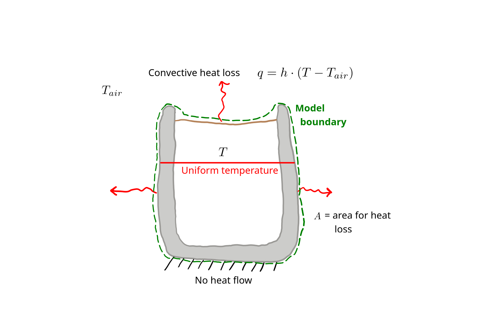
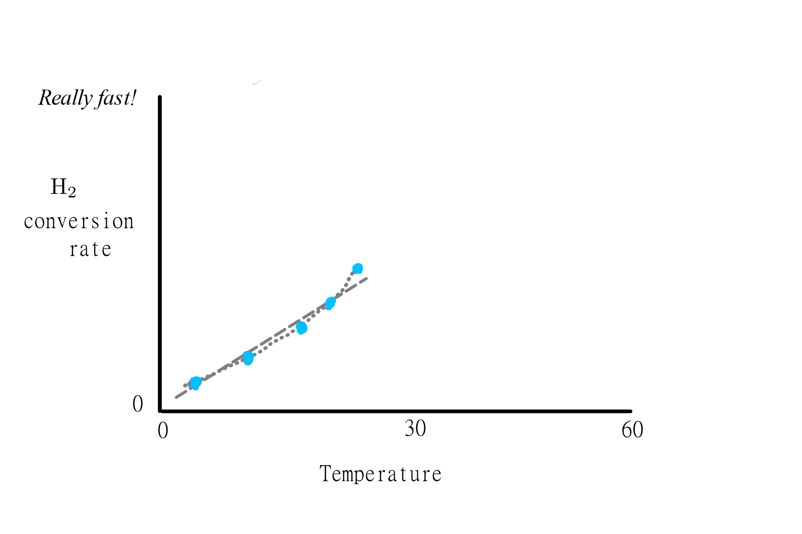
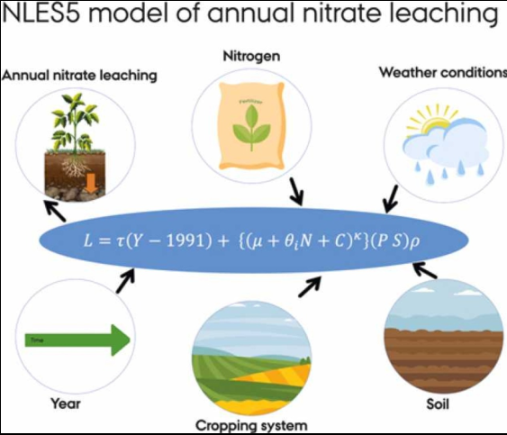
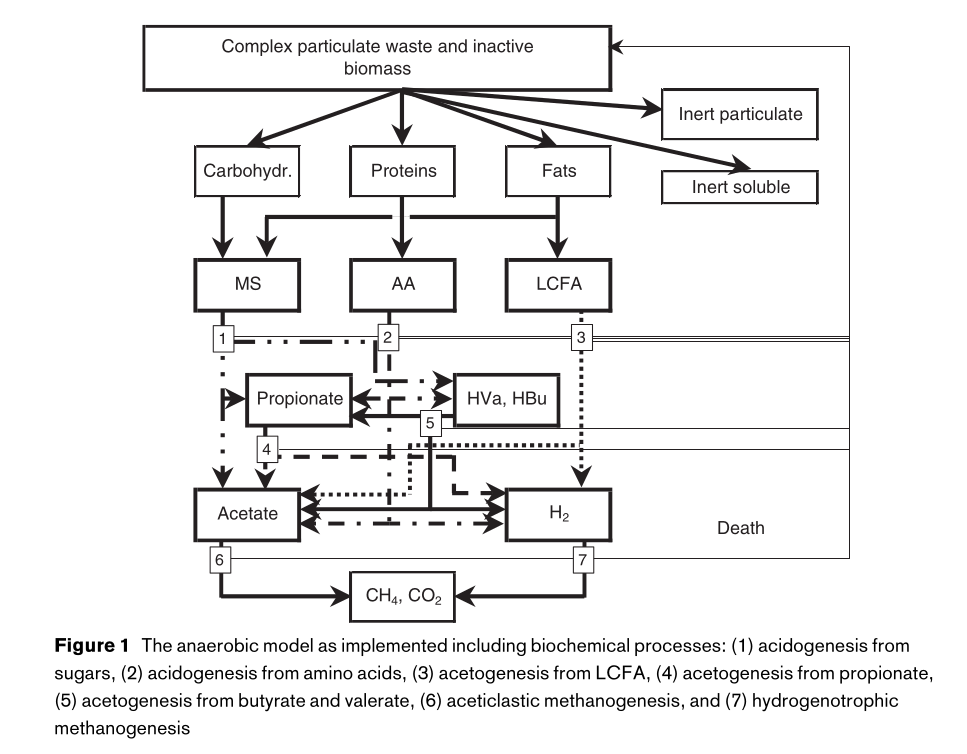

# An introduction to models {#sec-intro}
A *model* is a representation of a real system.
The term itself is quite general.
In this book, we will focus on models that are simplified representations of a physcial, chemical, or biological system.

Students in science and engineering might assume that a model means a piece of software or the underlying code.
This can be the case, but is not the only meaning of the term model.
A software implementation of a model, i.e., some kind of a software program or script that can be run to make model predictions, is called a *software model* or *computer model*.

What are models used for?
For several things.
They are used to make useful predictions about the future.
For example, national policy and international agreements on greenhouse gas emissions rely on sophisticated "general circulation models" of the atmosphere.
These models are used to predict future climate under different input scenarios, including more or less greenhouse gases in the atmosphere.

In research, models are used for understanding complex systems.
And in product development, models are used for design.
Expand. . .add a couple examples

## Types of models {#sec-classification}
There are multiple ways to group models, and the categories are useful for understanding, developing, and explaining models.
The different classification groups are not exclusive, so a single model could be a lumped parameter analytical model.

### Conceptual, mathematical, and computer models
Conceptual, mathematical, and computer models are not really levels in a model classification scheme, but terms for the stage of model development.
A *conceptual model* is some kind of qualitative description of a system.
Conceptual models can be explained and summarized with the help of a good sketch.
For example, let's say we want to develop a model to describe how the coffee in a mug (@fig-coffee) cools over time.

{#fig-coffee fig-alt="Sketch showing a cup of coffee."}

Our conceptual model could be summarized in the sketch below (@fig-coffee-concept).

{#fig-coffee-concept fig-alt="Sketch showing a conceptual model of coffee cooling."}

In our conceptual model there is some quantity of heat energy is present in the coffee and mug, and that amount determines its temperature.
We know from experience that the coffee cools over time, meaning that heat energy is lost.
In our model, the rate of heat loss depends on the temperature of the coffee and mug, the ambient temperature, and some heat transfer parameter.
Our model does not explicitly include heat transfer within the coffee, or separate consideration of different routes of heat transfer, such as from the exposed coffee surface or through the wall or bottom of the mug.
A conceptual model and a sketch is a good place to start most model formulation exercises.

Formulation of a *mathematical model* is typically the objective of a model formulation exercise.
A mathematical model for our coffee example could be:

$$
\frac{dT}{dt} = c \cdot (T - T_{air}). 
$$ {#eq-coffee-ge1}

@eq-coffee-ge1 is actually a *differential equation* (*DE*) because it describes the rate of change in coffee temperature $T$ over time.
In particular, it is an *ordinary differential equation* (*ODE*) because the dependent variable (temperature) depends on only a single independent variable (time).

@eq-coffee-ge1 is also the *governing equation* or *GE* for this model, or that complete equation that describes the system.
Governing equations typically need to be *solved* in order for a model to be useful.
In some cases a solution can be found using only mathematical tools and expressed as a simple *closed-form* equation.
Eq. (1) is one such example, and a solution is:

$$
T(t) = (T_0 - T_{air}) \cdot e^{(-c \cdot t)} + T_{air}.
$$ {#eq-coffee-sol1}

We saw a *computer model* above.
It is a piece of computer software that runs the model.
Creating a computer model means *implementing* a mathematical model.
We could also say that development of a software model means *programming* a mathematical model.
Here is an implementation of the coffee model, i.e., a computer model for cooling coffee.

```{python}
# Import modules
import numpy as np
import matplotlib.pyplot as plt

# Times, up to 60 min (s)
times = np.arange(0, 61, 1) * 60

# Initial condition (degrees C)
Tc0 = 80

# Ambient temperature
Tair = 20

# Set the constant that combines some variables and parameters
c = 9e-4

# And the solution
Tc = (Tc0 - Tair) * np.exp(-c * times) + Tair

# Plot predictions
plt.plot(times / 60, Tc)
plt.xlabel('Time (min)')
plt.ylabel(r'Temperature $(^\circ~\mathregular{C})$')
plt.show()
```

### Analytical (closed-form) vs. numerical {#sec-analytical-v-numerical}

The solution to the cooling coffee model above, @eq-coffee-sol1, is an example of an *analytical* or *closed-form* model.
That means the model can be written as an equation that could be plugged into a calculator.
The only part of @eq-coffee-sol1 that could not be solved with pencil and paper is the $e^{()}$ bit.
Analytical solutions are great because they are easy to implement or program.
The model solution is entered on a single line of code in the example above.
They can also provide insight into model behavior at the mathematical model stage, without actually performing a single calculation.
This is another major advantage of closed-form solutions.
For example, @eq-coffee-sol1 tells us that $T$ will start at $T_0$ and drop toward $T_{air}$, quickly at first but then more and more slowly.
These inferences require some experience with symbolic mathematics.

So why not use only analytical solutions?
Because it is not possible to derive an analytical solution in most cases.
The GE in @eq-coffee-ge1 is a very simple ODE, and only simple ODEs can be solved analytically.
In other cases, we will have to solve GEs numerically, without an *explicit* solution.
Numerical solutions really take advantage of the power of computing and programming languages to arrive at a solution.
Much of this book is focused on numerical models.

### Lumped vs. distributed parameter (0D vs. 1D+)

Our coffee model is many things, including a *lumped parameter* model. 
Lumped parameter models do not explicitly include variation in the condition or state of the system (here our coffee and mug) over space.
In it, we only consider a single "lumped" coffee + mug temperature $T$.
The name "lumped **parameter**" is a bit confusing because it isn't model parameters that we are lumping, really.

What if we created a two-dimensional (*2D*) model that explicitly included the temperature *profile* over space?
That means our model would predict not just a single temperature, but the temperature for multiple locations within the coffee and mug, as well as the effect that differences in temperature over space have on cooling.
That would be a much more complicated model, and potentially more accurate, and would be called a *distributed parameter* model.
Deciding whether to use a lumped parameter approach is an important step in model simplification.

### Steady-state vs. dynamic

Our cooling coffee model is an example of a *dynamic* model, because it predicts the coffee temperature over time.
But we won't always need a dynamic model.
For example, it is the *steady-state* performance of a reactor that usually matters, i.e., how it performs once it has started up and is running steadily.
The steady-state condition for our coffee model is not very interesting, but the process of finding a steady-state solution, i.e., developing a steady-state model, is the same in more complex models.
We start with the GE, set the time derivative to zero, and simplify:

$$
c \cdot (T - T_{air}) = 0,
$$ 

$$
T =  T_{air}.
$$ {#eq-coffee-ss1}

Our steady-state solution shows that the coffee temperature will be the same as the air temperature at steady state.
In other cases the steady-state solution is more interesting and useful.

### Mechanistic versus empirical

Models that include a representation the underlying physics, chemistry, or biology are called *mechanistic*.
Conversely, models based on simple relationship between inputs and outputs that is independent of the underlying mechanisms are called *empirical*.
In reality, all models include some empirical components.
Let's compare the two using a single concrete system.

In a biomethanation reactor hydrogen gas ($\text{H}_2$) is combined with carbon dioxide ($\text{CO}_2$) to form methane ($\text{CH}_4$).
The rate of the reaction increases with temperature.
So an empirical model could look like this, a simple equation:

$$
r = k_{T} \cdot T,
$$

where the reaction rate $r$ could be in $\kgps$, temperature $T$ in $\degC$, and $k_T$ is an empirical coefficient, determined from fitting to measurements.
Some measurements might look like those shown in @fig-biomethmod1.

@rafrafi2021

{#fig-biomethmod1 fig-alt="Hypothetical biomethanation measurements"}

## Model simplification
*Simplification* is key part of model development.
You might have the feeling that the more processes and dimensions you can cram into a model, the more accurate and in general the better it is.
That's not true.
Simplifications are in fact what make models useful, and without significant simplifications, many models would require too many inputs to ever be used.

It is true that models should include the essential processes and components in order to be accurate and useful.
And it is also true that existing sophisticated models include many processes and components and generally increase in both complexity and accuracy as they are extended and refined over time.
So do we have a bit of a contradiction here?
Perhaps.
But even the most sophisticated model is vastly simpler than the actual physical system it represents.
And adding processes and components requires underlying math and associated parameter values.
If either is uncertain, the accuracy of the model may not improve.

It is useful to remember that model complexity can and often does increase over time and as the result of contributions of multiple individuals.
Good modeling advice is to start simple and add more complexity if necessary only after testing a model and identifying shortcomings.

How simple should a model be?
That depends--on the objectives of a project or the task requirements, on available resources, on the level of understanding of the real system, and on the opinion of developers or others who have a say.
In this book we'll look at a variety of models that encompass a range of complexity.
But in fact all of these models are relatively simple.


## Problems

Some different models are described below.
Apply the labels conceptual, mathematical, computer, analytical, numerical, lumped parameter, distributed parameter, 1D, steady-state, dynamic, mechanistic, and empirical appropriately. Is the answer always clear?

1. The NLES5 model predicts nitrate leaching based on the equation shown in the figure below (@fig-NLES5), where $L$ is the predicted leaching rate and the other terms are input variables or model parameters. Is it mechanistic or empirical? 

{#fig-NLES5 fig-alt="NLES5 model."}

2. ADM1 is a chemical and biological model that simulates conversion of organic waste to biogas. It tracks development of microbial communities over time. Is it mechanistic or empirical? Dynamic or steady-state? 

{#fig-ADM1 fig-alt="ADM1 model."}

3. The Gaussian plume model is a simple general approach for modeling dilution of atmospheric pollutants from a fixed source, e.g., a smokestack. It can be expressed as an equation for the concentration of pollutant,

   $$
   c(x, y, z) = e \cdot f(h, \sigma_y, \sigma_z) ,
   $$

   where $e$ is pollutant emission rate, $x$, $y$, and $z$ define a position relative to the source smokestack with a height of $h$, and the $\sigma$ terms are parameters determined from large-scale measurements that quantify horizontal and vertical dispersion.
   How would you characterize this model?
   Does it neatly fit into one box?

## References {.unnumbered}

