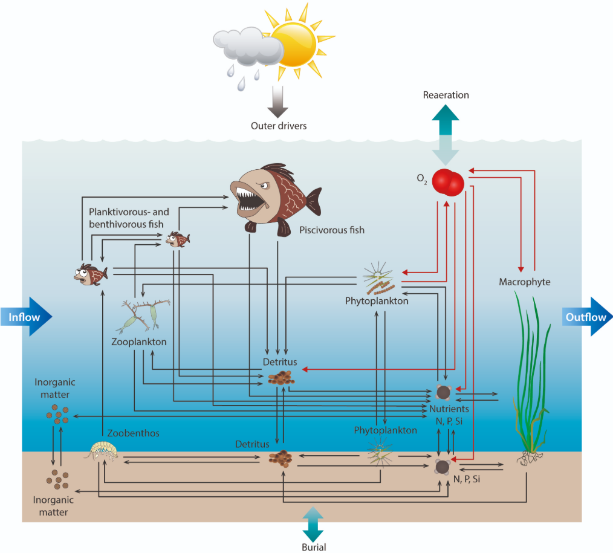

# Model Formulation {#sec-formulation}

Model *formulation* or, more broadly, *development*, means producing a mathematical model. 
Once a mathematical model has been formulated, it usually has to be implemented to create a software model for use.
This chapter presents steps for formulating models.

## Basic steps

The basic steps in model formulation are given below.
In the following sections, these are described in detail.

1. Conceptual model, including sketch showing: system boundary, state variables, essential inputs
2. Balance/conservation equations
3. Constitutive equations (transfer or rate equations)
4. Linking equations
5. Initial or boundary conditions
6. Governing equation (GE)

## Conceptual model {#sec-conceptual-model}
A conceptual model should include several components:

* *system boundary*,
* *state variables*,
* *external conditions* or *boundary conditions*, 
* main *flows* of matter or energy,
* *geometry*,
* main model *parameters*, and
* other key assumptions.

Most of these can be effectively presented in a model sketch.
You already encountered a sketch of a conceptual model in @sec-intro (@fig-coffee-concept).
It is copied below (@fig-coffee-concept2).

{#fig-coffee-concept2 fig-alt="Sketch showing a conceptual model of coffee cooling. This time, notice all the components and labels."}

Let's go through the list of conceptual model components, using @fig-coffee-concept2 as an example.

The system boundary shows what is being modeled.
In a sketch, it is common to represent the system boundary with a dashed line; a green dashed line is used in @fig-coffee-concept2.
Here, the boundary shows that we are modeling the temperature of the coffee and the mug.
Air temperature sits outside the boundary, implying that is a fixed external condition.
(It can be hard to place the boundary exactly where it should be, but close usually works.)

The state variable in this model is the coffee temperature, or really, coffee + mug system temperature.
For a lumped parameter model like this one, the only way our state variable can change is by flow of energy through the system boundary;
here, that flow is shown by the wavy red arrows.

We don't have much about geometry in this sketch.
That can be hard to show clearly in a sketch, and a lumped parameter model doesn't really have any geometry.
The $A$ that is shown in the model provides a hint that we are taking a simple approach here, and assuming surface temperature and so heat flux is uniform across the entire exposed surface, including coffee and the mug.
The uniform temperature, shown by the horizontal red line, also shows that we are dealing with a lumped parameter model here.

We defined one main model parameter in the sketch--$h$, the convection heat transfer coefficient.
Area $A$ is another *model input*, and one could argue about whether it should be called a parameter or not.
We could add more details (Doesn't the coffee + mug mass play a role? And specific heat capacity? Some of that will have to wait until @sec-heat.), but this is a sufficient sketch.

## Conservation equations {#sec-conservation}

*Conservation equations* or *balance equations* are a fundamental part of most models and all that we will consider, whether or not the equations are explicitly considered during model formulation.
The word conservation simply means that something is preserved, i.e., not produced or destroyed.
In our models, we will be concerned with conservation of *energy* and *matter*.

We can use a "cookbook" formula as a starting point for both energy and matter conservation:
$$
\text{accumulation} = \text{in} - \text{out} + \text{generation} - \text{consumption}.
$${#eq-conservation}

Exactly what the terms mean, along with their dimensions and units, can vary. 
Of course dimensions and units must match for all terms.
We will typically use rates for all terms, e.g., $\Jps$ = W for energy and $\kgps$ for mass.

To develop a conservation equation for a new model, start with  @eq-conservation and eliminate the terms that are not relevant.
For our coffee model (@sec-classification), the relevant conservation equation is
$$
\text{accumulation} = - \text{out}, 
$${#eq-coffee-conservation}

because there is no heat coming in, only heat loss, and no heat generated (e.g., from electricity or a reaction) or consumed (e.g., through a reaction).

This is a very simple conservation equation.
At the other extreme, it is common to have cases where each term in the cookbook equation includes multiple processes.
For example, take a look at the diagram below, of the Aarhus University WET model of aquatic ecosystems.

{#fig-wet1 fig-alt="Diagram of a lake model."}           

What is an appropriate mass balance for the water column nitrogen (N), shown toward the lower right?
There are several arrows coming in and several going out.
An incomplete N balance might look like this:

$$                                                                                                                                                                                    
\begin{aligned}                                                                                                                                                                       
\text{accumulation} = &\text{ fish decomposition} + \text{plankton decomposition} \\                                                                                                  
                     +&\text{ transport from sediment} - \text{macrophyte uptake} \\                                                                                                  
                     -&\text{ phytoplankton uptake} - \text{transport into sediment}.
\end{aligned}                                                                                                                                                                         
$$    

There highlights an important point: that conservation equations apply to a specific state variable and a specific *domain*.
This clarity is necessary when developing a model.
In the WET model example, the state variable could be the water column total N concentration, or perhaps the inorganic N concentration, or the inorganic N mass.
We don't know for sure, but if we were developing or even applying this model, we must!
Units could be $\kgpmcps$ or $\kgps$.

And the domain for the WET model (@fig-wet1) might be the entire water volume of a lake, if we were taking a lumped-parameter approach with this model.
However, the domain could also be a single *cell* or *node* within the lake, if we were taking a spatial approach.
During model development, it is common for the domain to be a *control volume*, which is some hypothetical small volume within the larger model domain.
This can be convenient for GE development.

Every state variable in a model needs a conservation equation.
Fortunately, most of the models we'll cover in this book have a single state variable and so a single conservation equation.
For the simple coffee model, the state variable is the coffee temperature and the domain is the entire cup of coffee.
Units for our conservation equation, @eq-coffee-conservation, should be W, i.e., $\Jps$.

<!-- Fundamental component of all models.
     Apply to energy and mass.
     Cookbook formula: accumulation = in - out + gen - consumption.
     Terms can be expanded; unused terms are typically dropped.
     Domain: whole system (0D), control volume (symbolic), or cell/node (1D+). -->

## Constitutive equations {#sec-constitutive}

*Constitutive equations* describe how matter or energy are transferred.
We will need a constitutive equation for each term in the model conservation equation.
Figuring out what equations to use here requires familiarity with the different options.
We'll take a look at just a couple here and present more in @sec-heat, @sec-mass, and @sec-reactions.
These equations typically have a name like "someone's law".
In general, constitutive equations include a difference or derivative and a proportionality constant on the right-hand side (RHS).
The left-hand side (LHS) is usually some kind of *flux*, which is a flow rate per unit cross-sectional area.

For our coffee model, we only need one constitutive equation (take a look at @eq-coffee-conservation to see why), and the appropriate one is called *Newton's law of cooling*.
It is:

$$
q = h \cdot (T_s - T_\infty),
$${#eq-coffee-constitutive}

where $q=$ *heat flux* ($\Wpms$), $h=$ *convection heat transfer coefficient* ($\WpmspK$), $T_s=$ surface temperature of an object (K or $\degC$, either is fine because we are dealing with a temperature difference, not the absolute value), and $T_\infty=$ temperature of the surrounding fluid at some point where the object does not affect it.
Applied to our cooling coffee system, $T_s=$ the coffee temperature, uniform throughout, and $T_{\infty}=$ air temperature.

Constitutive equations depend on the state of the system and material properties.
Take a look at @eq-coffee-constitutive.
The "state of the system" component is clear in the presence of $T_s$, which is the coffee temperature here.
And the heat transfer coefficient $h$ depends on the properties of air--it would be very different if the coffee were immersed in water!

<!-- Why rates matter.
     Brief preview with Fourier's law -- full treatment in @sec-heat.
     CE often has a derivative or difference on the RHS.
     CE depends on material properties and state variables. -->

## Linking equations {#sec-linking}

*Linking equations* are those relationships that are sometimes needed to connect or related different physical quantities included in the model.
Not all models need linking equations.
Our simple coffee model does though! 
Why?
Well, our state variable is temperature $T$, but our conservation equation, @eq-coffee-conservation, is for energy.
The same is true for our constitutive equation, @eq-coffee-constitutive, which has $T$ on the RHS, but only energy on the LHS.
So somehow we need to link the two, temperature and energy.
To do so, we need to know something about heat energy and thermal temperature, but even without this knowledge we might guess that the two are directly proportional, i.e., $\Delta T = c \cdot \Delta Q$, where $c$ is some arbitrary constant.
In fact this is (approximately) correct, but $c$ depends on the material and the quantity present.
So here, the linking equation that we need is:

$$
\Delta Q = c_p \cdot m \cdot \Delta T,
$$ {#eq-coffee-linking}

where $\Delta Q=$ a change in thermal energy (J), $c_p=$ a new parameter called *specific heat capacity* ($\kJpkgpK$), $m=$ the material mass (kg), and $\Delta T=$ the corresponding change in material temperature (K or $\degC$).
Somehow our three equations will have to be combined to derive our GE.
This is explained in @sec-formulation-steps below.

<!-- Connect different physical quantities (e.g., energy and temperature).
     Needed when the state variable in the balance differs from the variable of interest. -->

## Model formulation {#sec-formulation-steps}

Now we have the components we need to formulate a mathematical model.
How do we put them together to get a GE?

Energy conservation in W:

$$
\text{accumulation} = - \text{out}. 
$$ {#eq-coffee-conservation2}

The constitutive equation needs to be multiplied by area $A$ to get total heat flow in W:

$$
\dot Q = A \cdot h \cdot (T_s - T_\infty).
$$ {#eq-coffee-constitutive2}

And let's write the linking equation using derivatives:

$$
\frac{dQ}{dt} = c_p \cdot m \cdot \frac{dT}{dt}.
$$ {#eq-coffee-linking2}

These three equations and an initial condition plus some inputs are all we need.

Ultimately we want a GE that gives an expression for a derivative for our state variable.

Study the equations a bit--how are they related?
A good place to start is to review what the terms in the conservation equation actually mean.
Here, the LHS in @eq-coffee-conservation2 is the accumulation of energy.
Interestingly, that is what we also have in the LHS of @eq-coffee-linking2.
What is the RHS of the conservation equation @eq-coffee-conservation2?
It can help to refer back to the sketch, @fig-coffee-concept2.
With that, you may realize that the RHS of the conservation equation is our convective heat loss, which is given by the constitutive equation, @eq-coffee-constitutive2.

This all means we can substitute the RHS of @eq-coffee-linking2 for the LHS of @eq-coffee-conservation2.
And we can substitute the RHS of @eq-coffee-constitutive2 for the RHS of @eq-coffee-conservation2.
This gives:

$$
c_p \cdot m \cdot \frac{dT}{dt} = - A \cdot h \cdot (T_s - T_\infty)
$$

Almost there!
We now have an expression that includes the derivative of our state variable $T$ (see the $\frac{dT}{dt}$ term?) so we have a DE.
We just need to rearrange, by solving for that $\frac{dT}{dt}$ term.

$$
\frac{dT}{dt} = - \frac{A \cdot h}{c_p \cdot m} \cdot (T_s - T_\infty)
$$ {#eq-coffee-ge2}

And there, @eq-coffee-ge2, is a GE for our model.
It shows that the rate of temperature change depends on the size of the coffee + mug system ($m$ and $A$), a heat transfer coefficient specific to the conditions of the surrounding air ($h$), the air temperature of course ($T_\infty$), and the temperature of the coffee itself ($T$).

We can't simply plug numbers into the GE and get a solution, because it is an ODE, and only tells how the coffee temperature *changes* over time, not the actual value.
We'll look at actually getting results in @sec-solving.
But here we can see what inputs will be needed.

You might notice that this GE is different from the one presented in @sec-intro, @eq-coffee-ge1. 
In that simpler GE, several terms were combined together into a single constant:

$$
c = - \frac{A \cdot h}{c_p \cdot m}
$$ {#eq-coffee-const}

Both approaches can give identical predictions if @eq-coffee-const is true.
The difference implies something about what we know and how we know it.
Do we know the value of each term on the RHS of @eq-coffee-const, perhaps from measurements and correlations?
Or instead do we just know the single lumped parameter on the LHS, $c$, perhaps from fitting to measurements?

<!-- Show how balance + constitutive + linking equations combine to give the GE.
     Scope here: 0D (lumped-parameter) models only.
     Approach for 1D+ models (start from full GE, then simplify) introduced in @sec-spatial. -->

## Problems {.unnumbered}

1. Formulate a simple model for evaporation of gasoline from a spill on an impervious surface.
   Start with a conceptual model, and draw a sketch.
   Try to get to a governing equation.
   What parameters would you need to apply the model? 
   We will learn more about this type of problem in @sec-mass, but these details are not needed for this problem.
   Here, use your existing knowledge or make a guess about the form of the necessary constitutive equation.

2. Refrigeration of animal slurry is a commercial technology used at full-scale to reduce emission of methane and other air pollutants from animal barns.
   Using the cooling coffee model for inspiration, follow the model formulation steps to try to develop a governing equation for a slurry cooling system.

3. A denitrifying wood chip bioreactor is just a trench in the ground filled with wood chips.
   Nitrate ($\text{NO}_3^-$) in water draining from agricultural fields is removed by bacterial denitrification, with wood organic matter as the electron donor and carbon source.
   The nitrate is converted to relatively inert dinitrogen gas ($\text{N}_2$) (or at least that is the intent--in fact some oxidized N gases are undoubtedly produced as well).
   You can find more information on the technology [here](https://www.agriculture.com/crops/conservation/woodchip-bioreactors-are-at-the-forefront-of-conservation-technology).
   Develop a conceptual model for this system.
   See the list of conceptual model components in @sec-conceptual-model to think about what to include.
   (We will learn more about reaction stoichiometry and microbiology in @sec-reactions.)
