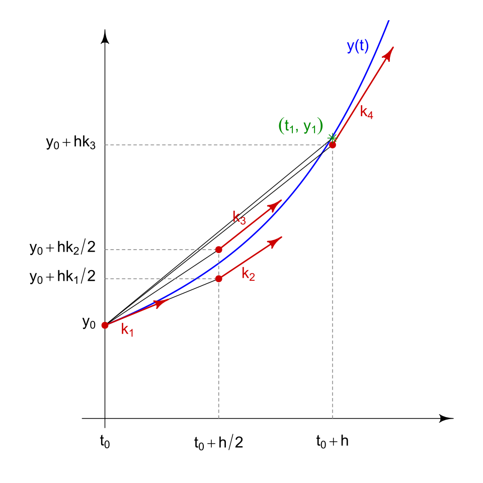

# Solving and implementing models {#sec-solving}

A GE, like @eq-coffee-ge2, is a mathematical model.
In order to get predictions, we need to solve the model.
There are two general ways to do that: analytical versus numerical approaches.
The conceptual difference between the two of these should be familiar from @sec-analytical-v-numerical.
In this chapter we'll explore the two types of models, also methods of solving models, in more detail.

Numerical models are almost always associated with computer code.
One exception is pencil-and-paper demonstration of numerical calculations that you might perform on an exam.
But to actually make useful predictions using numerical methods, the ability of computers to perform numerous calculations quickly is necessary.

In this book, analytical models will also be associated with code in the end.


<!-- Lots of variation in how to do this.
     Numerical implementations can use separate balance and constitutive equations without
     forming a single GE.
     A single GE can always serve as the basis for both numerical and analytical solutions.
     Spatial models require more work -- see @sec-spatial. -->

## Numerical solution: Euler method

The basic approach to numerical solutions of dynamic models is to repeatedly update the state of the system using the GE.
Any dynamic model needs explicit initial conditions, a quantitative description of the state of the system at the start.
For the coffee model, it means knowing the initial temperature of the coffee + mug system.
In general, it means having a value for each state variable.

In Python and other programming languages, explicit *for loops* can be used to implement a numerical model.
The simplest numerical method is based on calculating the state variable derivative at each time and extrapolating into the future by some fixed *time step*.
This approach is also called the *explicit forward finite difference method* or the *Euler method*.
It was first described by Leonhard Euler more than 300 years ago.
Let's write some code to implement it using the coffee model.

```{python}
# Load NumPy package
import numpy as np

# And plotting package
import matplotlib.pyplot as plt

# Set model inputs
cp = 4.2       # J g-1 K-1
T_init = 80    # deg. C
T_air = 20     # deg. C
mass = 300     # g
area = 0.026   # m2
h = 75         # W m-2 K-1
dt = 60 * 5    # 5 min time step (s)
times = np.arange(0, 3600 + dt, dt) # Times (s)

# Calculate model constant or coefficient, which does not change over time
con_cool = area * h / (cp * mass)

# Create vector of temperatures to fill later
T_coffee = np.zeros_like(times)

# Set the first value
T_coffee[0] = T_init

# Implement an explicit forward finite difference method in a loop
for i in range(1, len(T_coffee)):
    T_coffee[i] = T_coffee[i - 1]  - con_cool * (T_coffee[i - 1] - T_air) * dt

print(T_coffee)
```

We can plot predictions to see what we got.

```{python}
#| label: fig-coffee-preds1
#| fig-cap: "Predicted coffee temperature using Euler method."

plt.plot(times / 60, T_coffee, 'ro-', label = 'Euler')
plt.legend()
plt.xlabel('Time (min)')
plt.ylabel(r'Predicted coffee temperature $(^\circ\mathregular{C})$')
plt.show()
```
So there are some predictions from a simple numerical model (@fig-coffee-preds1).
Whether or not it is accurate depends on the model structure as well as the input variables.
We'll leave that question for another time.
Certainly predictions are plausible and the model provides the qualitative response that we had expected (see @sec-intro).

The points in @fig-coffee-preds1 show the model predictions for specific times.
Our model made no predictions for other times, and in the plot the straight lines just connect points. 
We had to explicitly select a time step, called `dt` in the code; it was set to 10 minutes (600 s) above.
We should try some different values to see the effect.
While we could edit the chunk of code above, a more efficient and reproducible approach is to create a Python *function* of the model.

```{python}
def cool_eu(T_init, T_air, mass, area, h, time_range, dt, cp=4.2):
    """
    Simulate coffee cooling using the Euler method.

    Parameters
    ----------
    T_init : float
        Initial coffee temperature (deg. C)
    T_air : float
        Ambient air temperature (deg. C)
    mass : float
        Mass of coffee (g)
    area : float
        Surface area of mug (m2)
    h : float
        Convective heat transfer coefficient (W m-2 K-1)
    time_range : tuple
        Start and end time (s), e.g. (0, 3600)
    dt : float
        Time step (s)
    cp : float, optional
        Specific heat capacity of coffee (J g-1 K-1), default 4.2

    Returns
    -------
    dict with keys 'times' (s) and 'T_coffee' (degC)
    """

    # Calculate constant, which does not change over time
    con_cool = area * h / (cp * mass)

    # Create vector of times and concentrations
    times = np.arange(time_range[0], time_range[1] + dt, dt)
    T_coffee = np.zeros_like(times)
    T_coffee[0] = T_init

    # Implement an explicit forward finite difference method in a loop
    for i in range(1, len(T_coffee)):
        T_coffee[i] = T_coffee[i - 1]  - con_cool * (T_coffee[i - 1] - T_air) * dt

    # Return solution
    return {
        'times': times,
        'T_coffee': T_coffee,
    }
```

Now we can call the function and run the model with a single line of code.

```{python}
pred_temp1 = cool_eu(
    T_init=80, 
    T_air=20, 
    mass=300, 
    area=0.026, 
    h=75, 
    time_range=(0., 60 * 60), 
    dt = 5 * 60
)
```

That result should exactly match our earlier result, because the inputs were identical.

```{python}
print(pred_temp1['T_coffee'])
print(T_coffee)
```

Now let's try a few different values for `dt`.

```{python}
pred1 = cool_eu(
    T_init=80, 
    T_air=20, 
    mass=300, 
    area=0.026, 
    h=75, 
    time_range=(0., 60 * 60), 
    dt = 5 * 60
)

pred2 = cool_eu(
    T_init=80, 
    T_air=20, 
    mass=300, 
    area=0.026, 
    h=75, 
    time_range=(0., 60 * 60), 
    dt = 10 * 60
)

pred3 = cool_eu(
    T_init=80, 
    T_air=20, 
    mass=300, 
    area=0.026, 
    h=75, 
    time_range=(0., 60 * 60), 
    dt = 20 * 60
)
```

And plot results.

```{python}
#| label: fig-coffee-preds2
#| fig-cap: "Predicted coffee temperature using the Euler method, showing results for different time steps."

plt.plot(pred1['times'] / 60, pred1['T_coffee'], label = '5 min.')
plt.plot(pred2['times'] / 60, pred2['T_coffee'], label = '10 min.')
plt.plot(pred3['times'] / 60, pred3['T_coffee'], label = '20 min.')
plt.legend()
plt.xlabel('Time (min)')
plt.ylabel(r'Predicted coffee temperature $(^\circ\mathregular{C})$')
plt.show()
```

Well, what do you think?
Can you see the problem with Euler method?
In brief, the derivative of a state variable at some particular time is not always a good estimate of its value at later times.
For the method to work well, the time step needs to be relatively small.
The 20 minute time step fails spectacularly, predicting a coffee temperature below -20 $\degC$ after 20 minutes, a full 40 $\degC$ below air temperature, and then *warming* up to 60 $\degC$, followed by another big drop in temperature.
This type of *oscillating* response is an example of *numerical instability*, and reflects inaccuracy in the solution as well as solutions that depend on the details of the call, here, the solution depends strongly on the time step.

Does this example prove that the Euler method is worthless?
Nope!
It was the method of choice for ecological models for years @odum2000modeling and is most likely still used in many existing computer models.
It is in fact still a useful method, as long as care is taken in selecting a reasonable time step.
How do you know when a time step is small enough?
In general, simply try a smaller value and see if there is any effect.
We'll cover this general topic more in a later section.

<!-- Continue with the coffee example.
     Implement and explain.
     Show effect of time step size. -->

## Higher-order methods: `solve_ivp()`

More sophisticated models usually use something called an *ODE solver*.
ODE solvers are algorithms or computer functions that accept a GE and some initial conditions and return a solution.
Just like the Euler method, the "solution" here is an actual numeric solution, i.e., the state of the system over time.
This is another numerical approach.
In this book we'll use the Python ODE solver `solve_ivp()` from the scipy package.

The `solve_ivp()` approach has two major differences when compared to the Euler method:

1. adaptive step size, and
2. higher-order methods.

The first of these means that we, the user, doesn't set a fixed step size `dt`.
Instead, the algorithm implemented in `solve_ivp()` adjusts the value on the fly, as needed to ensure accurate results without long run times that could be avoided.
When state variable derivatives change a lot over time or the problem is otherwise a *stiff* one, the solver will use a small step size.
When a small step size is not needed, it will (or can, depending on the settings for some arguments) increase again to a larger (i.e., faster) value.

The Euler method is a *first-order* method, because it is based completely on first derivatives.
By applying it, we explicitly assume that the we can approximate the derivative over some time interval as equal to the exact value at the start of the interval.
The `solve_ivp()` function implements *higher-order* methods that evaluate (calculate) the derivative at other times and use a weighted average value to move onto the next time step.
The slopes considered in the 4th order Runge-Kutta method is in @fig-RK4-slopes.
And the green asterisk shows the estimated value, which is quite close to the true response shown by the blue curve.
Where would the the Euler method land?
Hint: at $t_0 + h$, and look at $k_1$ for the single slope that is applied.

{#fig-RK4-slopes fig-alt="Runge-Kutta slopes."}

So what does `solv_ivp()` look like in practice?
In a way it is simpler to set up than the Euler method, because `solve_ivp()` takes care of the loop.
On the other hand, we need to define a function for calculating the derivate(s) of the state variable(s).
Here we will define that function within our model and call it `rates()`, which is a convention we'll use throughout this book.
Here is an implementation of the coffee example.

```{python}
import numpy as np
from scipy.integrate import solve_ivp

def cool_rk(T_init, T_air, mass, area, h, time_range, dt, cp=4.2):
    """
    Simulate coffee cooling using the RK45 method in `solve_ivp()`.

    Parameters
    ----------
    T_init : float
        Initial coffee temperature (deg. C)
    T_air : float
        Ambient air temperature (deg. C)
    mass : float
        Mass of coffee (g)
    area : float
        Surface area of mug (m2)
    h : float
        Convective heat transfer coefficient (W m-2 K-1)
    time_range : tuple
        Start and end time (s), e.g. (0, 3600)
    dt : float
        Time step (s)
    cp : float, optional
        Specific heat capacity of coffee (J g-1 K-1), default 4.2

    Returns
    -------
    dict with keys 'times' (s) and 'T_coffee' (degC)
    """

    # Calculate constant, which does not change over time
    con_cool = area * h / (cp * mass)

    # Create an array of times
    times = np.arange(time_range[0], time_range[1] + dt, dt)

    # Define rates function
    def rates(t, T_current):
        return - con_cool * (T_current - T_air)

    # And use the RK45 method with solve_ivp() defaults
    res = solve_ivp(
        rates, 
        t_span=time_range, 
        y0=[T_init], 
        t_eval=times
    )

    # Return solution
    return {
        'times': res.t,
        'T_coffee': res.y[0, :],
    }

```

Let's see how it works, and compare it the the first solution from the Euler method.


```{python}
pred_eu = cool_eu(
    T_init=80, 
    T_air=20, 
    mass=300, 
    area=0.026, 
    h=75, 
    time_range=(0., 60 * 60), 
    dt = 5 * 60
)

pred_rk = cool_rk(
    T_init=80, 
    T_air=20, 
    mass=300, 
    area=0.026, 
    h=75, 
    time_range=(0., 60 * 60), 
    dt = 5 * 60
)
```

```{python}
#| label: fig-coffee-preds3
#| fig-cap: "Predicted coffee temperature using Euler method and an RK45 approach based on `solve_ivp()`."

plt.plot(pred_eu['times'] / 60, pred_eu['T_coffee'], label = 'Euler')
plt.plot(pred_rk['times'] / 60, pred_rk['T_coffee'], label = 'RK45')
plt.legend()
plt.xlabel('Time (min)')
plt.ylabel(r'Predicted coffee temperature $(^\circ\mathregular{C})$')
plt.show()
```

What do you think?
Could you make the two match?
Give it a try.

The object returned by `solve_ivp()` can be a little tricky to work with.
Below there are three different ways of checking its structure, which we need to know if we want to extract components.

```{python}
#| eval: false
def cool_rk_debug(T_init, T_air, mass, area, h, time_range, dt, cp=4.2):
    """
    ...
    """

    # Calculate constant, which does not change over time
    con_cool = area * h / (cp * mass)

    # Create an array of times
    times = np.arange(time_range[0], time_range[1] + dt, dt)

    # Define rates function
    def rates(t, T_current):
        return - con_cool * (T_current - T_air)

    # And use the RK45 method with solve_ivp() defaults
    res = solve_ivp(
        rates, 
        t_span=time_range, 
        y0=[T_init], 
        t_eval=times
    )

    # We could use breakpoint()
    breakpoint()

    # print()
    print(res)

    # Or just return the whole thing to inspect it
    return res

```

## Closed-form (analytical) solutions {#sec-expmodel}

Closed-form solutions are different.
(Refer back to @sec-analytical-v-numerical if you don't remember what a closed-form solution is.)
Here, the challenge is in the mathematical (symbolic) derivation; the programming part is simple.
As soon a model becomes a bit complicated analytical solutions become impossible.
Even in these cases though, it can be possible to derive an analtyical solution to a limiting case, often steady-state.

There are many different ODEs that can be solved analytically.
Here we will work with one that appears in many different applications, including our cooling coffee model: the exponential model.

It is

$$
\frac{dx}{dt} = \lambda \cdot x.
$${#eq-exp-ode}

It is a linear, first-order ODE. 
Here, $x$ is some state variable and $\lambda$ is the rate constant, with dimensions $\text{T}^{-1}$.
Where does the exponential model show up? 
All over! 
For example:

1. In first-order chemical reactions, where $x$ might be a the concentration or mass of a reactant and $\lambda$ is entered as the negative of the first-order rate constant. 
   Note that "first-order" here is different from a first-order ODE. 
   It might be called a first-order model or exponential decay model here.

2. For unlimited growth of bacteria or any other organism, where $x$ is microbial biomass or other measure of population size and $\lambda$ is the intrinsic rate of growth. 
   It might be called an exponential growth model here, but it is the same model with a change in sign!

3. In heat transfer by a lumped capacitance method, where $x$ is temperature, $\lambda$ has a negative sign and includes a convection heat transfer coefficient, specific heat capacity, probably exposed surface area and object mass as well, and possibly other sources of surface or near-surface resistance. 
   We'll use it like this in our cooling coffee model.
   There, the term exponential decay model could be applied.

So you really do need to be able to solve this type of ODE! 
Below we'll go through the steps in solving it, but ultimately you will probably find it easiest to just memorize the solution. 
Remember you can always check a solution as shown below.

### A general solution

Start with the ODE

$$
\frac{dx}{dt} = \lambda \cdot x.
$$ 

Separate variables

$$
\frac{1}{x} \cdot dx = \lambda \cdot dt,
$$

and integrate both sides

$$
\int \frac{1}{x} \cdot dx = \int \lambda \cdot dt.
$$

The solution to the LHS integral could be found in a table, but you should know the solution to the RHS!

$$
\ln{\left|x\right|} + c_1 = \lambda \cdot t + c_2.
$$

The $c$ values are just constants of integration.
We can combine them together:

$$
\ln{\left|x\right|} = \lambda \cdot t + c.
$$

Now exponentiate both sides (take the antilog), for:


$$
\left|x\right| = e^{\lambda \cdot t + c}.
$$

And remember your exponent rules.


$$
\left|x\right| = e^{\lambda \cdot t} \cdot e^{c}.
$$

The last term on the RHS is a constant, and we can roll the $\pm$ from the LHS into it as well.
We'll call the new constant $x_0$ for a reason that you'll see below.
So, an analytical solution to @eq-exp-ode is:

$$
x = x_0 \cdot e^{\lambda \cdot t}.
$${#eq-exp-solution}

### Application to cooling coffee model

Let's apply @eq-exp-solution to our cooling coffee model.
Doing so just requires a bit of symbolic math manipulation.

Let's copy our GE from @eq-coffee-ge2.

$$
\frac{dT}{dt} = - \frac{A \cdot h}{c_p \cdot m} \cdot (T - T_\infty)
$$ 

To use the solution to @eq-exp-ode we need to express our GE in the same form.
We can lump those constants on the RHS into a single one we'll call $k_{cool}$.

$$
k_{cool} = \frac{A \cdot h}{c_p \cdot m},
$$ 

$$ 
\frac{dT}{dt} = -k_{cool} \cdot (T - T_\infty).
$$ 

What corresponds with our dependent variable $x$ in the generic form @eq-exp-ode and @eq-exp-solution?
It must be $T$, the coffee temperature.
But then the RHS is not in the right form.
To get it into the right form, we will have to define a new dependent variable $\theta$.

$$
\theta = T - T_\infty
$$

Of course,

$$
\frac{d(T - T_\infty)}{dt} = \frac{dT}{dt},
$$

so,

$$ 
\frac{d\theta}{dt} = -k_{cool} \cdot \theta.
$${#eq-theta-ode} 

This substitution is actually a common form of model simplification.
Here $\theta$ is a *normalized temperature* and in other cases we'll divide our response variable by some constants to normalize it.
This approach makes our model more *general*.

Moving on, do you see how  @eq-theta-ode now looks like @eq-exp-ode?
We just have to recognize that $\lambda = -k_{cool}$ and $x = \theta$.
So, applying the solution @eq-exp-solution we get:

$$
\theta = \theta_0 \cdot e^{-k_cool \cdot t}.
$${#eq-cooling-an-sol}

So this is our solution--an equation that gives us the coffee temperature at any time depending on the input that go into the $k_{cool}$ term.
We could have used any name for the contant of integration called $\theta_0$ here, but by plugging in $t=0$ we can see that $\theta_0$ is the initial value of $\theta$, or the normalized temperature at the start of exposure to air. 

### Implementation

Implementing @eq-cooling-an-sol in Python is easier than implementing a numerical approach.
Maybe the only tricky part is going between $\theta$ and $T$.

```{python}
import numpy as np
from scipy.integrate import solve_ivp

def cool_an(T_init, T_air, mass, area, h, time_range, dt, cp=4.2):
    """
    Simulate coffee cooling using an analytical solution.

    Parameters
    ----------
    T_init : float
        Initial coffee temperature (deg. C)
    T_air : float
        Ambient air temperature (deg. C)
    mass : float
        Mass of coffee (g)
    area : float
        Surface area of mug (m2)
    h : float
        Convective heat transfer coefficient (W m-2 K-1)
    time_range : tuple
        Start and end time (s), e.g. (0, 3600)
    dt : float
        Time step (s)
    cp : float, optional
        Specific heat capacity of coffee (J g-1 K-1), default 4.2

    Returns
    -------
    dict with keys 'times' (s) and 'T_coffee' (degC)
    """

    # Calculate constant, which does not change over time
    con_cool = area * h / (cp * mass)

    # Create an array of times
    times = np.arange(time_range[0], time_range[1] + dt, dt)

    # Solve for coffee temperature
    theta_init = T_init - T_air
    theta = theta_init * np.exp(- con_cool * times)
    T_coffee = theta + T_air

    # Return solution
    return {
        'times': times,
        'T_coffee': T_coffee,
    }

```

Finally, we can compare all three approaches, using identical inputs of course.

```{python}
pred_eu = cool_eu(
    T_init=80, 
    T_air=20, 
    mass=300, 
    area=0.026, 
    h=75, 
    time_range=(0., 60 * 60), 
    dt = 5 * 60
)

pred_rk = cool_rk(
    T_init=80, 
    T_air=20, 
    mass=300, 
    area=0.026, 
    h=75, 
    time_range=(0., 60 * 60), 
    dt = 5 * 60
)

pred_an = cool_an(
    T_init=80, 
    T_air=20, 
    mass=300, 
    area=0.026, 
    h=75, 
    time_range=(0., 60 * 60), 
    dt = 5 * 60
)
```


```{python}
#| label: fig-coffee-preds4
#| fig-cap: "Predicted coffee temperature using Euler method, an RK45 approach based on `solve_ivp()`, and an analytical solution."

plt.plot(pred_eu['times'] / 60, pred_eu['T_coffee'], label = 'Euler')
plt.plot(pred_rk['times'] / 60, pred_rk['T_coffee'], label = 'RK45')
plt.plot(pred_an['times'] / 60, pred_an['T_coffee'], label = 'Analytical', 
         linestyle = 'dashed')
plt.legend()
plt.xlabel('Time (min)')
plt.ylabel(r'Predicted coffee temperature $(^\circ\mathregular{C})$')
plt.show()
```

## Using Python modules

Now, we are going to take the "model function" approach one step further.
How should you implement or program a model in Python?
Here are three options.

1. Script
    * Everything in a single `.py` file (a script)
    * Model may be written with (as in most examples above) or without (as in first example) functions
    * Simple and quick
    * Not very modular or reusable
    * Model and model application code mixed together in single file
2. Module
    * Model is defined using functions in a `.py` file (a module)
    * The model module must then be imported for use
    * Model could be used interactively or in a second `.py` file (a script)
    * Better organized, clearer, more modular than option 1
3. Package
    * Model is defined within multiple modules 
    * Good for organizing complicated models or projects
    * Not used in this course

For your assignments and other coursework, you should use approach 2.
Why? 
Because it

* is standard Python practice,
* gives you a cleaner result that is easier for everyone to understand, 
* helps you think explicitly about the model inputs and outputs,
* makes code reuse easy, and
* introduces you to concepts that will be useful if you continue working with Python.


How does it work in practice?
Let's demonstrate with the RK45 model.

First, we need to create a `.py` file with the function definition from above.
Here, we'll name the file `cooling_mods.py`.
Here are the contents:

```{python}
#| eval: false
"""
File: cooling_mods.py
Authors: Sasha D. Hafner and Frederik R. Dalby
Course: Modelling 2026

Description:
    A module with a single function implementing a numerical
    model for a cooling cup of coffee.
"""

import numpy as np
from scipy.integrate import solve_ivp

def cool(T_init, T_air, mass, area, h, time_range, dt, cp=4.2):
    """
    Simulate coffee cooling using the RK45 method in `solve_ivp()`.

    Parameters
    ----------
    T_init : float
        Initial coffee temperature (deg. C)
    T_air : float
        Ambient air temperature (deg. C)
    mass : float
        Mass of coffee (g)
    area : float
        Surface area of mug (m2)
    h : float
        Convective heat transfer coefficient (W m-2 K-1)
    time_range : tuple
        Start and end time (s), e.g. (0, 3600)
    dt : float
        Time step (s)
    cp : float, optional
        Specific heat capacity of coffee (J g-1 K-1), default 4.2

    Returns
    -------
    dict with keys 'times' (s) and 'T_coffee' (degC)
    """

    # Calculate constant, which does not change over time
    con_cool = area * h / (cp * mass)

    # Create an array of times
    times = np.arange(time_range[0], time_range[1] + dt, dt)

    # Define rates function
    def rates(t, T_current):
        return - con_cool * (T_current - T_air)

    # And use the RK45 method with solve_ivp() defaults
    res = solve_ivp(
        rates, 
        t_span=time_range, 
        y0=[T_init], 
        t_eval=times
    )

    # Return solution
    return {
        'times': res.t,
        'T_coffee': res.y[0, :],
    }

```

Then, to use the model, we first *import* the module we defined and then run the function, like this:


```{python}
"""
File: cool_pred.py
Authors: Sasha D. Hafner and Frederik R. Dalby
Course: Modelling 2026

Description:
    Application of the `cool_rk()` model function.
"""

import cooling_mods as cm

preds = cm.cool(
    T_init=80, 
    T_air=20, 
    mass=300, 
    area=0.026, 
    h=75, 
    time_range=(0., 60 * 60), 
    dt = 5 * 60
)

print(preds)
```

## Problems

1. Implement a complete slurry cooling model in Python.
   Try either a numeric or analytical approach.
   

