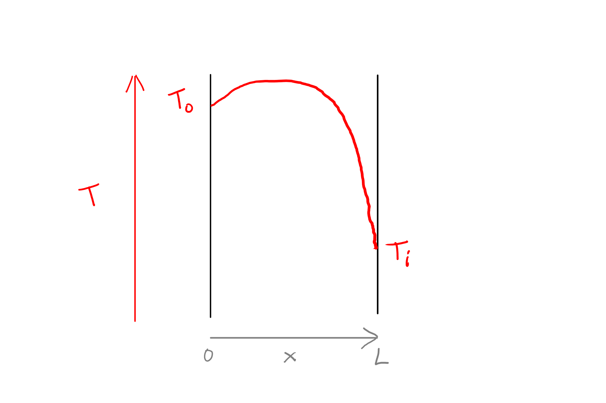
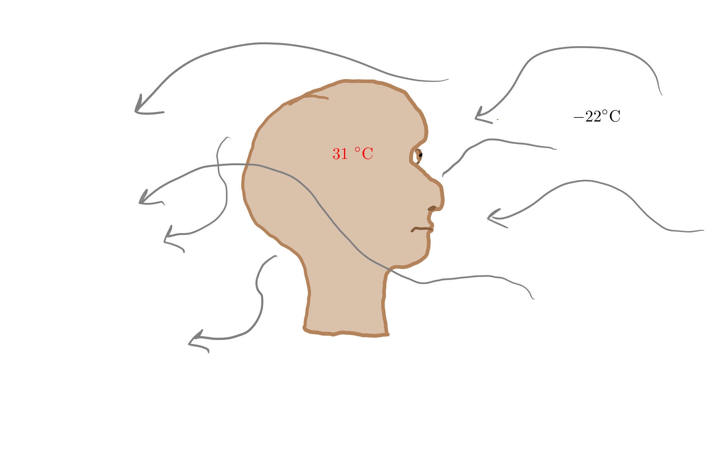
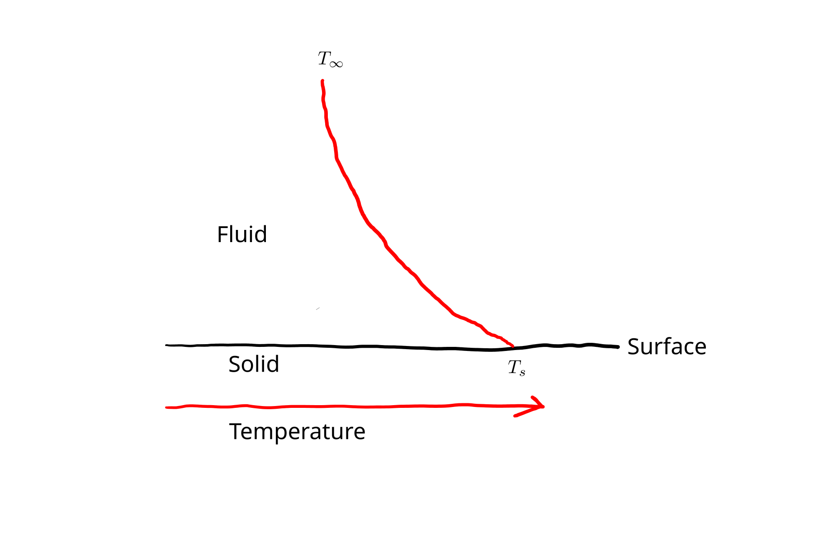
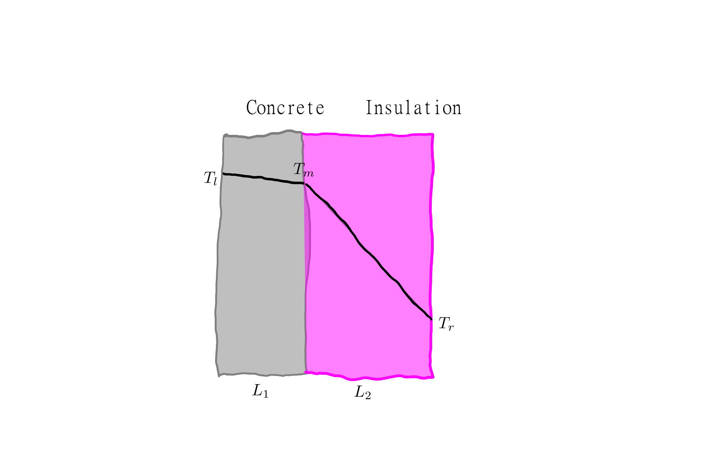
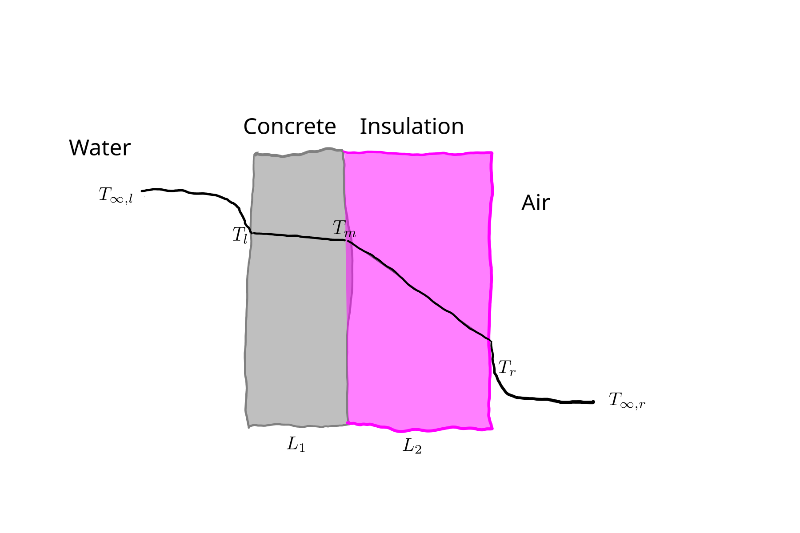
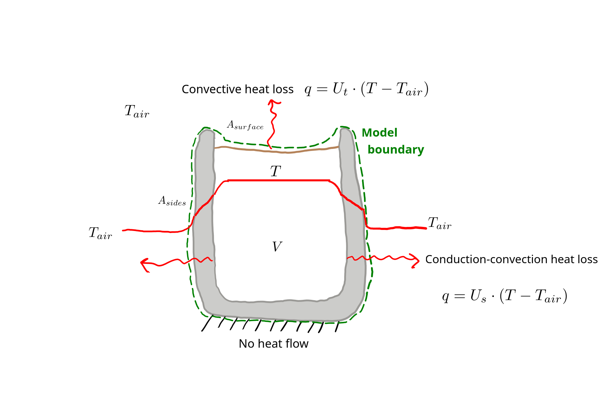

# Heat Transfer {#sec-heat}

## Introduction

Heat is a form of energy, associated with random motion of molecules or atoms.
Heat transfer is concerned with the net movement of that energy from high temperature to low.
Generally, heat transfer is associated with a temperature change, so measurement of temperature change is one way to quantify heat flow, but the change in temperature over time is also a common output from heat transfer models.

Heat transfer occurs in different ways that are modeled differently.
These are called *modes*, and we will cover the following:

* Advection, transfer of heat energy due to bulk fluid movement.
* Conduction, diffusion of heat energy through solids or fluids.
* Convection, a more empirical mode to describe heat transfer between a surface and a fluid.

From our modeling perspective, we need to recognize the relevant mode of heat transfer in order to select an appropriate constitutive equation (see @sec-constitutive for a review if needed).
There are a couple fundamental concepts we'll cover first.
For a lot more information on heat transfer, see @Bergman2013.
<!-- Heat is a form of energy.
     Temperature measures heat energy indirectly.
     Modelling temperature / energy loss means predicting rate of heat energy flow.
     Flux vs. flow, and why the distinction matters.
     Constitutive equations naturally describe flux.
     Modes: conduction, convection, advection -- operational classification of heat flow. -->

## Advection {#sec-advection}
When a fluid flows into a location originally containing fluid with a different temperature, the temperature at that location or in that volume changes.
The thermal energy has therefore changed as well.
That is advection.
It is a relatively easy process to understand and model.

Let's take a tank, for example the water tank in @fig-tank1, with a fixed volume and fixed flow rate $\dot{V}$ in and out of the tank.

{#fig-tank1 fig-alt="Sketch showing a water tank."}

If the temperature of water flowing into the tank $T_{inflow}$ differs from the current tank temperature $T_{tank}$, then $T_{tank}$ must be changing over time.
This is advection.
If $T_{inflow}$ is higher than $T_{tank}$, the tank temperature is increasing; if lower, $T_{tank}$ is decreasing.

The fundamental advection equation for heat transfer needs a *reference temperature*, which we'll call $T_{ref}$ here.
The value used will not matter in our work, because it should always cancel in our applications because our domain will have constant volume.
Advection becomes trickier when we don't have a constant volume (or mass) within our model domain or control volume.

$$
\dot{Q} = \dot{V} \cdot{\rho} \cdot c_p \cdot (T - T_{ref}),
$${#eq-advection1}

where $\dot{Q}$ is energy flow in W, $\rho=$ fluid density in $\kgpmc$, and $c_p=$ specific heat capacity ($\kJpkgpK$).
(Specific heat capacity is discussed more below in @sec-heat-link.)
That, @eq-advection1, is the fundamental constitutive equation for advection.
For our tank example, it would be applied to flow in and flow out, both based on the same constant value $\dot{V}$.
Then net energy flow would be calculated by difference, giving:

$$
\dot{Q}_{in} - \dot{Q}_{out} = \dot{V} \cdot{\rho} \cdot c_p \cdot (T_{inflow} - T_{tank}).
$${#eq-tank1}

Do you see how $T_{ref}$ drops out?

As long as density and specific heat capacity are constant (we will always assume they are in this book), we can always derive an equation for the rate of temperature change by recognizing that $dT = \frac{\dot{Q}}{\dot{V} \cdot{\rho} \cdot c_p}$.
Start with substitution: 

$$
\frac{dT}{dt} = \frac{\dot{V} \cdot{\rho} \cdot c_p \cdot (T_{inflow} - T_{tank})}{V \cdot{\rho} \cdot c_p}.
$$

Then simplify for

$$
\frac{dT}{dt} = \frac{\dot{V} \cdot (T_{inflow} - T_{tank})}{V}.
$${#eq-tank2}

Advection becomes trickier when we don't have a constant volume (or mass) within our model domain or control volume.
Fortunately, most models do, and we won't cover those other cases.

Another simple advection scenario is a shown in @fig-pipe1.

{#fig-pipe1 fig-alt="Sketch showing a fluid flowing through a constant-diameter round pipe at a constant flow rate."}

The small section at the bottom can be called a *control volume*--a hypothetical volume used for deriving flow equations.
We can treat that control volume like the tank above (@fig-tank1, @eq-tank1).
The instantaneous rate of net energy flow into the control volume by advection is: 

$$ 
\dot{Q} = \dot{V} \cdot{\rho} \cdot c_p \cdot (T_{left} - T_{right}),
$${#eq-advection2}

where $T_{left}$ and $T_{right}$ are at the boundaries of the control volume.
How about the rate of temperature change?
That is what we are really after.

$$ 
\frac{dT}{dt} = \frac{\dot{Q}}{V \cdot {\rho} \cdot c_p}
$${#eq-advection3}

Or, recognizing that $V = \Delta x \cdot A$,

$$ 
\frac{dT}{dt} = \frac{\dot{Q}}{\Delta x \cdot A \cdot {\rho} \cdot c_p}
$${#eq-advection3.5}

And we can then substitute the RHS of @eq-advection2 for $\dot{Q}$ in @eq-advection3.

$$ 
\frac{dT}{dt} = \frac{\dot{V} \cdot{\rho} \cdot c_p \cdot (T_{x=0} - T_{x=\Delta x})}{\Delta x \cdot A \cdot {\rho} \cdot c_p}
$${#eq-advection4}

And simplify @eq-advection4, recognizing that $\frac{\dot{V}}{A} = v_x =$ superficial fluid velocity:

$$ 
\frac{dT}{dt} = v_x \cdot \frac{(T_{x=0} - T_{x=\Delta x})}{\Delta x}.
$${#eq-advection5}

And that quotient on the RHS of @eq-advection5 becomes the definition of a derivative as $\Delta x$ approaches 0, so the associated ODE is:

$$ 
\frac{dT}{dt} = v_x \cdot \frac{dT}{dx}.
$${#eq-advection-ode1}

@eq-advection-ode1 is actually pretty intuitive.
It says that the rate of temperature change at a fixed location is equal to the temperature derivative over space and the rate at which fluid flows over that same space.

@eq-advection-ode1, along with @eq-advection1, will together suffice for the constitutive equations for advection in most of the systems we'll encounter in this book.
For others, derivation of an advection equation is pretty simple.

In our pipe conceptual model, we've implicitly assumed that radial position has no bearing on transfer.
In reality, 

In heat transfer models (as well as mass transfer), it is common to work with flow rates normalized by the cross-sectional area of the space through which the flow is moving, i.e., heat *flux*.
Our heat flow units are typically W and heat flow $\Wpms$.
One reason to use flux is because it gives us more general models that are easy to apply at different scales without making any changes.
For example, thinking about the second advection example above, the pipe (@fig-pipe1), does the diameter of the pipe play any role?

Well, the heat flow at one location, say $x=0$ is:

$$ 
\dot{Q}_{x=0} = \dot{V} \cdot{\rho} \cdot c_p \cdot (T_{x=0} - T_{ref}).
$${#eq-advection10}

If we divide by area $A$, 

$$ 
q_{x=0} = v_x \cdot{\rho} \cdot c_p \cdot (T_{x=0} - T_{ref}),
$${#eq-advection11}

we get an equation that does not depend on pipe size, but only the superficial fluid velocity.
So for a given velocity, the diameter is immaterial.
(Of course this is true only if our assumption about uniform radial profile, i.e., a 1D system, is accurate.)

...


((Do we need to start with integration to go from flux to dT/dt already here? Kind of have some above on advection accidentially))

## Conduction and Fourier's law {#sec-fourier}

*Conduction* is the transfer of heat through solids and fluids by random motion of molecules or atoms (electrons also play a role, at least in metals). 
It can also be called *thermal diffusion*.

The fundamental heat transfer law, the relevant constitutive equation, is called *Fourier's law*, @eq-fouriers-law1.

$$
q = -k \cdot \frac{dT}{dx}
$${#eq-fouriers-law1}

@eq-fouriers-law1 says that the heat flux in the $x$ direction is proporational to derivative of temperature with respect to $x$, or the temperature gradient.
The two--heat flux and temperature gradient--are linked through a proporationality constant called $thermal conductivity$, which typically has units of $\WpmpK$ and depends strongly on the substance through which heat is diffusing.
Thermal conductivity is high for metals (around $10^2$ $\WpmpK$), low for gases (around $10^{-1}$ $\WpmpK$, or about 1000-fold less), and somewhere in the middle for other materials.

So @eq-fouriers-law1 depends on material properties and a state variable--temperature, or more specifically, the temperature gradient.
This is a characteristic of constitutive equations.

Heat energy flows via conduction from high temperature to low temperature, and this is ensured by the negative sign in front of thermal conductivity.
That simple concept underlies a simple tool for inferring heat transfer and temperature change from temperature differences, gradients, or derivatives.

A *temperature profile* is a graphical representation of temperature over space, and it can be useful for understanding Fourier's law.
For example, @fig-wall1 shows the temperature profile of a wall with one fixed temperature at the left surface, $T_o$, where $o$ is for outside, and another at the right surface, $T_i$.
It is common to show space horizontally--here the $x$ dimension--and temperature vertically.

{#fig-wall1 fig-alt="Wall temperature profile."}

@fig-wall1 and similar simple sketches are best for one dimensional (1D) problems where the temperature varies only over one dimension and is uniform in all others. 
Here, that means that the profile for 1 mm from the bottom of the wall is the same as the one at 2 m--moving up or down has no effect on the profile.
In fact, @fig-wall1 does not really show any vertical dimension, or wall height.
The vertical position of a point on the red $T$ line shows the temperature at a particular depth in the wall.

The slope of the red line in @fig-wall1 is the derivative of temperature with respect to the $x$ dimension.
Here, because the red $T$ line is straight, the derivative is uniform with $x$, which is characteristic steady-state for plane walls.
Why?
Well, let's apply @eq-fouriers-law1.
Let's say the temperature difference is 10 $\degC$ over 0.2 m, so the average gradient is therefore 50 $\degCpm$.
And thermal conductivity is exactly 1 $\WpmpK$.
Applying @eq-fouriers-law1, the heat flux is 10 $\Wpms$ at all locations.
So for any point in the wall between $x=0$ and $x=L$, heat energy is travelling at a fixed rate to the right.

Remember the relationship between heat flux and heat flow: $\dot{Q} = A \cdot q$.
For a *plane wall* then, one with uniform cross-sectional area and thickness, the heat flow going into any control volume is exactly equal to the heat flow leaving that volume (@fig-plane-wall-flow).

{#fig-plane-wall-flow fig-alt="Wall control volume."}

OK, so what does all this mean about cases where the temperature gradient is not linear, i.e., the temperature derivative varies over space?
For example, see @fig-wall2.

Well, the nonlinear temperature profile means the temperature derivative $\frac{dT}{dx}$ is not constant over space, which means that the rate of heat transfer, the heat flux really, by convection, is not constant over space either.
At the left side, there is a *positive* temperature derivative, so the heat flux is *negative*, or to the left.
Alternatively, we can just see that the temperature is increasing from the edge in, and because heat flows from high to low temperature through conduction, heat flow must be flowing to the left.
Get used to this intuitive approach--it is helpful for model implementation, debugging, and verification.
Using the same concepts, we can see there is heat flow to the right at the right edge.
Together this means the wall must be losing heat.
It is not at steady state unless there is some source of heat within the wall.
In fact, downward curvature in a temperature profile in a plane wall can always be used to infer that a wall is either cooling or, if at steady-state, has an internal heat source.

{#fig-wall2 fig-alt="Wall temperature profile."}

With a linear profile, as in @fig-wall1, Fourier's law can be expressed as

$$
q = -k \cdot \frac{\Delta T}{L},
$${#eq-fouriers-law2}

where $\Delta T$ is the temperature difference across the wall ($T_o - T_i$) and $L$ is the wall thickness.
This works because the gradient or derivative is the same everywhere, so can be calculated from the overall difference $\Delta T$ and $L$.
For our work in this book, this is the fundamental form of Fourier's law that we will apply.
We'll see it a lot more in the following sections.

With this approach (@eq-fouriers-law2) we can also use a *resistance* concept.
We will define resistance $R$ as $\frac{L}{k}$.
For a fixed wall thickness, resistance is inversely proporational to thermal conductivity.
So the analog to @eq-fouriers-law2 is @eq-resistance1:

$$
q = \frac{\Delta T}{R}.
$${#eq-resistance1}

Note that the term resistance and the symbol can be defined for total heat flow $\dot{Q}$ instead of heat flux $q$ in other sources.
Below, we will see how the resistance approach can be used to combine resistance from multiple layers in a *composite wall*, even including convection.

## Convection and Newton's law of cooling {#sec-newtons-law}

If you are bald and go outside in Canada in the winter without covering your head (@fig-head1) the mode of heat loss that you experience is called *convection*.
The term is, unfortunately, used in some different ways, but we'll follow @bergman_introduction_2011 and use it for a combination of conduction and advection that causes heat transfer between a fluid and a surface.
Temperature gradients driving convection are commonly shown like @fig-convection-prof1.
It is common to use the symbole $T_\infty$ for the *bulk* fluid temperature, "far away" from the surface.
In practice this means far enough away to not be influenced by the surface temperature, or outside of the fluid *boundary layer*.

{#fig-head1 fig-alt="Bald person in cold wind."}

{#fig-convection-prof1 fig-alt="Thermal convection temperature profile."}

The constitutive equation for convective heat transfer is called Newton's law of cooling: 

$$
q = h \cdot (T_s - T_\infty).
$${#eq-newtons-law1}

It is a simple, phenomenological, relationship that posits that the rate of heat loss is proportional to the temperature *difference* (note that distance is not involved) between the surface temperature $T_s$ and fluid temperature $T_\infty$ and some proportionality constant $h$ called the *convection heat transfer coefficient*.
We'll often call $h$ a shorter name: convection coefficient.
It depends on the physical properties of the fluid as well as whether and how it is flowing--the speed and turbulence.
We'll use tabulated values or guesses in our work.

As with conduction, we can use a resistance-based form for Newton's law:

$$
q = \frac{T_s - T_\infty}{R}.
$${#eq-newtons-restance1}

## Resistance in series

With multiple layers in series, in a composite wall for example as in @fig-composite-wall1, the multiple layers together influence heat flow.

{#fig-composite-wall1 fig-alt="Composite wall."}

It turns out that multiple sources of resistance can easily be combined by summing resistances.
This can be shown with a little bit of simple symbolic math.
If the individual values for $k$ and $L$ are known, then the overall resistance is:

$$
R = \frac{L_1}{k_1} + \frac{L_2}{k_2} + ... \frac{L_n}{k_n}.
$${#eq-series-resistance1}

Although intermediate temperatures, like $T_m$ in @fig-composite-wall1, could be calculated, only the overall temperature difference, $\Delta T = T_l - T_r$ is needed for application of @eq-resistance1.

Looking at @eq-newtons-restance1, you might be able to see that convection and conduction together in series, as in @fig-composite-wall2, can also be combined using the same approach.

{#fig-composite-wall2 fig-alt="Composite wall with fluids."}

For example, with $n_d$ layers with conduction and $n_v$ with convection, 
$$
R = \frac{L_1}{k_1} + \frac{L_2}{k_2} + ... \frac{L_n}{k_{n_d}} + \frac{1}{h_1} + \frac{1}{h_2} + ... \frac{1}{h_{n_v}}.
$${#eq-series-resistance1}

For calculating heat flux, the overall temperature difference $\Delta T$ is *divided* by resistance $R$.
It is a matter of preference to use instead the inverse of $R$.
Of course, for a single layer, the inverse of $R$ is $\frac{k}{L}$ or $h$.
For multiple layers, the quantity is called *overall heat transfer coefficient* and the symbol $U$ is used, so,

$$
U = \frac{1}{\frac{L_1}{k_1} + \frac{L_2}{k_2} + ... \frac{L_n}{k_{n_d}} + \frac{1}{h_1} + \frac{1}{h_2} + ... \frac{1}{h_{n_v}}}.
$${#eq-series-overall-u1}

And for flux,

$$
q = U \cdot \Delta T.
$${#eq-series-flux1}

Remember that $\Delta T$ is the overall temperaure difference.
So for @fig-composite-wall2, for example, $\Delta T = T_{\infty, l} - T_{\infty, r}$.
And for @fig-composite-wall1, $\Delta T = T_{l} - T_{r}$.
Does it seem inconsistent, that both expressions could be true?
Really the two figures could be different interpretations or the same physical system.
The resolution comes from defining $U$ correctly (it is different for the two) and using the appropriate temperatures.
We could, in fact, use $\Delta T = T_{l} - T_{r}$ for the system in @fig-composite-wall2, but then (1) should not include the fluids in the calculation of $U$ and (2) must use the temperaures at the fluid/solid interfaces ($T_l$ and $T_r$) for calculating flux.
If the fluids actually do contribute significant resistance to heat flow, those interface temperatures could be quite different from the bulk fluid temperatures $T_{\infty...}$, and difficult to determine.

This general approach is quite useful and we'll use it extensively.
Remember that it is defined for steady-state conditions--otherwise we cannot assume that conduction temperature gradients are linear or really that convective heat loss is directly proportional to the temperature difference.
But the approach can still be applied to non-steady-state conditions, as long as the heat energy stored within those zones with a gradient is small compared to the overall system.

## Parameter values

In modeling, there are two ways to get parameter values: from (1) theory or (2) measurements.
For example, for the system in @fig-composite-wall2 we could use individual $k$ (from compilations by material) and $h$ (from published correlations and fluid properties) values and combine them as in @eq-series-overall-u1 to estimate $U$.
Or, we could use some measurements of heat flow and temperature to estimate best-fit or empirical parameter values.
Really the two approaches are not completely separate.
After all, the starting parameters from the theoretical approach often originally come from fitting to measurements.
For this book and course, we'll add (3) from guesses.
Using a very rough estimate based on values in @sec-parameter-values combined with a gut feeling is perfectly acceptable *for this course* and for the examples and problems in this book.

## Linking equation {#sec-heat-link}

The constitutive equations given above describe the rate of heat energy transfer.
Ultimately it is typically temperature we are interested in modeling.
And furthermore, it is temperature that determines the rate of transfer.
So we need a way of linking heat energy to temperature.
This was done above in @sec-advection, but in general is applicable to any heat transfer model.
In general,

$$
\dot{Q} = \frac{dT}{dt} \cdot c_p \cdot M,
$${#eq-cp-def}

where $M =$ the material mass and $c_p =$ specific heat capacity. 

## Phase changes

If a substance remains in a single phase, any change in thermal energy causes a change in temperature following @eq-cp-def.
But when a change, between solid, liquid, and gas, occurs, energy is consumed or released in the phase change, and does not show up in temperature.
In systems with phase changes, it is necessary to track one or more specific phases as a state variable.
We can think of the equations that relate energy transfer and phase change as linking equations.
There are only two important parameters, which are physical constants: the heat of fusion $h_f$ and heat of vaporization $k_v$, both  typically $\kJpkg$.
These constants directly link the mass-based rate of phase change to energy flow.

$$
\dot{m_m} = \frac{\dot{Q}} {h_f} 
$${eq-hf-link}

$$
\dot{m_v} = \frac{\dot{Q}} {h_v} 
$${eq-hf-link}


<!-- Specific heat capacity links energy and temperature. -->

## Example: lumped-parameter model with all modes

Let's extend our coffee model as an application of some of the concepts explored in this chapter.
@fig-coffee2modes is a revised model sketch.
Now we will explicitly consider heat loss through two different routes: the exposed coffee surface (through two fluid layers) and the mug sides (two fluids and one solid wall). 
We have a choice of using more fundamental parameter inputs or more empirical.
We'll go with the more empirical route, where only $U_t$ (t for top) and $U_s$ (s for side) are specified.

{#fig-coffee2modes fig-alt="Extended coffee model sketch."}

```{python}
#| eval: false
"""
File: cooling_mods_2m.py
Authors: Sasha D. Hafner and Frederik R. Dalby
Course: Modelling 2026

Description:
    A module with a single function implementing a numerical
    model for a cooling cup of coffee.
"""

import numpy as np
from scipy.integrate import solve_ivp

def cool(T_init, T_air, mass, area, h, time_range, dt, cp=4.2):
    """
    Simulate coffee cooling using the RK45 method in `solve_ivp()`.

    Parameters
    ----------
    T_init : float
        Initial coffee temperature (deg. C)
    T_air : float
        Ambient air temperature (deg. C)
    mass : float
        Mass of coffee (g)
    area : float
        Surface area of mug (m2)
    h : float
        Convective heat transfer coefficient (W m-2 K-1)
    time_range : tuple
        Start and end time (s), e.g. (0, 3600)
    dt : float
        Time step (s)
    cp : float, optional
        Specific heat capacity of coffee (J g-1 K-1), default 4.2

    Returns
    -------
    dict with keys 'times' (s) and 'T_coffee' (degC)
    """

    # Calculate constant, which does not change over time
    con_cool = area * h / (cp * mass)

    # Create an array of times
    times = np.arange(time_range[0], time_range[1] + dt, dt)

    # Define rates function
    def rates(t, T_current):
        return - con_cool * (T_current - T_air)

    # And use the RK45 method with solve_ivp() defaults
    res = solve_ivp(
        rates, 
        t_span=time_range, 
        y0=[T_init], 
        t_eval=times
    )

    # Return solution
    return {
        'times': res.t,
        'T_coffee': res.y[0, :],
    }

```

Then, to use the model, we first *import* the module we defined and then run the function, like this:


```{python}
"""
File: cool_pred_2m.py
Authors: Sasha D. Hafner and Frederik R. Dalby
Course: Modelling 2026

Description:
    Application of the `cool2m()` model function.
"""

import sys
sys.path.append('modules')

import cooling_mod_2m as cm

pred = cm.cool2m(
    T_init=80, 
    T_air=20, 
    mass=300, 
    area_t=0.010, 
    area_s=0.016, 
    U_t=75, 
    U_s=10, 
    time_range=(0., 60 * 60), 
    dt = 5 * 60
)

print(pred)
```


```{python}
#| label: fig-coffee-preds5
#| fig-cap: "Predicted coffee temperature using the cooling_mod_2m."

import matplotlib.pyplot as plt

plt.plot(pred['times'] / 60, pred['T_coffee'])
plt.xlabel('Time (min)')
plt.ylabel(r'Predicted coffee temperature $(^\circ\mathregular{C})$')
plt.show()
```

## Problems {.unnumbered}

1. You have a fermenter that is heated to around 45 $\degC$ using a water jacket. 
   The water flowing into the water jacket has a constant temperature of 50 $\degC$.
   Develop and implement a steady-state model to predict fermemter temperature based on heating water flow and relevant parameters and system characteristics.

2. How long will it take for an ice cube to melt once it is exposed to room temperature air?
   Follow the model formulation steps we covered in class to develop a model to simulate the processes.
   You can use an analytical or numerical approach.
   Predict the time required for melting for a couple ice cube sizes.

## References {.unnumbered}


