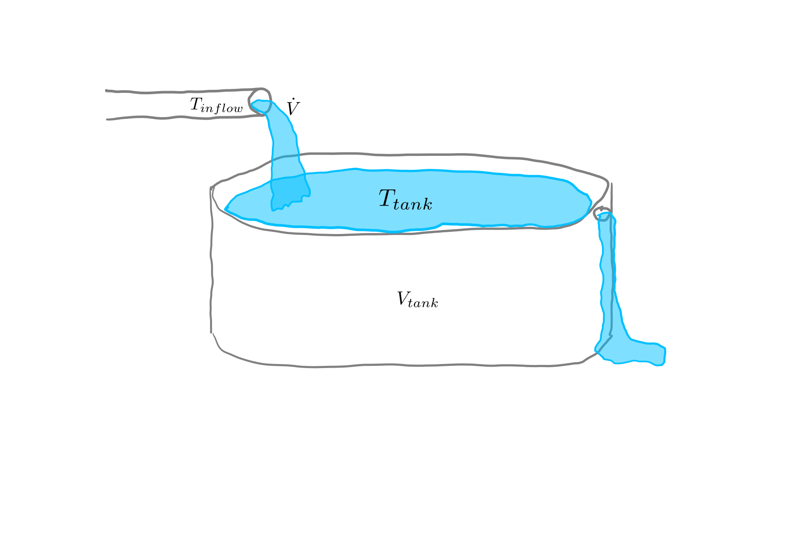
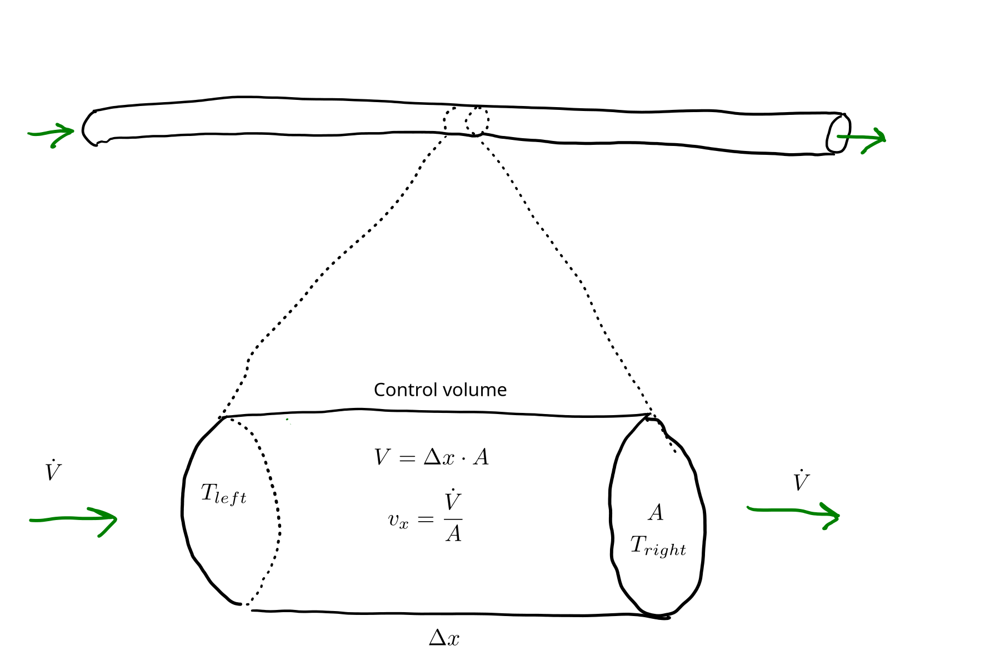
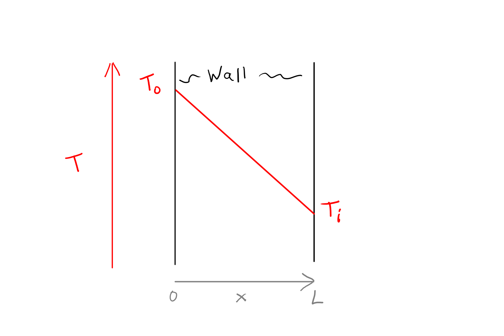

# Heat Transfer {#sec-heat}

## Introduction

Heat is a form of energy, associated with random motion of molecules or atoms.
Heat transfer is concerned with the net movement of that energy from high temperature to low.
Generally, heat transfer is associated with a temperature change, so measurement of temperature change is one way to quantify heat flow, but the change in temperature over time is also a common output from heat transfer models.

Heat transfer occurs in different ways that are modeled differently.
These are called *modes*, and we will cover the following:

* Advection, transfer of heat energy due to bulk fluid movement.
* Conduction, diffusion of heat energy through solids or fluids.
* Convection, a more empirical mode to describe heat transfer between a surface and a fluid.

From our modeling perspective, we need to recognize the relevant mode of heat transfer in order to select an appropriate constitutive equation (see @sec-constitutive for a review if needed).
There are a couple fundamental concepts we'll cover first.
For a lot more information on heat transfer, see @Bergman2013.
<!-- Heat is a form of energy.
     Temperature measures heat energy indirectly.
     Modelling temperature / energy loss means predicting rate of heat energy flow.
     Flux vs. flow, and why the distinction matters.
     Constitutive equations naturally describe flux.
     Modes: conduction, convection, advection -- operational classification of heat flow. -->

## Advection
When a fluid flows into a location originally containing fluid with a different temperature, the temperature at that location or in that volume changes.
The thermal energy has therefore changed as well.
That is advection.
It is a relatively easy process to measure and think about.

Let's take a tank, for example the water tank in @fig-tank1, with a fixed volume and fixed flow rate $\dot{V}$ in and out of the tank.

{#fig-tank1 fig-alt="Sketch showing a water tank."}

If the temperature of water flowing into the tank $T_{inflow}$ differs from the current tank temperature $T_{tank}$, then $T_{tank}$ must be changing over time.
This is advection.
If $T_{inflow}$ is higher than $T_{tank}$, the tank temperature is increasing; if lower, $T_{tank}$ is decreasing.

How about the quantitative constitutive equation?
For this tank:

$$
\text{energy transfer rate} = \dot{Q} = \dot{V} \cdot{\rho} \cdot c_p \cdot (T_{inflow} - T_{tank}),
$${#eq-tank1}

where $\dot{Q}$ is energy flow in W, $\rho=$ fluid density in $\kgpmc$, and $c_p=$ specific heat capacity ($\kJpkgpK$).

As long as density and specific heat capacity are constant (we will always assume they are in this book), we could derive an equation for the rate of temperature change by recognizing that $dT = \frac{\dot{Q}}{\dot{V} \cdot{\rho} \cdot c_p}$.
Start with substitution: 

$$
\frac{dT}{dt} = \frac{\dot{V} \cdot{\rho} \cdot c_p \cdot (T_{inflow} - T_{tank})}{V \cdot{\rho} \cdot c_p}.
$$

Then simplify for

$$
\frac{dT}{dt} = \frac{\dot{V} \cdot (T_{inflow} - T_{tank})}{V}.
$${#eq-tank2}

Advection becomes trickier when we don't have a constant volume (or mass) within our model domain or control volume.
Fortunately, most models do, and we won't cover those other cases.

Another simple advection scenario is a shown in @fig-pipe1.

{#fig-pipe1 fig-alt="Sketch showing a fluid flowing through a constant-diameter round pipe at a constant flow rate."}

The small section at the bottom can be called a *control volume*--a hypothetical volume used for deriving flow equations.
We can treat that control volume like the tank above (@fig-tank1, @eq-tank1).
The instantaneous rate of net energy flow into the control volume by advection is: 

$$ 
\dot{Q} = \dot{V} \cdot{\rho} \cdot c_p \cdot (T_{left} - T_{right}),
$${#eq-advection2}

where $T_{left}$ and $T_{right}$ are at the boundaries of the control volume.
How about the rate of temperature change?
That is what we are really after.

$$ 
\frac{dT}{dt} = \frac{\dot{Q}}{V \cdot A \cdot {\rho} \cdot c_p}
$${#eq-advection3}

And we can then substitute the RHS of @eq-advection2 for $\dot{Q}$ in @eq-advection3.

$$ 
\frac{dT}{dt} = \frac{\dot{V} \cdot{\rho} \cdot c_p \cdot (T_{left} - T_{right})}{\Delta x \cdot A \cdot {\rho} \cdot c_p}
$${#eq-advection4}

And simplify @eq-advection4, recognizing that $\frac{\dot{V}}{A} = v_x =$ superficial fluid velocity:

$$ 
\frac{dT}{dt} = v_x \cdot \frac{(T_{left} - T_{right})}{\Delta x}.
$${#eq-advection5}

And that quotient on the RHS of @eq-advection5 becomes the definition of a derivative as $\Delta x$ approaches 0, so the associated ODE is:

$$ 
\frac{dT}{dt} = v_x \cdot \frac{dT}{dx}.
$${#eq-advection-ode1}

@eq-advection-ode1, is actually pretty intuitive.
It says that the rate of temperature change at a fixed location is equal to the temperature derivative over space and the rate at which fluid flows over that same space.

@eq-advection-ode1, along with @eq-advection3 and @eq-advection5 will together suffice for the constitutive equations for advection in most of the systems we'll encounter in this book.
For others, derivation of an advection equation is pretty simple.

In our pipe conceptual model, we've implicitly assumed that radial position has no bearing on transfer.
In reality, 

## Conduction and Fourier's law {#sec-fourier}

*Conduction* is the transfer of heat through solids and fluids by random motion of molecules or atoms (electrons also play a role, at least in metals). 
It can also be called *thermal diffusion*.

Heat energy flows from high temperature to low temperature.
That simple concept underlies a simple tool for inferring heat transfer and temperature change from temperature differences, gradients, or derivatives.

A *temperature profile* is a graphical representation of temperature over space.
For example, @fig-wall1 shows the temperature profile of a wall with one fixed temperature at the left surface, $T_o$, where $o$ is for outside, and another at the right surface, $T_i$.
It is common to show space horizontally--here the $x$ dimension--and temperature vertically.

{#fig-wall1 fig-alt="Wall temperature profile."}

@fig-wall1 and similar simple sketches are best for one dimensional (1D) problems where the temperature varies only over one dimension and is uniform in all others. 
Here, that means that the profile for 1 mm from the bottom of the wall is the same as the one at 2 m--moving up or down has no effect on the profile.
In fact, @fig-wall1 does not really show any vertical dimension, or wall height.
The vertical position of a point on the red $T$ line shows the temperature at a particular depth in the wall.

The slope of the red line in @fig-wall1 is the derivative of temperature with respect to the $x$ dimension.
Here, because the red $T$ line is straight, the derivative is uniform with $x$, which is characteristic steady-state for plane walls.
These concepts are expanded below.

<!-- Derivative form and difference form.
     Thermal conductivity k is a material property.
     Occurs in solids and fluids.
     Typical k values. -->

## Convection and Newton's law of cooling {#sec-newtons-law}

<!-- Newton's law of cooling: the constitutive equation for convection.
     Overall heat transfer coefficient U. -->

## Linking equations

<!-- Specific heat capacity links energy and temperature. -->

## Example: lumped-parameter model with all modes

<!-- Single 0D example combining conduction, convection, and advection. -->
