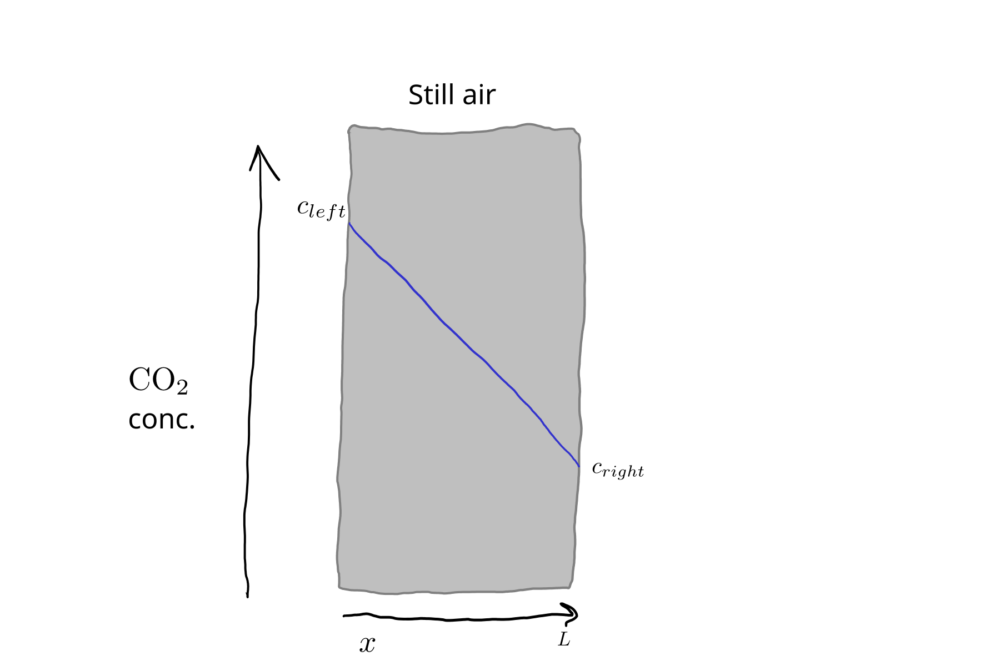
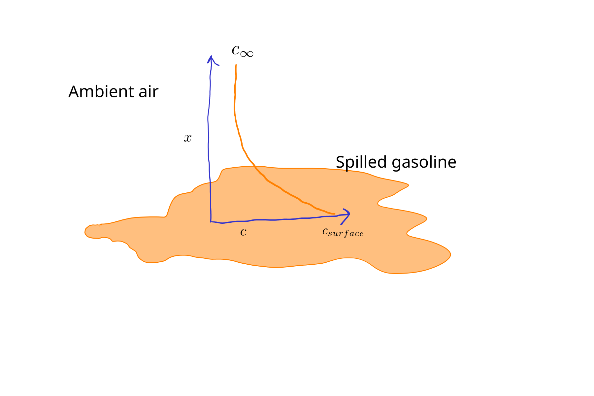
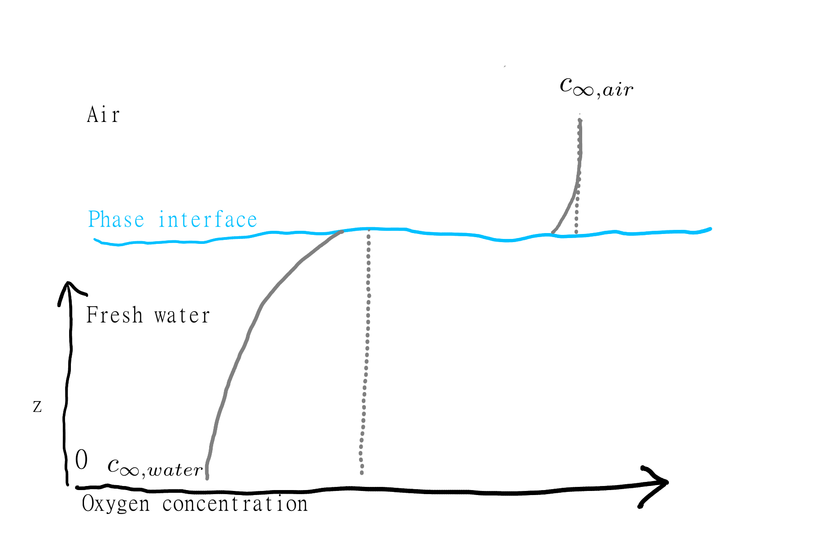

# Mass Transfer {#sec-mass}
Mass transfer occurs through similar processes as heat transfer.
In fact the mathematics of mass transfer is often based on a formal analogy with heat transfer. 
Mass transfer is simpler in some ways--in particular there is only mass, unlike heat where we have temperature and energy to think about.
But in other ways it is more complicated, especially for systems with multiple phases.
Here we'll cover advection, diffusion, and convection.

## Advection
As with heat transfer, advection describes bulk flow.
Here is a simple equation for mass flow of some solute or component present in a flowing fluid:

$$
\dot{m} = c \cdot \dot{V},
$${#eq-mass_advect_1}

where $\dot{m} =$ mass flow rate of some component ($\kgps$), $c =$ volumetric concentration of component ($\kgpmc$), and $\dot{V} =$ volumetric fluid flow rate ($\mcbps$).
Assuming we have flow in one direction in a pipe or some other system with a uniform cross-sectional area $A$, we can get flux by dividing by cross-sectional area,
$$
J = c \cdot v_x,
$${#eq-mass-advect-1}

where $\frac{\dot{V}}{A} = v_x =$ superficial fluid velocity.

For a fixed point in space, 

$$ 
\frac{dc}{dt} = v_x \cdot \frac{dc}{dx}.
$${#eq-mass-advect-ode1}

With mass, we don't have anything like the temperature vs. energy distinction.
Mass concentration gradients drive mass flow directly, altering concentrations over time.

<!-- Simple bulk flow. Include note on dispersion. -->

## Diffusion and Fick's laws {#sec-fick}

Diffusion is the term for mass transfer through random molecular or atomic movement.
Fick's law is:

$$ 
J = - D \cdot \frac{dc}{dx},
$${#eq-ficks1}

where $D$ is the diffusivity or diffusion coefficient (we will use $\msqps$, but be aware that $\mathrm{cm^{2}~s^{-1}}$ is commonly used) and $c$ is concentration ($\kgpmc$).
The minus sign indicates that flow occurs down a concentration gradient, from high to low concentration.
It is possible to do a lot with just @eq-ficks1 using numerical modeling.
Like constitutive equations in general, Fick's law includes on the RHS a material property, $D$, and a state variable, $c$.

Diffusivity is properly called a *binary* diffusion coefficient, because it depends on both materials.
For example, values of $D$ for oxygen in air and water are of course different, but so are the values for air and ethanol both in air. 
Diffusivity values vary widely; @tbl-diff-vals has *approximate* values for different media.
These can be handy for setting parameter values.

| Medium   | Approximate $D$     |                                                        
|------    |------               |
| Gases    | $10^{-5}~\msqps$    |
| Liquids  | $10^{-9}~\msqps$    |
| Polymers | $10^{-12}~\msqps$    |
| Solids   | $10^{-34}~\msqps$    |
                                                                              
: Approximate diffusivity values from @cussler_diffusion_1997 {#tbl-diff-vals}

The time derivative of concentration is the integral of @eq-ficks1, or:
$$ 
\frac{dc}{dt} = - D \cdot \frac{d^2c}{dx^2}.
$${#eq-ficks2}
This form can be used as a starting point for a numerical or analytical solution.

Mathematically and conceptually, mass diffusion is analogous to thermal conduction.
This should be clear from comparing the equations for Fick's and Fourier's laws here and in @sec-heat.
So when the concentration gradient (derivative) is linear, i.e., $\frac{dc}{dx}$ is uniform, the system is at steady-state, with constant (but not uniform) concentrations over time.
When this is the case or we can approximate reality with this simplification, a simpler expression can be used:

$$
J = -D \cdot \frac{\Delta c}{L},
$${#eq-ficks3}

where $\Delta c$ is the concentration difference across a slab or plane wall and $L$ is its thickness.
For example, take a look at @fig-CO2-wall1.

{#fig-CO2-wall1 fig-alt="CO2 profile."}

## Convection and mass transfer coefficients

Convection occurs for mass as with temperature, due to the same mechanisms.
The general constitutive equation is:

$$
J = k_c \cdot \Delta c,
$${#eq-mass-trans1}

where $k_c=$ the mass transfer convection coefficient, or the mass transfer coefficient, and $\Delta c$ = some appropriate concentration difference, e.g., from a surface into ambient air.
For an example, see @fig-gasoline1, where $\Delta c = c_{surface} - c_\infty$.
As with heat convection, the exact shape of the concentration (temperature) profile is generally unknown and not needed.
Intead, all resistance to mass transfer is lumped into a single convection coefficient $k_c$.

{#fig-gasoline1 fig-alt="Gasoline volatilization."}

The numeric values for mass transfer coefficients depend on the properties of the flowing fluid (air in @fig-gasoline1) and to a lesser degree, the transported component (here the volatile organic molecules that make up gasoline).
Various "correlations" exist for calculating approximate values, e.g., Table 8.3-2 in @cussler_diffusion_1997.
In general, higher fluid speed, more turbulence, and smaller transported molecules all mean higher mass transfer and so higher values for $k_c$.

Do you see how @eq-ficks3 and @eq-mass-trans1 essentially have the same form?
As with heat transfer, for a system at steady-state (or that can be assumed to be at steady-state) a *mass transfer coefficient approach* can be applied.
When mass transfer is controlled by diffusion, @eq-mass-trans1 can be applied with $k_c = D / L$.
So which approach should you use? 
If you know that mass transfer depends on more than just regular diffusion, it is more honest and so straightforward to use a mass transfer coefficient approach, because $k_c$ is an empirical constant that can include multiple processes.
For true diffusion, and when the concentration profile is of interest (not just mass transfer), either approach could be used, but it is more typical to use explicit diffusion and some version of Fick's law.

## Interphase mass transfer {#sec-interphase}

As with heat transfer, it is also possible to model mass transfer through multiple layers of different materials or substances. 
Unfortunately, this is where we really run into complexity. 
When different phases, e.g., water and air, are stacked together, differences in the affinity of the transported substance for each phase makes for some challenges for both understanding and modelling.

Take a look at the example in @fig-aeration1.
The discontinuity at the interface between the two phases is a defining feature of interpase mass transfer (note that interface and interphase are two different words with two different meanings!).
Thinking about *equilibrium* conditions, when a system without consumption or production is allowed to stabilize after some amount of time, can be very helpful.
In @fig-aeration1, equilibrium is shown with dotted lines.
The straight lines with $\frac{dc}{dz}$ show that there is no mass transfer--you should be able to infer this result from @eq-ficks1.
The discontinuity at the interface reflects the different affinities of water and air for oxygen.
It can also reflect the challenge of units, which is one reason units are omitted from the figure.
Oxygen is relatively insoluble in water, so even thought air is around 20% oxygen by volume, the corresponding equilibrium concentration in water is around 10 $\mgpl$ (= 10 $\gpmc$).

{#fig-aeration1 fig-alt="O2 profiles."}

The concept of an equilibrium concentration gives us a way to model mass transfer through an interface.
We can use @eq-mass-trans1 with an appropriate expression for $\Delta c$.
That is,

$$
J = k_c \cdot (c^* - c),
$${#eq-mass-interphase-trans1}

where $c^*=$ the bulk equilibrium concentration of the transported substance in phase A in phase B units, and $c=$ the bulk phase A concentration.
That seems complicated!
For our water-air system, we could have $c^*=$ 10 $\gpmc$.
This is the equilibrium concentration of oxygen in the water, which is another way of saying it is the bulk concentration of oxygen in air converted into aqueous phase units.
And $c=$ bulk concentration of oxygen in water, which could be around 5 $\gpmc$ based on the figure.
Our $k_c$ value must be consistent with the units used for the $(c^* - c)$ bit of the calculation.
Typically, the symbol $K_L$ would be used for this system.
The capital (big) $K$ indicates that this is an *overall* mass transfer coefficient, for transport through both phases, and the $_L$ bit shows that it is in liquid-phase (or more properly, aqueous phase) units.

Interphase mass transfer can be approached from a more theoretical and more complicated perspective, and it is common to calculate mass transfer coefficients based on estimates of resistance in both phases as well as the partitioning behavior of the substance being transported.
But you can do a lot with this simple explanation if you just make sure that units are consistent and for a single phase.

## Other stuff

Linking equations are generally not needed in simple mass transfer models.
It is a difference in mass concentration that drives mass transfer.

We won't get into modelling concentration profiles until the spatial sections later in this book.

## Problems{.unnumbered}

1. Fish transport dissolved oxygen from water into their bloodstream through gills.
   Early work on the topic suggests that most of the resistance for this transport comes from a film of water outside the gills. 
   An increase in water flow over gills might reduce effective film thickness from 50 down to 20 μm.

   What constitutive equations can be used to express dissolved oxygen transport in this system?
   What is the smaller corresponding mass transfer coefficient value for these conditions?
   How fast can oxygen move into the blood in for these two scenarios?
   
   If you struggle to find an appropriate value for $D$ you can use $2 \cdot 10^{-9} \msqps$.
   Bulk oxygen concentration depends on temperature and consumption rate, but you may assume it is 10 $\text{mg}~ \text{L}^{-1}$, which might be the case for cool, clean water.
   In the blood, free oxygen rapidly reacts with hemoglobin, so you can assume the dissolved oxygen concentration is zero.

2. Develop a steady-state or dynamic model for benzene volatilization from an open industrial wastewater lagoon in Python.
   You can assume a negligible bulk air concentration.
   The bulk concentration in the lagoon is 10 $\mgpl$, which corresponds to an vapor-phase equilibrium concentration of about 2 $\gpmc$ (that is based on Henry's law).
   Most of the resistance to mass transfer comes from the water.
   You can assume the overall mass transfer coefficient in air phase units, $K_G$, is 0.001 $\mps$.
   If the lagoon is 1 m deep, predict the relative daily loss with your model.

