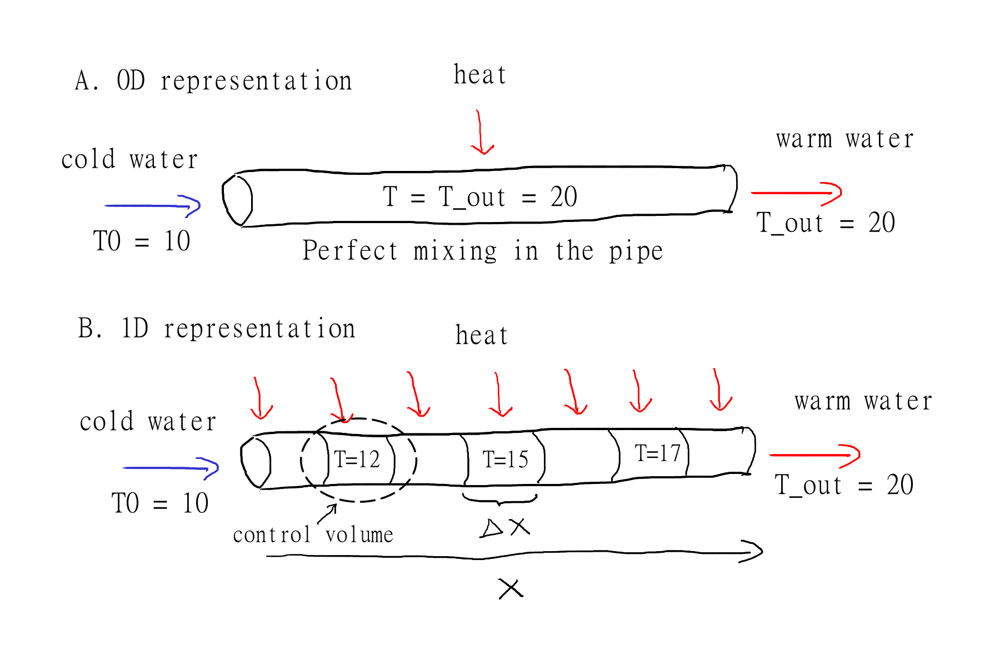
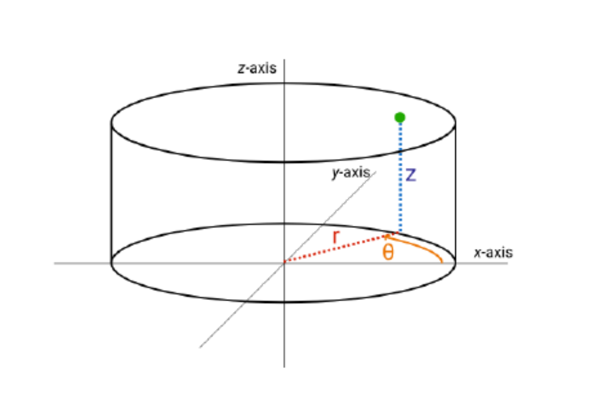
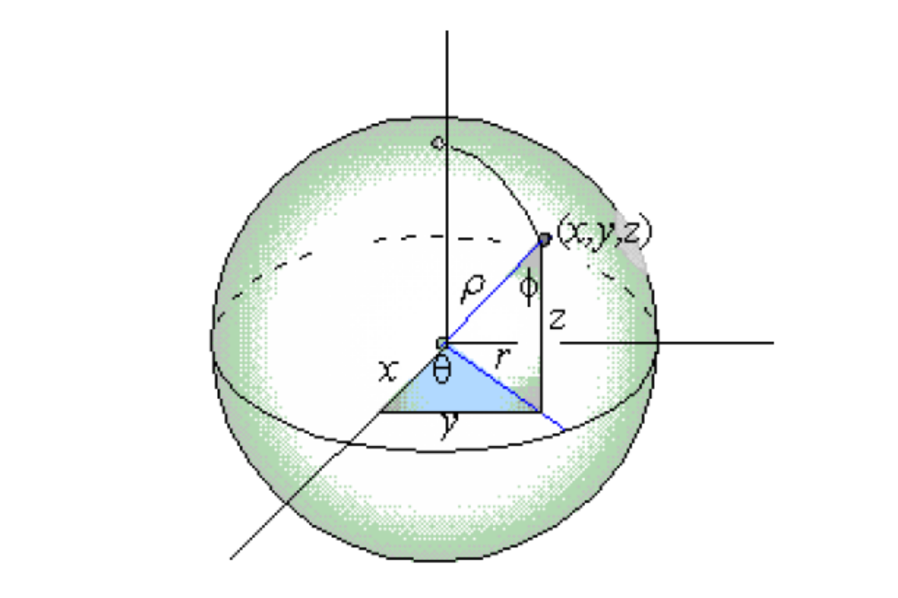

# Spatial Models {#sec-spatial}

## From 0D (lumped model) to a spatial model

So far we have dealt with 0D models (lumped-parameter models) that do not explicitly represent spatial variation. We will start from the same fundamental principles of conservation and constitutive equations, but now we will explicitly represent spatial variation in the state variable(s) and fluxes. This will lead us to partial differential equations (PDEs) that govern the system. A PDE means that the state variable is differentiated with respect to more than one independent variable; that could be time and a spatial dimension (e.g. up-down). 

Imagine we have a pipe with water flowing through it, and we want to model the temperature of the water. The incoming water is cold and the pipe is warmed by some heat source, which heats up the water inside the pipe. With a 0D model we would assume that the water is well mixed inside the entire pipe and therefore the temperature of the water would be the same everywhere @fig-pipe_discretize1 A., but in reality the fluid will have a lower temperature at the left side compared to the right side. 
{#fig-pipe_discretize1 fig-alt="Sketch showing water flowing through a constant-diameter round pipe at a constant flow rate with heat applied from outside."}. 
We will model this temperature distributed along the pipe (x dimension) by splitting the pipe into multiple control volumes @fig-pipe_discretize1 B and rather than a single conservation equation (0D), we will write a conversation equation for each control volume. 

The energy flowing in and out of a control volumes shall now be represented by two different modes of energy transport that was already touched upon in Chapter 4, that is advection and diffusion (or conduction for heat/energy diffusion). Advection is the transport of energy by the bulk movement of the fluid. Heat diffusion is the transport of energy by random molecular motion. In the case of a 0D problem we did not distinguish between these processes because diffusion was absent (perfect mixing) implicitely assuming "in" and "out" was through advection. Now it is different and a conservation equation must be made for each control volume by considering flow of energy into and out of the control volume, as well as any heat generated within the control volume. The conservation equation for a control volume can be written as:

$$
\text{accumulation} = adv_{in} + diff_{in} - adv_{out} - diff_{out}  + generated - consumed. 
$$
Earlier in Chapter 4, we already showed that advection was the product of the superficial velocity and temperature difference over the length of the control volume (gradient). We now flip the sign of the temperature difference to be consistent with the direction of flow, which gives us:
$$ 
\frac{dT}{dt} = v_x \cdot \frac{(T_{in} - T_{out})}{\Delta x} = -v_x \cdot \frac{(T_{out} - T_{in})}{\Delta x}
$$
But we still need to add diffusion. Heat diffusion in and out of the control volume can be represented by Fourier's law, $q = -k \cdot \frac{dT}{dx}$, where q is the heat flux, k is the thermal conductivity and $\frac{dT}{dx}$ is the temperature gradient. We multiply by the cross-sectional area $A$, to get total energy flow rather than flux. But we are still dealing with the difference between flux over the length ($\Delta x$) of the control volume so rather than a temperature gradient we actually need the flux gradient. Starting from @eq-advection3.5 derived in Chapter 4:
$$ 
\frac{dT}{dt} = \frac{\dot{Q}}{V \cdot {\rho} \cdot c_p} = \frac{\dot{Q}}{\Delta x \cdot A \cdot {\rho} \cdot c_p}
$$
We now rewrite the energy flow $\dot{Q}$ as the difference between the flux in and out of the control volume and substitute Fourier's law for the fluxes, multiplied with $A$, which gives us

$$ 
\frac{dT}{dt} = \frac{q_{in} \cdot A-q_{out} \cdot A}{\Delta x \cdot A \cdot {\rho} \cdot c_p} = \frac{-k \cdot \frac{dT}{dx}_{in} -(- k \cdot \frac{dT}{dx}_{out})}{\Delta x \cdot {\rho} \cdot c_p} = \frac{k}{\rho \cdot c_p} \cdot \frac{\frac{dT}{dx}_{out} - \frac{dT}{dx}_{in}}{\Delta x}
$$
Putting advection and diffusion together

$$
\frac{dT}{dt} = -v_x \cdot \frac{(T_{in} - T_{out})}{\Delta x} + \frac{k}{\rho \cdot c_p} \cdot \frac{\frac{dT}{dx}_{out} - \frac{dT}{dx}_{in}}{\Delta x}
$$
Good! we now only miss the heat generated within the control volume, which we will just call S for source (that source could represent many things, which we will get into later). The governing equation for a control volume is then

$$
\frac{dT}{dt} = -v_x \cdot \frac{(T_{in} - T_{out})}{\Delta x} + \frac{k}{\rho \cdot c_p} \cdot \frac{\frac{dT}{dx}_{out} - \frac{dT}{dx}_{in}}{\Delta x} + S
$$
Note that S is in units of temperature per time. In practice we are likely given S as some energy input $Q$ in units of (energy per time) and thus we need to divide it by $\Delta x \cdot {\rho} \cdot c_p$ to make units match.

Now we take the limit $\Delta x \rightarrow 0$ and our equation becomes a partial differential equation (PDE).

$$
\frac{dT}{dt} = -v_x \cdot \frac{\partial T}{\partial x} + \frac{k}{\rho \cdot c_p} \cdot \frac{\partial^2T}{\partial x^2} + S
$${#eq-1D_heat}

The equivalent governing PDE for a 1D mass problem is 

$$
\frac{dC}{dt} = -v_x \cdot \frac{\partial C}{\partial x} + D \cdot \frac{\partial^2C}{\partial x^2} + R
$${#eq-1D_mass}

Where $R$ denotes mass added or removed due to a reaction and $D$ is the diffusion coefficient. Note that both the mass and energy governing equations have the same form with $\frac{k}{\rho \cdot C_p}$ often referred to as the thermal diffusivity $\alpha$. 

## Coordinate systems

In @eq-1D_heat and @eq-1D_mass the Governing PDEs are derived with a single spatial dimension (x). In reality we have advection and diffusion in all three dimensions (x,y,z). For completeness we can write the 3D governing PDE for mass

$$ 
\begin{align}
\frac{dC}{dt} &= -v_x \cdot \frac{\partial C}{\partial x} - v_y \cdot \frac{\partial C}{\partial y} - v_z \cdot \frac{\partial C}{\partial z}\\
&+ D \cdot \left( \frac{\partial^2C}{\partial x^2} + \frac{\partial^2C}{\partial y^2} + \frac{\partial^2C}{\partial z^2} \right)\\
&+ R 
\end{align}
$${#eq-3D_mass}

and for energy

$$
\begin{align}
\frac{dT}{dt} &= -v_x \cdot \frac{\partial T}{\partial x} - v_y \cdot \frac{\partial T}{\partial y} - v_z \cdot \frac{\partial T}{\partial z}\\
&+ \frac{k}{\rho \cdot c_p} \cdot \left( \frac{\partial^2T}{\partial x^2} + \frac{\partial^2T}{\partial y^2} + \frac{\partial^2T}{\partial z^2} \right)\\
&+ S
\end{align}
$${#eq-3D_heat}

$v_x$, $v_y$ and $v_z$ are the velocity components in the x, y and z direction, respectively. 

We are now introducing a new term called, "coordinate system". The above equations are written in Cartesian (also called rectangular) coordinates (@fig-rectangular_coords), which is the most common coordinate system used in spatial models.

{#fig-rectangular_coords fig-alt="Sketch showing the three dimensions in cartesian coordinates (also called rectangular coordinates)"}. 

However, there are other coordinate systems that can be used depending on the geometry of the problem. For example, if we are modeling a cylindrical pipe, it might be more convenient to use cylindrical coordinates (r, $\theta$, z) instead of Cartesian coordinates (x, y, z). Or if we have a sphere, spherical coordinates are a better choice. The choice of coordinate system can simplify the equations and make them easier to solve. Below are governing equations for cylindrical and spherical coordinates are provided here

The governing equation for cylindrical coordinates for mass is

$$
\begin{align}
\frac{dC}{dt} &= -v_r \cdot \frac{\partial C}{\partial r} - v_\theta \cdot \frac{\partial C}{\partial \theta} - v_z \cdot \frac{\partial C}{\partial z}\\
& + D \cdot \left( \frac{1}{r} \cdot \frac{\partial}{\partial r} \left( r \cdot \frac{\partial C}{\partial r} \right) + \frac{1}{r^2} \cdot \frac{\partial^2C}{\partial \theta^2} + \frac{\partial^2C}{\partial z^2} \right)\\
&+ R
\end{align}
$$
and for energy 

$$
\begin{align}
\frac{dT}{dt} &= -v_r \cdot \frac{\partial T}{\partial r} - v_\theta \cdot \frac{\partial T}{\partial \theta} - v_z \cdot \frac{\partial T}{\partial z}\\
& + \frac{k}{\rho \cdot c_p} \cdot \left( \frac{1}{r} \cdot \frac{\partial}{\partial r} \left( r \cdot \frac{\partial T}{\partial r} \right) + \frac{1}{r^2} \cdot \frac{\partial^2T}{\partial \theta^2} + \frac{\partial^2T}{\partial z^2} \right)\\
& + S
\end{align}
$$#{eq-3D_cylindrical_heat}

with reference to cylindrical coordinates {#fig-cylindrical_coords fig-alt="Sketch showing the three dimensions in cylindrical coordinates"}. 

The governing equation for mass in spherical coordinates is

$$
\begin{align}
\frac{dC}{dt} &= -v_r \cdot \frac{\partial C}{\partial r} - v_\theta \cdot \frac{\partial C}{\partial \theta} - v_\phi \cdot \frac{\partial C}{\partial \phi}\\
&+ D \cdot \left( \frac{1}{r^2} \cdot \frac{\partial}{\partial r} \left( r^2 \cdot \frac{\partial C}{\partial r} \right) + \frac{1}{r^2 \cdot \sin \theta} \cdot \frac{\partial}{\partial \theta} \left( \sin \theta \cdot \frac{\partial C}{\partial \theta} \right) + \frac{1}{r^2 \cdot \sin^2 \theta} \cdot \frac{\partial^2C}{\partial \phi^2} \right)\\
&+ R
\end{align}
$$
and for energy

$$
\begin{align}
\frac{dT}{dt} &= -v_r \cdot \frac{\partial T}{\partial r} - v_\theta \cdot \frac{\partial T}{\partial \theta} - v_\phi \cdot \frac{\partial T}{\partial \phi} \\
&+ \frac{k}{\rho \cdot c_p} \cdot \left( \frac{1}{r^2} \cdot \frac{\partial}{\partial r} \left( r^2 \cdot \frac{\partial T}{\partial r} \right) + \frac{1}{r^2 \cdot \sin \theta} \cdot \frac{\partial}{\partial \theta} \left( \sin \theta \cdot \frac{\partial T}{\partial \theta} \right) + \frac{1}{r^2 \cdot \sin^2 \theta} \cdot \frac{\partial^2T}{\partial \phi^2} \right) \\
&+ S
\end{align}
$$
with reference to the spherical coordinate system {#fig-spherical_coords fig-alt="Sketch showing the three dimensions in spherical coordinates"}. 

While these equations looks quite terrifying at first, we shall now see how we can reduce complexity. This will primarily be done by eliminating dimensions that are not important for the problem and by including only modes of transfer that is relevant to our problem. 

Lets continue with the example of water being pumped through a pipe in @fig-pipe_discretization1 and assign it a cross sectional area $A$ of $0.02~m^2$ a superficial velocity, $v$, of $0.5~m~s^{-1}$, a total pipe length of $2~m$ and with heat being applied at a rate of $1000~W$ distributed on the whole pipe. 

Since a pipe is a cylinder we will choose cylindrical coordinates and start from @eq-3D_cylindrical_heat. There is flow along the length of the pipe and we are mainly interested in the development along this axis ($z$ in cylindrical coordinates, but $x$ in @fig-pipe_discretization1s). We assume that the flow is turbulent and well mixed in the radial ($r$) and angular ($\theta$) dimension. What does that imply? Well if it is well mixed, the derivate with respect to those dimensions are 0. We can therefore eliminate the terms in @eq-3D_cylindrical_heat that includes derivatives with respect to $r$ and $\theta$, because they are equal to 0. This gets us to 

$$
\frac{dT}{dt} = - v_z \cdot \frac{\partial T}{\partial z} + \frac{k}{\rho \cdot c_p}\cdot \left(\frac{\partial^2T}{\partial z^2} \right) + S
$$#{eq-3D_cylindrical_heat}

Interesting, because that looks exactly like @eq-1D_heat, which was the governing equation for 1D and rectangular coordinates (except we call the dimension $z$ rather than $x$). So we learned that the governing equations for 1D problems are similar for rectangular and cylindrical coordinates! 

We have bulk flow along the z direction (because we are given a velocity, $v$, in the problem). This corresponds to the advection term ($-v\cdot\frac{dT}{dz}$. What about diffusion? We know that diffusion always occurs, it is a law of nature that heat and mass spreads until there is no gradient. The question should rather be, is diffusion significant compared to the advection term here? We will get back to how we can estimate that, but for now we do not know, and therefore we keep the diffusion term ($\frac{k}{\rho \cdot C_p}\cdot \frac{\partial^2T}{\partial z^2}$). We also have heat being added to the system, which is the S term, but the unit is currently in $W$. We will use the linking equation from Chapter 4 to get the unit in $K s^{-1}$. We know that $C_p$ of water is $4180 \frac{J}{kg \cdot K}$ and the density $\rho$ is $1000 kg m^{-3}$. The control volume, $V$ is $A \cdot \partial z$. So from @eq-advection3 we get the S term in correct units. 

$$
\begin{align}
\frac{dT}{dt} &= \frac{\dot{Q}}{V \cdot \rho \cdot C_p}\\ 
&=\frac{1000~J~s^{-1}~}{(A\cdot \partial z) \cdot 1000 ~kg~m^{-3} \cdot 4180~J~kg^{-1}~K^{-1}}\\
&= \frac{1000 s^{-1}}{(0.02~m^2 \cdot m)\cdot 1000~m^{-3} \cdot 4180~K^{-1}}\\
&= \frac{1000~s^{-1}}{0.02\cdot 1000 \cdot 4180~K^{-1}}=0.012\cdot\frac{K}{s}
\end{align}
$$
We know the thermal conductivity of water is $0.6~W\cdot m^{-1} \cdot K^{-1}$. Then we plug into our governing equation and check that units are ok at the same time.

$$
\frac{dT}{dt}\frac{K}{s} = - 0.5\frac{m}{s} \cdot \frac{\partial T}{\partial z} \frac{K}{m} + \frac{0.6~J~s^{-1}~m^{-1}~K^{-1}}{1000~kg~m^{-3}\cdot 4180~J~kg^{-1}~K^{-1}}\cdot \left(\frac{\partial^2T}{\partial z^2}\frac{K}{m^2} \right) + 0.012\frac{K}{s}
$$
by cancelling out units we see that each term has indeed units of $K~s^{-1}$

$$
\frac{dT}{dt}\frac{K}{s} = \left(-0.5\cdot \frac{\partial T}{\partial z}\right)\frac{K}{s}
 + \left(1.435^{-7}\cdot \frac{\partial^2T}{\partial z^2}\right)\frac{K}{s} + 0.012\frac{K}{s}
$$#{eq-1D_governing}
We have now reducing our problem to 1 dimension, and kept advection, diffusion, and the source term. Finally we have estimated the thermal diffusivity, $\alpha = 1.435^{-7}~ m^2~s^{-1}$, the source term $S = 0.012~K~s^{-1}$, and checked that units match for our governing equation. 

## Method of lines and discretization

After arriving at our governing equation @eq-1D_governing we still have a PDE with the partial derivatives on the right hand side of @eq-1D_governing. To get rid of these we will need to do discretization and we will use the method of lines for that. 

<!-- Discretize space, keep time derivative continuous.
     Different schemes for spatial discretization. -->

## Nodes vs. cells

There are two main ways to develop discretized spatial models.
The *cell-based finite volume method* (FVM) uses finite layers or cells of fixed volume, with flux or flow calculated for each boundary between cells at all evaluated times.
It is easier to grasp intuitively and easier to go from the fundamental constitutive equations and conservation laws to model equations and ultimately Python code.
Boundary conditions can be implemented very intuitively.
Conservation (energy and mass) is ensured with the approach, and it is easy to check cumulative flow into or out of a domain for model verification to ensure it has been implemented correctly.
One of us (Sasha) likes FVM because it allows models to be developed completely from fundamental principles and a little thinking.

The *finite difference method* (FDM) uses nodes that represent points in space, and is implemented by discretizing a governing equation, i.e., the PDE for the state variable.
The model code can be more compact and the math simpler.
Boundary conditions utilize a construct called "ghost points", which take some care to understand and implement.
One of us (Frederik) likes FDM because it is the more sophisticated approach and provides a good basis for moving ahead to more dimensions and more challenging modeling problems. 

In this book we will introduce both, but focus on FDM.

<!-- Conceptual illustration.
     Implications at boundaries.
     Node-based: more efficient but harder to understand.
     Cell-based: easier to understand and verify.
     Book favors one approach (TBD). -->

## Flux-based vs. state-variable implementation

<!-- Analogous to the lumped-parameter choice in earlier chapters.
     Flux-based: explicitly programs constitutive equations -- more code, easier to follow.
     State-variable: implements a single GE -- compact but requires Python trickery. -->

## Boundary conditions {#sec-bcs}

<!-- Types: Dirichlet, Neumann, Robin.
     Number of BCs needed.
     Implementation: ghost points (within GE) or explicit (more code). -->

## Initial conditions

<!-- One per ODE.
     Uniform profiles are common but not required. -->

## Implementation

<!-- Start with a small number of nodes/cells.
     Show different implementation and BC approaches.
     Loops and slicing. -->

## Grid size and convergence

<!-- Grid spacing and time step have opposite effects on stability.
     Grid spacing evaluation / convergence check. -->
