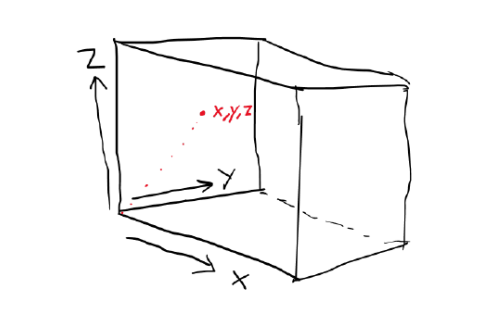
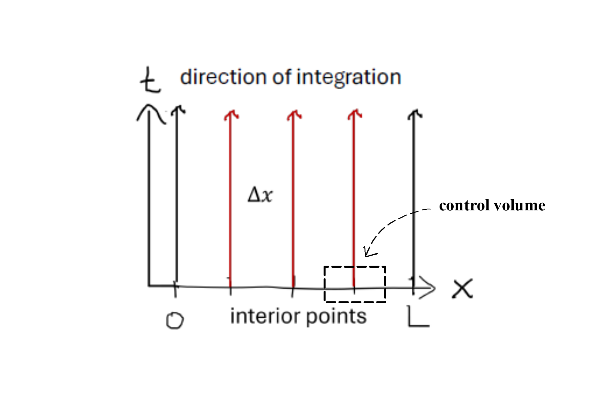

# Spatial Models {#sec-spatial}

## From 0D (lumped model) to a spatial model

So far we have dealt with 0D models (lumped-parameter models) that do not explicitly represent spatial variation. We will start from the same fundamental principles of conservation and constitutive equations, but now we will explicitly represent spatial variation in the state variable(s) and fluxes. This will lead us to partial differential equations (PDEs) that govern the system. A PDE means that the state variable is differentiated with respect to more than one independent variable; that could be time and a spatial dimension (e.g. up-down). 

Imagine we have a pipe with water flowing through it, and we want to model the temperature of the water. The incoming water is cold and the pipe is warmed by some heat source, which heats up the water inside the pipe. With a 0D model we would assume that the water is well mixed inside the entire pipe and therefore the temperature of the water would be the same everywhere @fig-pipe_discretize1 A., but in reality the fluid will have a lower temperature at the left side compared to the right side. 

{#fig-pipe_discretize1 fig-alt="Sketch showing water flowing through a constant-diameter round pipe at a constant flow rate with heat applied from outside."}. 
We will model this temperature distributed along the pipe (x dimension) by splitting the pipe into multiple control volumes @fig-pipe_discretize1 B and rather than a single conservation equation (0D), we will write a conversation equation for each control volume. 

The energy flowing in and out of a control volumes shall now be represented by two different modes of energy transport that was already touched upon in Chapter 4, that is advection and diffusion (or conduction for heat/energy diffusion). Advection is the transport of energy by the bulk movement of the fluid. Heat diffusion is the transport of energy by random molecular motion. In the case of a 0D problem we did not distinguish between these processes because diffusion was absent (perfect mixing) implicitely assuming "in" and "out" was through advection. Now it is different and a conservation equation must be made for each control volume by considering flow of energy into and out of the control volume, as well as any heat generated within the control volume. The conservation equation for a control volume can be written as:

$$
\text{accumulation} = adv_{in} + diff_{in} - adv_{out} - diff_{out}  + generated - consumed. 
$$
Earlier in Chapter 4, we already showed that advection was the product of the superficial velocity and temperature difference over the length of the control volume (gradient). We now flip the sign of the temperature difference to be consistent with the direction of flow, which gives us:
$$ 
\frac{dT}{dt} = v_x \cdot \frac{(T_{in} - T_{out})}{\Delta x} = -v_x \cdot \frac{(T_{out} - T_{in})}{\Delta x}
$$
But we still need to add diffusion. Heat diffusion in and out of the control volume can be represented by Fourier's law, $q = -k \cdot \frac{dT}{dx}$, where q is the heat flux, k is the thermal conductivity and $\frac{dT}{dx}$ is the temperature gradient. We multiply by the cross-sectional area $A$, to get total energy flow rather than flux. But we are still dealing with the difference between flux over the length ($\Delta x$) of the control volume so rather than a temperature gradient we actually need the flux gradient. Starting from @eq-advection3.5 derived in Chapter 4:
$$ 
\frac{dT}{dt} = \frac{\dot{Q}}{V \cdot {\rho} \cdot c_p} = \frac{\dot{Q}}{\Delta x \cdot A \cdot {\rho} \cdot c_p}
$$
We now rewrite the energy flow $\dot{Q}$ as the difference between the flux in and out of the control volume and substitute Fourier's law for the fluxes. Then we multiply with $A$ to go from fluxes to energy flows:

$$ 
\frac{dT}{dt} = \frac{q_{in} \cdot A-q_{out} \cdot A}{\Delta x \cdot A \cdot {\rho} \cdot c_p} = \frac{-k \cdot \frac{dT}{dx}_{in} -(- k \cdot \frac{dT}{dx}_{out})}{\Delta x \cdot {\rho} \cdot c_p} = \frac{k}{\rho \cdot c_p} \cdot \frac{\frac{dT}{dx}_{out} - \frac{dT}{dx}_{in}}{\Delta x}
$$
Putting advection and diffusion together

$$
\frac{dT}{dt} = -v_x \cdot \frac{(T_{in} - T_{out})}{\Delta x} + \frac{k}{\rho \cdot c_p} \cdot \frac{\frac{dT}{dx}_{out} - \frac{dT}{dx}_{in}}{\Delta x}
$$
Good! we now only miss the heat generated within the control volume, which we will just call S for source (that source could represent many things, which we will get into later). The governing equation for a control volume is then

$$
\frac{dT}{dt} = -v_x \cdot \frac{(T_{in} - T_{out})}{\Delta x} + \frac{k}{\rho \cdot c_p} \cdot \frac{\frac{dT}{dx}_{out} - \frac{dT}{dx}_{in}}{\Delta x} + S
$$
Note that S is in units of temperature per time. In practice we are likely given S as some energy input $Q$ in units of (energy per time) and thus we need to divide it by $\Delta x \cdot {\rho} \cdot c_p$ to make units match.

Now we take the limit $\Delta x \rightarrow 0$ and our equation becomes a partial differential equation (PDE).

$$
\frac{dT}{dt} = -v_x \cdot \frac{\partial T}{\partial x} + \frac{k}{\rho \cdot c_p} \cdot \frac{\partial^2T}{\partial x^2} + S
$${#eq-1D_heat}

The equivalent governing PDE for a 1D mass problem is 

$$
\frac{dC}{dt} = -v_x \cdot \frac{\partial C}{\partial x} + D \cdot \frac{\partial^2C}{\partial x^2} + R
$${#eq-1D_mass}

Where $R$ denotes mass added or removed (for example by reaction) and $D$ is the diffusion coefficient. Note that the mass and energy governing equations have the same general form. Sometimes $\frac{k}{\rho \cdot C_p}$ is noted as $\alpha$ - the thermal diffusivity. 

## Coordinate systems

In @eq-1D_heat and @eq-1D_mass the Governing PDEs are derived with a single spatial dimension (x). In reality we have advection and diffusion in all three dimensions (x,y,z). For completeness we can write the 3D governing PDE for mass

$$ 
\begin{align}
\frac{dC}{dt} &= -v_x \cdot \frac{\partial C}{\partial x} - v_y \cdot \frac{\partial C}{\partial y} - v_z \cdot \frac{\partial C}{\partial z}\\
&+ D \cdot \left( \frac{\partial^2C}{\partial x^2} + \frac{\partial^2C}{\partial y^2} + \frac{\partial^2C}{\partial z^2} \right)\\
&+ R 
\end{align}
$${#eq-3D_mass}

and for energy

$$
\begin{align}
\frac{dT}{dt} &= -v_x \cdot \frac{\partial T}{\partial x} - v_y \cdot \frac{\partial T}{\partial y} - v_z \cdot \frac{\partial T}{\partial z}\\
&+ \frac{k}{\rho \cdot c_p} \cdot \left( \frac{\partial^2T}{\partial x^2} + \frac{\partial^2T}{\partial y^2} + \frac{\partial^2T}{\partial z^2} \right)\\
&+ S
\end{align}
$${#eq-3D_heat}

where $v_x$, $v_y$ and $v_z$ are the velocity components in the x, y and z direction, respectively. 

We are now introducing a new term called, "coordinate system". The above equations are written in rectangular (also called cartesian) coordinates (@fig-rectangular_coords), which is the most common coordinate system used in spatial models.

{#fig-rectangular_coords fig-alt="Sketch showing the three dimensions in rectangular coordinates"}. 

However, there are other coordinate systems that can be used depending on the geometry of the problem. For example, if we are modeling a cylindrical pipe, it might be more convenient to use cylindrical coordinates (r, $\theta$, z) instead of rectangular coordinates (x, y, z). Or if we have a sphere, spherical coordinates are a better choice. The choice of coordinate system can simplify the equations and make them easier to solve. Below are governing equations for cylindrical and spherical coordinates shown.

The governing equation for cylindrical coordinates for mass is

$$
\begin{align}
\frac{dC}{dt} &= -v_r \cdot \frac{\partial C}{\partial r} - v_\theta \cdot \frac{\partial C}{\partial \theta} - v_z \cdot \frac{\partial C}{\partial z}\\
& + D \cdot \left( \frac{1}{r} \cdot \frac{\partial}{\partial r} \left( r \cdot \frac{\partial C}{\partial r} \right) + \frac{1}{r^2} \cdot \frac{\partial^2C}{\partial \theta^2} + \frac{\partial^2C}{\partial z^2} \right)\\
&+ R
\end{align}
$$
and for energy 

$$
\begin{align}
\frac{dT}{dt} &= -v_r \cdot \frac{\partial T}{\partial r} - v_\theta \cdot \frac{\partial T}{\partial \theta} - v_z \cdot \frac{\partial T}{\partial z}\\
& + \frac{k}{\rho \cdot c_p} \cdot \left( \frac{1}{r} \cdot \frac{\partial}{\partial r} \left( r \cdot \frac{\partial T}{\partial r} \right) + \frac{1}{r^2} \cdot \frac{\partial^2T}{\partial \theta^2} + \frac{\partial^2T}{\partial z^2} \right)\\
& + S
\end{align}
$${#eq-3D_cylindrical_heat}

with reference to cylindrical coordinates shown on top of a rectangular system.

{#fig-cylindrical_coords fig-alt="Sketch showing the three dimensions in cylindrical coordinates"}. 

The governing equation for mass in spherical coordinates is

$$
\begin{align}
\frac{dC}{dt} &= -v_r \cdot \frac{\partial C}{\partial r} - v_\theta \cdot \frac{\partial C}{\partial \theta} - v_\phi \cdot \frac{\partial C}{\partial \phi}\\
&+ D \cdot \left( \frac{1}{r^2} \cdot \frac{\partial}{\partial r} \left( r^2 \cdot \frac{\partial C}{\partial r} \right) + \frac{1}{r^2 \cdot \sin \theta} \cdot \frac{\partial}{\partial \theta} \left( \sin \theta \cdot \frac{\partial C}{\partial \theta} \right) + \frac{1}{r^2 \cdot \sin^2 \theta} \cdot \frac{\partial^2C}{\partial \phi^2} \right)\\
&+ R
\end{align}
$$
and for energy

$$
\begin{align}
\frac{dT}{dt} &= -v_r \cdot \frac{\partial T}{\partial r} - v_\theta \cdot \frac{\partial T}{\partial \theta} - v_\phi \cdot \frac{\partial T}{\partial \phi} \\
&+ \frac{k}{\rho \cdot c_p} \cdot \left( \frac{1}{r^2} \cdot \frac{\partial}{\partial r} \left( r^2 \cdot \frac{\partial T}{\partial r} \right) + \frac{1}{r^2 \cdot \sin \theta} \cdot \frac{\partial}{\partial \theta} \left( \sin \theta \cdot \frac{\partial T}{\partial \theta} \right) + \frac{1}{r^2 \cdot \sin^2 \theta} \cdot \frac{\partial^2T}{\partial \phi^2} \right) \\
&+ S
\end{align}
$$
with reference to the spherical coordinate system

{#fig-spherical_coords fig-alt="Sketch showing the three dimensions in spherical coordinates"}. 

While these equations looks quite terrifying at first, we shall now see how we can reduce complexity. This will primarily be done by eliminating dimensions that are not important for the problem and by including only modes of transfer that is relevant to our problem. 

Lets continue with the example of water being pumped through a pipe in @fig-pipe_discretize1 and assign it a cross sectional area, $A$, of $0.02~m^2$ a superficial velocity, $v$, of $0.5~m~s^{-1}$, a total pipe length of $2~m$ and with heat being applied at a rate of $1000~W$ distributed on the whole pipe. 

Since a pipe is a cylinder we will choose cylindrical coordinates and start from @eq-3D_cylindrical_heat. There is flow along the length of the pipe and we are mainly interested in the development along this axis ($z$ in cylindrical coordinates, but $x$ in @fig-pipe_discretization1). We assume that the flow is turbulent and well mixed in the radial ($r$) and angular ($\theta$) dimension. What does that imply? Well if it is well mixed, the derivate with respect to those dimensions are 0. We can therefore eliminate the terms in @eq-3D_cylindrical_heat that includes derivatives with respect to $r$ and $\theta$, because they are equal to 0. This gets us to 

$$
\frac{dT}{dt} = - v_z \cdot \frac{\partial T}{\partial z} + \frac{k}{\rho \cdot c_p}\cdot \left(\frac{\partial^2T}{\partial z^2} \right) + S
$${#eq-1D_cylindrical_heat}

Interesting, because that looks exactly like @eq-1D_heat, which was the governing equation for 1D and rectangular coordinates (except we call the dimension $z$ rather than $x$). So we learned that the governing equations for 1D problems are similar for rectangular and cylindrical coordinates! 

We have bulk flow along the z direction (because we are given a velocity, $v$, in the problem). This corresponds to the advection term ($-v\cdot\frac{dT}{dz}$). What about diffusion? We know that diffusion always occurs, it is a law of nature that heat and mass spreads until there is no gradient. The question should rather be, is diffusion significant compared to the advection term here? We will get back to how we can estimate that, but for now we do not know, and therefore we keep the diffusion term ($\frac{k}{\rho \cdot C_p}\cdot \frac{\partial^2T}{\partial z^2}$). We also have heat being added to the system, which is the S term, but the unit is currently in $W$. We will use the linking equation from Chapter 4 to get the unit in $K s^{-1}$. We know that $C_p$ of water is $4180 \frac{J}{kg \cdot K}$ and the density $\rho$ is $1000~kg~m^{-3}$. The control volume, $V$, is equal to $A \cdot \partial z$. So from @eq-advection3 we get the S term in correct units. 

$$
\begin{align}
\frac{dT}{dt} &= \frac{\dot{Q}}{V \cdot \rho \cdot C_p}\\ 
&=\frac{1000~J~s^{-1}~}{(A\cdot \partial z) \cdot 1000 ~kg~m^{-3} \cdot 4180~J~kg^{-1}~K^{-1}}\\
&= \frac{1000 s^{-1}}{(0.02~m^2 \cdot m)\cdot 1000~m^{-3} \cdot 4180~K^{-1}}\\
&= \frac{1000~s^{-1}}{0.02\cdot 1000 \cdot 4180~K^{-1}}=0.012\cdot\frac{K}{s}
\end{align}
$$
We know the thermal conductivity of water is $0.6~W\cdot m^{-1} \cdot K^{-1}$. Then we plug it into our governing equation and check that units are consistent at the same time.

$$
\frac{dT}{dt}\frac{K}{s} = - 0.5\frac{m}{s} \cdot \frac{\partial T}{\partial z} \frac{K}{m} + \frac{0.6~J~s^{-1}~m^{-1}~K^{-1}}{1000~kg~m^{-3}\cdot 4180~J~kg^{-1}~K^{-1}}\cdot \left(\frac{\partial^2T}{\partial z^2}\frac{K}{m^2} \right) + 0.012\frac{K}{s}
$$
by cancelling out units we see that each term has indeed units of $K~s^{-1}$

$$
\frac{dT}{dt}\frac{K}{s} = \left(-0.5\cdot \frac{\partial T}{\partial z}\right)\frac{K}{s}
 + \left(1.435^{-7}\cdot \frac{\partial^2T}{\partial z^2}\right)\frac{K}{s} + 0.012\frac{K}{s}
$${#eq-1D_governing}

We have now reduced our problem to 1 dimension, and kept advection, diffusion, and the source term. Finally we have estimated the thermal diffusivity, $\alpha = 1.435\cdot 10^{-7}~ m^2~s^{-1}$, the source term $S = 0.012~K~s^{-1}$, and checked that units match for our governing equation. 

## Method of lines and discretization

After arriving at our governing equation @eq-1D_governing we still have a PDE with the partial derivatives on the right hand side of @eq-1D_governing. To get rid of these we will need to do discretization and we will use the method of lines for that. 

With method of lines we choose to discretize the spatial derivatives and leave the time derivative as is. By discretizing we mean to approximate the derivative with a finite-difference (or similar spatial) approximation method at a fixed set of grid points that we will call "nodes". In @fig-MOL a grid with 5 nodes are shown, the distance between nodes are $\Delta x$ and we can call the space between nodes for domains. Three nodes are interior, and the two nodes at x = 0 and x = L are the boundary nodes. This converts the original PDE into a system of 5 ODEs coupled in space and evolving in time — one ODE per spatial node. The boundary nodes are at the edge of our model domain (the space over which we apply the model) and these nodes needs special attention, which we will dive into in the next section. 

There exists many alternatives to method of lines for solving PDEs numerically and some of them involve discretizing the time derivative as well. We will not do that with method of lines, but instead let standard ODE solvers (e.g. `solve_ivp()`) solve the time derivative. Now, how do these nodes relate to the control volume we discussed earlier? Here we shall imagine that a node, which is a point without any extension, represents the state of a control volume, where the control volume extends $0.5~\Delta x$ on either size of the node. Flow of mass/energy in and out of a node comes from the neighboring nodes rather than the edges of the control volumes. 

{#fig-MOL fig-alt="Sketch of grid with nodes for MOL."}
For the water flowing in a pipe problem the spatial derivatives are: $\frac{\partial T}{\partial z}$ and $\frac{\partial^2T}{\partial z^2}$. The time derivative $\frac{dT}{dt}$ is left as is. 

Remember from you numerical analysis course that finite difference could be either forward, backward or central difference, where the latter had a higher order of accuracy. Therefore we will use the finite central difference formula for the first and second derivatives. For general notation of these formulas we can write

$$
f'(x) = \frac{f(x + \Delta x) - f(x - \Delta x)}{2 \cdot \Delta x}
$${#eq-central_diff}

$$
f''(x) = \frac{f(x + \Delta x) - 2 \cdot f(x) + f(x - \Delta x)}{\Delta x^2}
$${#eq-central_diff2}

Sometimes $h$ is used to denote the step size ($\Delta x$), but this can be confusing if we are also discussing concepts related to the time step (where h is also frequently used). Now we can substitute @eq-central_diff and @eq-central_diff2 into @eq-1D_cylindrical_heat. We must remember to switch to the correct state variable and space derivative (T and z for our problem). This gives us: 

$$
\begin{align}
\frac{dT}{dt} = &- v_z \cdot \frac{T(z + \Delta z) - T(z - \Delta z)}{2 \cdot \Delta z}\\
&+ \frac{k}{\rho \cdot c_p}\cdot \left(\frac{T(z + \Delta z) - 2 \cdot T(z) + T(z - \Delta z)}{\Delta z^2} \right)\\
&+ S
\end{align}
$$

Note that S, having no spatial derivative, passes through the discretization unchanged and is simply evaluated at each node.

If we apply our problem to only 5 nodes like in @fig-MOL we should end up with 5 ODEs right? But we run into a problem at the boundary nodes, because our discretization involves nodes that are outside our grid! Therefore the boundary nodes should be handled differently and exactly how depends on the boundary conditions of our problem. We will discuss boundary conditions in depth in the next section, but for now lets assume that the temperature is always 10 $\degC$ at the left boundary (index 0). Because this is meant as a demonstration to how the ODEs are linked we will for simplicity remove advection and source terms. Remember the pipe is 2 m long, and 5 nodes means we must have one less domain, so $\Delta z = 2~m/(5~nodes - 1) = 0.5~m$. We write ODEs for the interior nodes first:  

$$
\begin{align}
&\frac{dT(0.5)}{dt} = \alpha \cdot\frac{T(0.5 + 0.5) - 2 \cdot T(0.5) + \color{red}{T(0.5 - 0.5)}}{0.5^2}\\
&\frac{dT(1.0)}{dt} = \alpha \cdot\frac{T(1.0 + 0.5) - 2 \cdot T(1.0) + T(1.0 - 0.5)}{0.5^2}\\
&\frac{dT(1.5)}{dt} = \alpha \cdot\frac{\color{red}{T(1.5 + 0.5)} - 2 \cdot T(1.5) + T(1.5 - 0.5)}{0.5^2}\\
\end{align}
$$
The terms written in red refers to the state variable at the boundaries. We assumed that $T = 10  \degC$ at any time at the left boundary. This implies that the $\frac{dT(0.0)}{dt} = 0$, because the temperature never changes here (it is always $10 \degC$). For the right end we did not specify anything, because the temperature here will be determined by how the ODE system evolves in time and space. But we need to change the central difference to a backward difference formula instead, since we otherwise have to use a node that is $\Delta z$ outside our model domain! The general formula for backward difference of the second derivative is:

$$
f''(x) = \frac{f(x) - 2 \cdot f(x-\Delta x) + f(x -2\cdot \Delta x)}{\Delta x^2}
$$

OK. Now we can put the information together write ODEs for the boundary nodes as well as information about the boundary conditions:

$$
\begin{align}
&\frac{dT(0.0)}{dt} = \color{red}{0}\\
&\frac{dT(0.5)}{dt} = \alpha \cdot\frac{T(0.5 + 0.5) - 2 \cdot T(0.5) + \color{red}{10}}{0.5^2}\\
&\frac{dT(1.0)}{dt} = \alpha \cdot\frac{T(1.0 + 0.5) - 2 \cdot T(1.0) + T(1.0 - 0.5)}{0.5^2}\\
&\frac{dT(1.5)}{dt} = \alpha \cdot\frac{T(1.5 + 0.5) - 2 \cdot T(1.5) + T(1.5 - 0.5)}{0.5^2}\\
&\frac{dT(2.0)}{dt} = \alpha \cdot\frac{T(2.0) - 2 \cdot T(2.0 - 0.5) + T(2.0 -2\cdot 0.5)}{0.5^2}
\end{align}
$${#eq-fiveODE}

This gives us the 5 coupled ODEs and with information about boundary conditions included in red.
Since we simplified the example by removing advection, we would need to apply finite difference formulas for the first derivative as well to solve the real problem. In @Appendix_FDM a complete overview of the finite difference formulas (backward, forward, central) are given for the first and second derivatives. 

Lets now go to python to encode and solve the ODE system in @eq-fiveODE. We want to see something happening
so lets assume that the water is $0 \degC$ everywhere to stat with, except at the left side ($10 \degC$).
We will run the simulation for 10 minutes.

```{python}
# we need the following libraries
import numpy as np
import matplotlib.pyplot as plt
from scipy.integrate import solve_ivp

# first we define the model domain
L = 2 # m, length of pipe
dz = 0.5 # m, step size in z dimension

# now we make the grid
z_grid = np.arange(0, L + dz, dz)

# check length, which should be 5
print(len(z_grid))

# Other constants
k = 0.6 # W/(m K)
Cp = 4180 # J/(kg K)
rho = 1000 # kg/m3
alpha = k/(rho * Cp) # m2/s

# now we make a function that shall return the derivatives to solve_ivp
# in numerical analysis course we called it the "rates" function. 

def rates(t, y, alpha, z_grid, dz):
  # our state variable is temperature, but it is passed as "y"
  # so we could for easier interpretation do
  T = y
  
  # we need one ODE for each node. 
  # we will initiate them as all being = 0 and then modify after
  dTdt = np.zeros(len(z_grid))
  
  # for the left boundary we had dTdt = 0, so this one is OK already
  # But we can be explicit about it like below
  dTdt[0] = 0
  
  # for the interior nodes we can use a for loop
  for i in range(1, len(dTdt)-1):
    # now we write the general equation
    dTdt[i] = alpha * (T[i+1] - 2*T[i] + T[i-1])/(dz**2)
    
  # for the right boundary we use the backward difference formula
  dTdt[-1] = alpha * (T[-1] - 2 * T[-2] + T[-3])/(dz**2)
  
  # then return dTdt to solver
  return dTdt

# before calling solve_ivp, we need to specificy the initial conditions

# We have 5 ODEs so we need five initial conditions.
# the temperature is 0 everywhere except at the left side it is 10.
T0 = np.full(len(z_grid), 0)
T0[0] = 10

# Now we can call the solver, but we also need to specify the simulation time
# units of our system is in seconds, so 10 min = 600 seconds
tmax = 600
out = solve_ivp(rates, t_span = [0, tmax], 
                y0 = T0, method = "LSODA", 
                t_eval = np.arange(0, tmax, 0.1), 
                args = (alpha, z_grid, dz))

# the output should contain solutions of 5 ODEs 
# So when we want to plot, we need to know which spatial node (point in space)
# we are interested in. We might be interested in the temperature of the water 
# when it comes out of the pipe. That would be the solution of the last ODE. 
# We can access that like this:
end_point_temp = out.y[-1,:]

# then plot it
plt.plot(out.t, end_point_temp, label = "end of pipe")
plt.xlabel('Time, seconds')
plt.ylabel('Temperature, deg C')
plt.show()
```

So the plot tells us that the temperature in the end of the pipe almost does not change (see y-axis 1e-11). This is not so strange because we only have heat transferred by conduction (from left) in the code, and we have not included the heat source (S) either. This hints to us that heat transfer by conduction is probably not so important in our case, but lets first try and implement advection and the source term as well. We will reduce simulation time to 20 seconds, which should be long enough to reach a steady state with a velocity of 0.5 m/s in a pipe that is only 2 m long. 

However! For the advection term we would now be tempted to use central difference discretization in the interior nodes, simply because we know it has a higher order of accuracy than backward and forward difference. But here is a special case. For advection, which is a unidirectional phenomenon we must NEVER use information from downwind nodes to approximate the derivative (which is what central difference does). This will cause the solution to oscillate or be unstable, a topic that will be dealt more with in a later chapter. So we must in this case use backward difference to avoid that. 

```{python}
# we need the following libraries
import numpy as np
import matplotlib.pyplot as plt
from scipy.integrate import solve_ivp

L = 2 # m, length of pipe
dz = 0.5
z_grid = np.arange(0, L + dz, dz)

k = 0.6 # W/(m K)
Cp = 4180 # J/(kg K)
rho = 1000 # kg/m3
alpha = k/(rho * Cp) # m2/s
# need velocity for advection and source 
v = 0.5 # m/s
S = 0.012 # K/s

def rates(t, y, alpha, v, S, z_grid, dz):

  T = y
  dTdt = np.zeros(len(z_grid))
  dTdt[0] = 0

  for i in range(1, len(dTdt)-1):
    # we now add the advection and source term to the governing equation here
    # for advection we will use backward difference (even in interior points)
    # still central difference for the conduction.
    dTdt[i] = alpha * (T[i+1] - 2*T[i] + T[i-1])/(dz**2) - v*(T[i] - T[i-1])/dz + S
    
  # for the right boundary we use the backward difference formula 
  # for both conduction and advection terms
  dTdt[-1] = alpha * (T[-1] - 2 * T[-2] + T[-3])/(dz**2) - v*(T[-1] - T[-2])/dz + S
  
  return dTdt

T0 = np.full(len(z_grid), 0)
T0[0] = 10

tmax = 20
out = solve_ivp(rates, t_span = [0, tmax], 
                y0 = T0, method = "LSODA", 
                t_eval = np.arange(0, tmax, 0.01), 
                args = (alpha, v, S, z_grid, dz))

end_point_temp = out.y[-1,:]

plt.plot(out.t, end_point_temp, label = "end of pipe")
plt.xlabel('Time, seconds')
plt.ylabel('Temperature, deg C')
plt.show()

# Is the heat source increasing the temperature over 10 deg C? 
print(f"The temperature at the outlet ends at {end_point_temp[-1]} deg C")
```

The temperature at the end of the pipe stabilize around $10 \degC$ after ~11 seconds. Se see that the heat source only increases the temperature by $~0.05 \degC$. So a much stronger heat source would be needed to get to the $20 \degC$ in @fig-pipe_discretize1  This implies that the source terms is not nearly strong enough to heat the water which is continuously being replaced with incoming $10 \degC$ water. Try to increase the Source term yourself to reach an outlet temperature of $20 \degC$.  

## Boundary and initial conditions


## Nodes vs. cells

There are two main ways to develop discretized spatial models.
The *cell-based finite volume method* (FVM) uses finite layers or cells of fixed volume, with flux or flow calculated for each boundary between cells at all evaluated times.
It is easier to grasp intuitively and easier to go from the fundamental constitutive equations and conservation laws to model equations and ultimately Python code.
Boundary conditions can be implemented very intuitively.
Conservation (energy and mass) is ensured with the approach, and it is easy to check cumulative flow into or out of a domain for model verification to ensure it has been implemented correctly.
One of us (Sasha) likes FVM because it allows models to be developed completely from fundamental principles and a little thinking.

The *finite difference method* (FDM) uses nodes that represent points in space, and is implemented by discretizing a governing equation, i.e., the PDE for the state variable.
The model code can be more compact and the math simpler.
Boundary conditions utilize a construct called "ghost points", which take some care to understand and implement.
One of us (Frederik) likes FDM because it is the more sophisticated approach and provides a good basis for moving ahead to more dimensions and more challenging modeling problems. 

In this book we will introduce both, but focus on FDM.


<!-- Conceptual illustration.
     Implications at boundaries.
     Node-based: more efficient but harder to understand.
     Cell-based: easier to understand and verify.
     Book favors one approach (TBD). -->

## Flux-based vs. state-variable implementation

<!-- Analogous to the lumped-parameter choice in earlier chapters.
     Flux-based: explicitly programs constitutive equations -- more code, easier to follow.
     State-variable: implements a single GE -- compact but requires Python trickery. -->

## Boundary conditions {#sec-bcs}

<!-- Types: Dirichlet, Neumann, Robin.
     Number of BCs needed.
     Implementation: ghost points (within GE) or explicit (more code). -->

## Initial conditions

<!-- One per ODE.
     Uniform profiles are common but not required. -->

## Implementation

<!-- Start with a small number of nodes/cells.
     Show different implementation and BC approaches.
     Loops and slicing. -->

## Grid size and convergence

<!-- Grid spacing and time step have opposite effects on stability.
     Grid spacing evaluation / convergence check. -->
