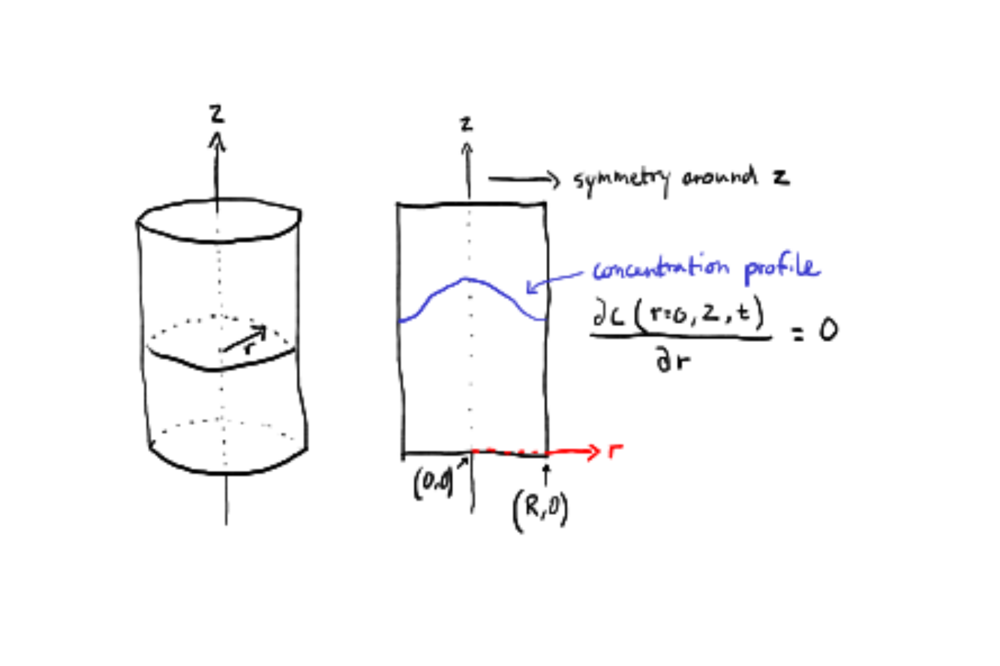

# Spatial Models {#sec-spatial}

## From 0D (lumped model) to a spatial model

So far we have dealt with 0D models (lumped-parameter models) that do
not explicitly represent spatial variation. We will start from the same
fundamental principles of conservation and constitutive equations, but
now we will explicitly represent spatial variation in the state
variable(s) and fluxes. This will lead us to partial differential
equations (PDEs) that govern the system. A PDE means that the state
variable is differentiated with respect to more than one independent
variable; that could be time and a spatial dimension (e.g. up-down).
When we are dealing with a PDE, the derivatives are "partial", and
therefore we will change notation from the classic $\frac{dC}{dt}$ to
$\frac{\partial C}{\partial t}$. From the $\partial$, it is indicated
that derivatives with respect to more than one independent variable
appears in the equation.

Lets start with an example where we have a pipe with water flowing
through it. Now we want to model the temperature of the water. The
incoming water is cold and the pipe is warmed by some heat source. With
a 0D model we would assume that the water is well mixed inside the
entire pipe and therefore that the temperature of the water would be the
same everywhere in @fig-pipedisc A. In reality the fluid will have a
lower temperature at the left side compared to the right side.

{#fig-pipedisc
fig-alt="Sketch showing water flowing through a constant-diameter round pipe at a constant flow rate with heat applied from outside."}

We will model this temperature distributed along the pipe (x dimension)
by splitting the pipe into multiple control volumes @fig-pipedisc B and
rather than a single conservation equation (0D), we will write a
conversation equation for each control volume.

The energy flowing in and out of a control volumes shall now be
represented by two different modes of energy transport that was already
touched upon in Chapter 4, that is advection and diffusion (or
conduction for heat/energy diffusion). Advection is the transport of
energy by the bulk movement of the fluid. Heat diffusion is the
transport of energy by random molecular motion. In the case of a 0D
problem we did not distinguish between these processes because diffusion
was absent (perfect mixing) implicitely assuming "in" and "out" was
through advection. Now it is different and a conservation equation must
be made for each control volume by considering flow of energy into and
out of the control volume, as well as any heat generated within the
control volume. The conservation equation for a control volume can be
written as:

$$
\text{accumulation} = adv_{in} + diff_{in} - adv_{out} - diff_{out}  + generated - consumed. 
$$ Earlier in Chapter 4, we already showed that advection was the
product of the superficial velocity and temperature difference over the
length of the control volume (gradient). We now flip the sign of the
temperature difference to be consistent with the direction of flow,
which gives us: $$ 
\frac{\partial T}{\partial t} = v_x \cdot \frac{(T_{in} - T_{out})}{\Delta x} = -v_x \cdot \frac{(T_{out} - T_{in})}{\Delta x}
$$ But we still need to add diffusion. Heat diffusion in and out of the
control volume can be represented by Fourier's law,
$q = -k \cdot \frac{dT}{dx}$, where q is the heat flux, k is the thermal
conductivity and $\frac{dT}{dx}$ is the temperature gradient. We
multiply by the cross-sectional area $A$, to get total energy flow
rather than flux. But we are still dealing with the difference between
flux over the length ($\Delta x$) of the control volume so rather than a
temperature gradient we actually need the flux gradient. Starting from
@eq-advection3.5 derived in Chapter 4: $$ 
\frac{\partial T}{\partial t} = \frac{\dot{Q}}{V \cdot {\rho} \cdot c_p} = \frac{\dot{Q}}{\Delta x \cdot A \cdot {\rho} \cdot c_p}
$$ We now rewrite the energy flow $\dot{Q}$ as the difference between
the flux in and out of the control volume and substitute Fourier's law
for the fluxes. Then we multiply with $A$ to go from fluxes to energy
flows:

$$ 
\frac{\partial T}{\partial t} = \frac{q_{in} \cdot A-q_{out} \cdot A}{\Delta x \cdot A \cdot {\rho} \cdot c_p} = \frac{-k \cdot \frac{dT}{dx}_{in} -(- k \cdot \frac{dT}{dx}_{out})}{\Delta x \cdot {\rho} \cdot c_p} = \frac{k}{\rho \cdot c_p} \cdot \frac{\frac{dT}{dx}_{out} - \frac{dT}{dx}_{in}}{\Delta x}
$$ Putting advection and diffusion together

$$
\frac{\partial T}{\partial t} = -v_x \cdot \frac{(T_{in} - T_{out})}{\Delta x} + \frac{k}{\rho \cdot c_p} \cdot \frac{\frac{dT}{dx}_{out} - \frac{dT}{dx}_{in}}{\Delta x}
$$ Good! we now only miss the heat generated within the control volume,
which we will just call S for source (that source could represent many
things, which we will get into later). The governing equation for a
control volume is then

$$
\frac{\partial T}{\partial t} = -v_x \cdot \frac{(T_{in} - T_{out})}{\Delta x} + \frac{k}{\rho \cdot c_p} \cdot \frac{\frac{dT}{dx}_{out} - \frac{dT}{dx}_{in}}{\Delta x} + S
$$ Note that S is in units of temperature per time. In practice we are
likely given S as some energy input $Q$ in units of (energy per time)
and thus we need to divide it by $\Delta x \cdot {\rho} \cdot c_p$ to
make units match.

Now we take the limit $\Delta x \rightarrow 0$ and our equation becomes
a partial differential equation (PDE).

$$
\frac{\partial T}{\partial t} = -v_x \cdot \frac{\partial T}{\partial x} + \frac{k}{\rho \cdot c_p} \cdot \frac{\partial^2T}{\partial x^2} + S
$$ {#eq-1D_heat}

The equivalent governing PDE for a 1D mass problem is

$$
\frac{\partial C}{\partial t} = -v_x \cdot \frac{\partial C}{\partial x} + D \cdot \frac{\partial^2C}{\partial x^2} + R
$$ {#eq-1D_mass}

Where $R$ denotes mass added or removed (for example by reaction) and
$D$ is the diffusion coefficient. Note that the mass and energy
governing equations have the same general form. Sometimes
$\frac{k}{\rho \cdot C_p}$ is noted as $\alpha$ - the thermal
diffusivity.

## Coordinate systems

In @eq-1D_heat and @eq-1D_mass the Governing PDEs are derived with a
single spatial dimension (x). In reality we have advection and diffusion
in all three dimensions (x,y,z). For completeness we can write the 3D
governing PDE for mass

$$ 
\begin{align}
\frac{\partial C}{\partial t} &= -v_x \cdot \frac{\partial C}{\partial x} - v_y \cdot \frac{\partial C}{\partial y} - v_z \cdot \frac{\partial C}{\partial z}\\
&+ D \cdot \left( \frac{\partial^2C}{\partial x^2} + \frac{\partial^2C}{\partial y^2} + \frac{\partial^2C}{\partial z^2} \right)\\
&+ R 
\end{align}
$$ {#eq-3D_mass}

and for energy

$$
\begin{align}
\frac{\partial T}{\partial t} &= -v_x \cdot \frac{\partial T}{\partial x} - v_y \cdot \frac{\partial T}{\partial y} - v_z \cdot \frac{\partial T}{\partial z}\\
&+ \frac{k}{\rho \cdot c_p} \cdot \left( \frac{\partial^2T}{\partial x^2} + \frac{\partial^2T}{\partial y^2} + \frac{\partial^2T}{\partial z^2} \right)\\
&+ S
\end{align}
$$ {#eq-3D_heat}

where $v_x$, $v_y$ and $v_z$ are the velocity components in the x, y and
z direction, respectively.

We are now introducing a new term called, "coordinate system". The above
equations are written in rectangular (also called cartesian) coordinates
(@fig-rect), which is the most common coordinate system used in spatial
models.

{#fig-rect
fig-alt="Sketch showing the three dimensions in rectangular coordinates"}

However, there are other coordinate systems that can be used depending
on the geometry of the problem. For example, if we are modeling a
cylindrical pipe, it might be more convenient to use cylindrical
coordinates (r, $\theta$, z) instead of rectangular coordinates (x, y,
z). Or if we have a sphere, spherical coordinates are a better choice.
The choice of coordinate system can simplify the equations and make them
easier to solve. Below are governing equations for cylindrical and
spherical coordinates shown.

The governing equation for cylindrical coordinates for mass is

$$
\begin{align}
\frac{\partial C}{\partial t} &= -v_r \cdot \frac{\partial C}{\partial r} - v_\theta \cdot \frac{\partial C}{\partial \theta} - v_z \cdot \frac{\partial C}{\partial z}\\
& + D \cdot \left( \frac{1}{r} \cdot \frac{\partial}{\partial r} \left( r \cdot \frac{\partial C}{\partial r} \right) + \frac{1}{r^2} \cdot \frac{\partial^2C}{\partial \theta^2} + \frac{\partial^2C}{\partial z^2} \right)\\
&+ R
\end{align}
$$ and for energy

$$
\begin{align}
\frac{\partial T}{\partial t} &= -v_r \cdot \frac{\partial T}{\partial r} - v_\theta \cdot \frac{\partial T}{\partial \theta} - v_z \cdot \frac{\partial T}{\partial z}\\
& + \frac{k}{\rho \cdot c_p} \cdot \left( \frac{1}{r} \cdot \frac{\partial}{\partial r} \left( r \cdot \frac{\partial T}{\partial r} \right) + \frac{1}{r^2} \cdot \frac{\partial^2T}{\partial \theta^2} + \frac{\partial^2T}{\partial z^2} \right)\\
& + S
\end{align}
$$ {#eq-3D_cylindrical_heat}

with reference to cylindrical coordinates shown on top of a rectangular
system in @fig-cyl.

{#fig-cyl
fig-alt="Sketch showing the three dimensions in cylindrical coordinates"}

The governing equation for mass in spherical coordinates is

$$
\begin{align}
\frac{\partial C}{\partial t} &= -v_r \cdot \frac{\partial C}{\partial r} - v_\theta \cdot \frac{\partial C}{\partial \theta} - v_\phi \cdot \frac{\partial C}{\partial \phi}\\
&+ D \cdot \left( \frac{1}{r^2} \cdot \frac{\partial}{\partial r} \left( r^2 \cdot \frac{\partial C}{\partial r} \right) + \frac{1}{r^2 \cdot \sin \theta} \cdot \frac{\partial}{\partial \theta} \left( \sin \theta \cdot \frac{\partial C}{\partial \theta} \right) + \frac{1}{r^2 \cdot \sin^2 \theta} \cdot \frac{\partial^2C}{\partial \phi^2} \right)\\
&+ R
\end{align}
$$ and for energy

$$
\begin{align}
\frac{\partial T}{\partial t} &= -v_r \cdot \frac{\partial T}{\partial r} - v_\theta \cdot \frac{\partial T}{\partial \theta} - v_\phi \cdot \frac{\partial T}{\partial \phi} \\
&+ \frac{k}{\rho \cdot c_p} \cdot \left( \frac{1}{r^2} \cdot \frac{\partial}{\partial r} \left( r^2 \cdot \frac{\partial T}{\partial r} \right) + \frac{1}{r^2 \cdot \sin \theta} \cdot \frac{\partial}{\partial \theta} \left( \sin \theta \cdot \frac{\partial T}{\partial \theta} \right) + \frac{1}{r^2 \cdot \sin^2 \theta} \cdot \frac{\partial^2T}{\partial \phi^2} \right) \\
&+ S
\end{align}
$$ with reference to the spherical coordinate system in @fig-sphere.

{#fig-sphere
fig-alt="Sketch showing the three dimensions in spherical coordinates"}

While these equations looks quite terrifying at first, we shall now see
how we can reduce complexity. This will primarily be done by eliminating
dimensions that are not important for the problem and by including only
modes of transfer that is relevant to our problem.

##example case##

Lets continue with the example of water being pumped through a pipe in
@fig-pipedisc and assign it a cross sectional area, $A$, of $0.02~m^2$ a
superficial velocity, $v$, of $0.5~m~s^{-1}$, a total pipe length of
$2~m$ and with heat being applied at a rate of $1000~W$ distributed on
the whole pipe.

Since a pipe is a cylinder we will choose cylindrical coordinates and
start from @eq-3D_cylindrical_heat. There is flow along the length of
the pipe and we are mainly interested in the development along this axis
($z$ in cylindrical coordinates, but $x$ in @fig-pipedisc). We assume
that the flow is turbulent and well mixed in the radial ($r$) and
angular ($\theta$) dimension. What does that imply? Well if it is well
mixed, the derivate with respect to those dimensions are 0. We can
therefore eliminate the terms in @eq-3D_cylindrical_heat that includes
derivatives with respect to $r$ and $\theta$, because they are equal to
0. This gets us to

$$
\frac{\partial T}{\partial t} = - v_z \cdot \frac{\partial T}{\partial z} + \frac{k}{\rho \cdot c_p}\cdot \left(\frac{\partial^2T}{\partial z^2} \right) + S
$$ {#eq-1D_cylindrical_heat}

Interesting, because that looks exactly like @eq-1D_heat, which was the
governing equation for 1D and rectangular coordinates (except we call
the dimension $z$ rather than $x$). So we learned that the governing
equations for 1D problems are similar for rectangular and cylindrical
coordinates!

We have bulk flow along the z direction (because we are given a
velocity, $v$, in the problem). This corresponds to the advection term
($-v\cdot\frac{dT}{dz}$). What about diffusion? We know that diffusion
always occurs, it is a law of nature that heat and mass spreads until
there is no gradient. The question should rather be, is diffusion
significant compared to the advection term here? We will get back to how
we can estimate that, but for now we do not know, and therefore we keep
the diffusion term
($\frac{k}{\rho \cdot C_p}\cdot \frac{\partial^2T}{\partial z^2}$). We
also have heat being added to the system, which is the S term, but the
unit is currently in $W$. We will use the linking equation from Chapter
4 to get the unit in $K s^{-1}$. We know that $C_p$ of water is
$4180 \frac{J}{kg \cdot K}$ and the density $\rho$ is $1000~kg~m^{-3}$.
The control volume, $V = A \cdot \partial z$. So from @eq-advection3 we
get the S term in correct units.

$$
\begin{align}
\frac{\partial T}{\partial t} &= \frac{\dot{Q}}{V \cdot \rho \cdot C_p}\\ 
&=\frac{1000~J~s^{-1}~}{(A\cdot \partial z) \cdot 1000 ~kg~m^{-3} \cdot 4180~J~kg^{-1}~K^{-1}}\\
&= \frac{1000 s^{-1}}{(0.02~m^2 \cdot m)\cdot 1000~m^{-3} \cdot 4180~K^{-1}}\\
&= \frac{1000~s^{-1}}{0.02\cdot 1000 \cdot 4180~K^{-1}}=0.012\cdot\frac{K}{s}
\end{align}
$$ We know the thermal conductivity of water is
$0.6~W\cdot m^{-1} \cdot K^{-1}$. Then we plug it into our governing
equation and check that units are consistent at the same time.

$$
\frac{\partial T}{\partial t}\frac{K}{s} = - 0.5\frac{m}{s} \cdot \frac{\partial T}{\partial z} \frac{K}{m} + \frac{0.6~J~s^{-1}~m^{-1}~K^{-1}}{1000~kg~m^{-3}\cdot 4180~J~kg^{-1}~K^{-1}}\cdot \left(\frac{\partial^2T}{\partial z^2}\frac{K}{m^2} \right) + 0.012\frac{K}{s}
$$

by cancelling out units we see that each term has indeed units of
$K~s^{-1}$

$$
\frac{\partial T}{\partial t}\frac{K}{s} = \left(-0.5\cdot \frac{\partial T}{\partial z}\right)\frac{K}{s}
 + \left(1.435^{-7}\cdot \frac{\partial^2T}{\partial z^2}\right)\frac{K}{s} + 0.012\frac{K}{s}
$$ {#eq-1D_governing}

We have now reduced our problem to 1 dimension, and kept advection,
diffusion, and the source term. Finally we have estimated the thermal
diffusivity, $\alpha = 1.435\cdot 10^{-7}~ m^2~s^{-1}$, the source term
$S = 0.012~K~s^{-1}$, and checked that units match for our governing
equation.

From these steps you should now be able to construct the simplied
governing equation of a problem. Convince yourself by now assuming the
problem has only two modes of heat transfer 1) conduction in the radial
dimension and 2) advection in the z dimension. You should reach the
following equation

$$
\begin{align}
\frac{\partial T}{\partial t} = -v\cdot \frac{\partial T}{\partial z} + \frac{k}{\rho \cdot C_p}\cdot \left(\frac{1}{r} \cdot \frac{\partial}{\partial r}\left(r \cdot \frac{\partial T}{\partial r}\right)\right)
\end{align}
$$

The part
$\frac{1}{r} \cdot \frac{\partial}{\partial r}\left(r \cdot \frac{\partial T}{\partial r}\right)$
can be tricky to interpret, but with the product rule of differentiation
we can show that:

$$
\frac{1}{r} \cdot \frac{\partial}{\partial r}\left(r \cdot \frac{\partial T}{\partial r}\right) = \frac{1}{r} \cdot \left(r \cdot \frac{\partial^2 T}{\partial r^2} + \frac{\partial T}{\partial r}\right) = \frac{\partial^2 T}{\partial r^2} + \frac{1}{r} \cdot \frac{\partial T}{\partial r}
$$

The later form might be easier to encode when we get to that. A similar
problem will occurs for the spherical coordinate system, in which case
the product rule can also be applied.

## Method of lines and discretization {#sec-MOL}

After arriving at our governing equation @eq-1D_governing we still have
a PDE with the partial derivatives on the right hand side of
@eq-1D_governing. To get rid of these we will need to do discretization
and we will use the method of lines for that.

With method of lines we choose to discretize the spatial derivatives and
leave the time derivative as is. By discretizing we mean to approximate
the derivative with a finite-difference (or similar spatial)
approximation method at a fixed set of grid points that we will call
"nodes". In @fig-MOL a grid with 5 nodes are shown, the distance between
nodes are $\Delta x$ and we can call the space between nodes for
domains. Three nodes are interior, and the two nodes at x = 0 and x = L
are the boundary nodes. This converts the original PDE into a system of
5 ODEs coupled in space and evolving in time — one ODE per spatial node.
The boundary nodes are at the edge of our model domain (the space over
which we apply the model) and these nodes needs special attention, which
we will dive into in section @sec-bc.

There exists many alternatives to method of lines for solving PDEs
numerically and some of them involve discretizing the time derivative as
well. We will not do that with method of lines, but instead let standard
ODE solvers (e.g. `solve_ivp()`) solve the time derivative. Now, how do
these nodes relate to the control volume we discussed earlier? Here we
shall imagine that a node, which is a point without any extension,
represents the state of a control volume, where the control volume
extends $0.5~\Delta x$ on either size of the node. Flow of mass/energy
in and out of a node comes from the neighboring nodes rather than the
edges of the control volumes.

{#fig-MOL
fig-alt="Sketch of grid with nodes for MOL."}

For the water flowing in a pipe problem the spatial derivatives are:
$\frac{\partial T}{\partial z}$ and $\frac{\partial^2T}{\partial z^2}$.
The time derivative $\frac{\partial T}{\partial t}$ is left as is.

Remember from you numerical analysis course that finite difference could
be either forward, backward or central difference, where the latter had
a higher order of accuracy. Therefore we will use the finite central
difference formula for the first and second derivatives. For general
notation of these formulas we can write

$$
f'(x) = \frac{f(x + \Delta x) - f(x - \Delta x)}{2 \cdot \Delta x}
$$ {#eq-central_diff}

$$
f''(x) = \frac{f(x + \Delta x) - 2 \cdot f(x) + f(x - \Delta x)}{\Delta x^2}
$$ {#eq-central_diff2}

Sometimes $h$ is used to denote the step size ($\Delta x$), but this can
be confusing if we are also discussing concepts related to the time step
(where h is also frequently used). Now we can substitute
@eq-central_diff and @eq-central_diff2 into @eq-1D_cylindrical_heat. We
must remember to switch to the correct state variable and space
derivative (T and z for our problem). This gives us:

$$
\begin{align}
\frac{\partial T}{\partial t} = &- v_z \cdot \frac{T(z + \Delta z) - T(z - \Delta z)}{2 \cdot \Delta z}\\
&+ \frac{k}{\rho \cdot c_p}\cdot \left(\frac{T(z + \Delta z) - 2 \cdot T(z) + T(z - \Delta z)}{\Delta z^2} \right)\\
&+ S
\end{align}
$$

Note that S, having no spatial derivative, passes through the
discretization unchanged and is simply evaluated at each node.

If we apply our problem to only 5 nodes like in @fig-MOL we should end
up with 5 ODEs right? But we run into a problem at the boundary nodes,
because our discretization involves nodes that are outside our grid!
Therefore the boundary nodes should be handled differently and exactly
how depends on the boundary conditions of our problem. We will discuss
boundary conditions in depth in @sec-bc, but for now lets assume that
the temperature is always 10 $\degC$ at the left boundary (index 0).
Because this is meant as a demonstration to how the ODEs are linked we
will for simplicity remove advection and source terms. Remember the pipe
is 2 m long, and 5 nodes means we must have one less domain, so
$\Delta z = 2~m/(5~nodes - 1) = 0.5~m$. We write ODEs for the interior
nodes first:

$$
\begin{align}
&\frac{dT(0.5)}{dt} = \alpha \cdot\frac{T(0.5 + 0.5) - 2 \cdot T(0.5) + \color{red}{T(0.5 - 0.5)}}{0.5^2}\\
&\frac{dT(1.0)}{dt} = \alpha \cdot\frac{T(1.0 + 0.5) - 2 \cdot T(1.0) + T(1.0 - 0.5)}{0.5^2}\\
&\frac{dT(1.5)}{dt} = \alpha \cdot\frac{\textcolor{red}{T(1.5 + 0.5)} - 2 \cdot T(1.5) + T(1.5 - 0.5)}{0.5^2}\\
\end{align}
$$ The terms written in red refers to the state variable at the
boundaries. We assumed that $T = 10  \degC$ at any time at the left
boundary. This implies that the $\frac{dT(0.0)}{dt} = 0$, because the
temperature never changes here (it is always $10 \degC$). For the right
end we did not specify anything, because the temperature here will be
determined by how the ODE system evolves in time and space. But we need
to change the central difference to a backward difference formula
instead, since we otherwise have to use a node that is $\Delta z$
outside our model domain! The general formula for backward difference of
the second derivative is:

$$
f''(x) = \frac{f(x) - 2 \cdot f(x-\Delta x) + f(x -2\cdot \Delta x)}{\Delta x^2}
$$

Now we can put the information together write ODEs for the boundary
nodes as well as information about the boundary conditions:

$$
\begin{align}
&\frac{dT(0.0)}{dt} = \color{red}{0}\\
&\frac{dT(0.5)}{dt} = \alpha \cdot\frac{T(0.5 + 0.5) - 2 \cdot T(0.5) + \color{red}{10}}{0.5^2}\\
&\frac{dT(1.0)}{dt} = \alpha \cdot\frac{T(1.0 + 0.5) - 2 \cdot T(1.0) + T(1.0 - 0.5)}{0.5^2}\\
&\frac{dT(1.5)}{dt} = \alpha \cdot\frac{T(1.5 + 0.5) - 2 \cdot T(1.5) + T(1.5 - 0.5)}{0.5^2}\\
&\frac{dT(2.0)}{dt} = \alpha \cdot\frac{T(2.0) - 2 \cdot T(2.0 - 0.5) + T(2.0 -2\cdot 0.5)}{0.5^2}
\end{align}
$$ {#eq-fiveODE}

This gives us the 5 coupled ODEs and with information about boundary
conditions included in red. Since we simplified the example by removing
advection, we would need to apply finite difference formulas for the
first derivative as well to solve the real problem. In @sec-appx-fdm a
complete overview of the finite difference formulas (backward, forward,
central) are given for the first and second derivatives.

**Implementation in Python**

Lets now go to python to encode and solve the ODE system in @eq-fiveODE.
We want to see something happening so lets assume that the water is
$0 \degC$ everywhere to stat with, except at the left side ($10 \degC$).
We will run the simulation for 10 minutes.

```{python}
# we need the following libraries
import numpy as np
import matplotlib.pyplot as plt
from scipy.integrate import solve_ivp

# first we define the model domain
L = 2 # m, length of pipe
dz = 0.5 # m, step size in z dimension

# now we make the grid
z_grid = np.arange(0, L + dz, dz)

# check length, which should be 5
print(len(z_grid))

# Other constants
k = 0.6 # W/(m K)
Cp = 4180 # J/(kg K)
rho = 1000 # kg/m3
alpha = k/(rho * Cp) # m2/s

# now we make a function that shall return the derivatives to solve_ivp
# in numerical analysis course we called it the "rates" function. 

def rates(t, T, alpha, dz):
  
  # we need one ODE for each node. 
  # we will initiate them as all being = 0 and then modify after
  dTdt = np.zeros(len(T))
  
  # for the left boundary we had dTdt = 0, so this one is OK already
  # But we can be explicit about it like below
  dTdt[0] = 0
  
  # for the interior nodes we can use a for loop
  for i in range(1, len(T)-1):
    # now we write the general equation
    dTdt[i] = alpha * (T[i+1] - 2*T[i] + T[i-1])/(dz**2)
    
  # for the right boundary we use the backward difference formula
  dTdt[-1] = alpha * (T[-1] - 2 * T[-2] + T[-3])/(dz**2)
  
  # then return dTdt to solver
  return dTdt

# before calling solve_ivp, we need to specificy the initial conditions

# We have 5 ODEs so we need five initial conditions.
# the temperature is 0 everywhere except at the left side it is 10.
T0 = np.full(len(z_grid), 0)
T0[0] = 10

# Now we can call the solver, but we also need to specify the simulation time
# units of our system is in seconds, so 10 min = 600 seconds
tmax = 600
out = solve_ivp(rates, t_span = [0, tmax], 
                y0 = T0, method = "LSODA", 
                t_eval = np.arange(0, tmax, 0.1), 
                args = (alpha, dz))

# the output should contain solutions of 5 ODEs 
# So when we want to plot, we need to know which spatial node (point in space)
# we are interested in. We might be interested in the temperature of the water 
# when it comes out of the pipe. That would be the solution of the last ODE. 
# We can access that like this:
end_point_temp = out.y[-1,:]

# then plot it
plt.plot(out.t, end_point_temp, label = "end of pipe")
plt.xlabel('Time, seconds')
plt.ylabel('Temperature, deg C')
plt.show()
```

So the plot tells us that the temperature in the end of the pipe almost
does not change (see y-axis 1e-11). This is not so strange because we
only have heat transferred by conduction (from left) in the code, and we
have not included the heat source (S) either. This hints to us that heat
transfer by conduction is probably not so important in our case, but
lets first try and implement advection and the source term as well. We
will reduce simulation time to 20 seconds, which should be long enough
to reach a steady state with a velocity of 0.5 m/s in a pipe that is
only 2 m long.

However! For the advection term we would now be tempted to use central
difference discretization in the interior nodes, simply because we know
it has a higher order of accuracy than backward and forward difference.
But here is a special case. For advection, which is a unidirectional
phenomenon we must NEVER use information from downwind nodes to
approximate the derivative (which is what central difference does). This
will cause the solution to oscillate or be unstable, a topic that will
be dealt more with in a later chapter. So we must in this case use
backward difference for the advection to avoid that. 

```{python}
#| lst-label: lst-pipe_model
#| lst-cap: "Water temperature in pipe by advection, conduction and source terms"
# we need the following libraries
import numpy as np
import matplotlib.pyplot as plt
from scipy.integrate import solve_ivp

L = 2 # m, length of pipe
dz = 0.5
z_grid = np.arange(0, L + dz, dz)

k = 0.6 # W/(m K)
Cp = 4180 # J/(kg K)
rho = 1000 # kg/m3
alpha = k/(rho * Cp) # m2/s
# need velocity for advection and source 
v = 0.5 # m/s
S = 0.012 # K/s

def rates(t, T, alpha, v, S, dz):

  dTdt = np.zeros(len(T))
  dTdt[0] = 0

  for i in range(1, len(T)-1):
    # we now add the advection and source term to the governing equation here
    # for advection we will use backward difference (even in interior points)
    # still central difference for the conduction.
    dTdt[i] = alpha * (T[i+1] - 2*T[i] + T[i-1])/(dz**2) - v*(T[i] - T[i-1])/dz + S
    
  # for the right boundary we use the backward difference formula 
  # for both conduction* and advection terms.
  dTdt[-1] = alpha * (T[-1] - 2 * T[-2] + T[-3])/(dz**2) - v*(T[-1] - T[-2])/dz + S
  
  return dTdt

T0 = np.full(len(z_grid), 0)
T0[0] = 10

tmax = 20
out = solve_ivp(rates, t_span = [0, tmax], 
                y0 = T0, method = "LSODA", 
                t_eval = np.arange(0, tmax, 0.01), 
                args = (alpha, v, S, dz))

end_point_temp = out.y[-1,:]

plt.plot(out.t, end_point_temp, label = "end of pipe")
plt.xlabel('Time, seconds')
plt.ylabel('Temperature, deg C')
plt.show()

# Is the heat source increasing the temperature over 10 deg C? 
print(f"The temperature at the outlet ends at {round(end_point_temp[-1], 3)} deg C")
```

The temperature at the end of the pipe stabilize around $10 \degC$ after
\~11 seconds. We see that the heat source only increases the temperature
by $~0.05 \degC$. So a much stronger heat source would be needed to get
to the $20 \degC$ in @fig-pipedisc. This implies that the source terms
is not nearly strong enough to heat the water, which is continuously
being replaced with incoming $10 \degC$ water. Try to increase the
Source term yourself to reach an outlet temperature of $20 \degC$.

Extra note: we used backward difference for the conduction term at the right boundary. This is OK for this specific case, but is normally not done. However, here we had to do it because we have not introduced the concept of types of boundary conditions and how to encode them. 

## Boundary and initial conditions {#sec-bc}

We touched upon boundary conditions (BC) in @sec-MOL, but without much
explanation. For any problem with a derivative in time we must have an
initial condition (IC), and if we have derivatives in space we also need
BC. How many do we need?

You simply take you simplified governing equation and look for the
highest order time derivative - that order would be the number of ICs
needed. For the BCs you look for the highest order derivative of each
spatial dimension, sum it up - that is the number of BCs needed to solve
the problem.

**Example case**

You have derived the following governing equation for your problem

$$
\begin{align}
\frac{\partial T}{\partial t} = -v\cdot \frac{\partial T}{\partial z} + \frac{k}{\rho \cdot C_p}\cdot \left(\frac{1}{r} \cdot \frac{\partial}{\partial r}\left(r \cdot \frac{\partial T}{\partial r}\right)\right)
\end{align}
$$

The highest order time derivative is 1. The highest order of spatial
derivative with respect to z is 1 and the highest order of spatial
derivative with respect to r is 2. Therefore we need 1 IC and 3 BCs to
solve the problem. A 2D space representation of the problem is shown in
@fig-bcs

{#fig-bcs
fig-alt="Sketch of 2D grid with nodes and three boundary conditions."}

In @fig-bcs we have 2 BCs on the r dimension (one in each end) and one
BC for the z dimension (only at $z = z_0$). We cannot specify a BC at z
= L, because that could (most certainly) create a conflict with the laws
of physics, which is described by the ODE system. We see that BC1 in
@fig-bcs fixes the temperature to $10 \degC$ all along r axis and at all
times. Each node is described with an ODE. This means that even though
we say there is one boundary condition at $z = z_0$, when we implement
it in our model code, we need to apply it to each ODE (it just appears
to be formulated the same way!). The number of ODEs would depend on the
step size along r, $\Delta r$. For BC2 and BC3, the boundary conditions
also apply to all the nodes with r = r0 and r = R, respectively. BC2 ad
BC3 are different types of boundary conditions than BC1. Rather than
specifying the value of the state variable (T), they specify something
about the derivative (gradient) of the state variable ($\frac{dT}{dr}$).
In BC2 the gradient is assigned a fixed value (0) and in BC3 the
gradient is a function of the state variable at the boundary ($T_R$) and
two constants, $k$ and $T_{bulk}$. We will get into details about these
three types of BCs shortly as they are critical to formulate and solve a
spatial model problem.

First notice that in two of the corners, $(r_0, z_0)$ and $(R, z_0)$, we
have a potential conflict between BC1 and BC2 and BC1 and BC3,
respectively. Here the modeller must make a choice, which BC should be
satisfied or whether both needs to be satisfied at once. In addition we
have all the ICs. All ODEs (all nodes in @fig-bcs, interior and
boundaries) must have an IC. Again we see a potential conflict between
BCs and ICs at the boundaries and the modeller must make a choice, which
condition must be satisfied. This depends on your problem, but almost
always the BCs overrule the ICs at the boundaries. In our pipe problem,
we did exactly that - the initial temperature was set to 0 everywhere,
except at the left side, where the BC had to be satisfied with a
temperature of 10. We implemented this be incorporating the BC directly
in our IC definition like this: `T0 = np.full(len(z_grid), 0)` and then
`T0[0] = 10`.

Generally speaking there is no restrictions as to what type of BCs you
can put at the boundaries For example two BCs of the same type are also
allowed in the same dimension. The type of BCs needed will depends on
the physical problem and what information you are given about. If the
information is inconsistent or interpreted incorrectly, you can get
conflicts between the BCs or conflicts with your physics. So lets learn
how and when to use them.

### Dirichlet boundary condition

The Dirictlet BC is also referred to as a BC of the first type. It
describes the state variable value at the boundary. We already used it
in the @fig-pipedisc example, where we fixed the temperature at the left
boundary to $10 \degC$. For a 1D problem where $c$ is the state variable, $x$ is the spatial varible and $t$ is time, the Dirichlet BC can be mathematically formulated as:

$$
c(x = a, t) = \alpha(t)
$$

where $a$ is at the boundary, that is $a = 0$ or $a = L$ in Figure x.
The right hand side, $\alpha(t)$ implies that the value of the state
variable at the boundary can depend on time, $t$, but does not have to.

**Example case**

A model that predicts how oxygen concentration changes with time and
with depth of a small pond. At the top boundary (surface of the water)
the concentration of oxygen is in equilibrium with the atmospheric
oxygen concentration. At this boundary the value (oxygen concentration)
does not change if the air is constantly exchanged, which is the case if
the wind blows just mildly. This situation would be well described with
a Dirichlet BC. If we had put a closed chamber on top of the water, such
that air could not be exchanged, then we could not do this because the
concentration of oxygen in the air would decline over time as it
diffuses into the water (assuming it was not saturated with oxygen
already).

**Implementation in Python**

The Dirichlet BC can be enforced in many ways. Below is an example where
it is enforced by setting the IC at the boundary equal to the BC. Inside
the `rates()` function we initially set the derivatives at all nodes to
0 through this command `dcdt = np.zeros_like(c)`. In the `for loop` we
only loop through interior nodes, because the start index is 1
(`range(1, len(c)-1)`) and we stop before the last index. Hence
`dcdt[0]` will stay as 0 (meaning change in c over change in time is
zero) and effectively ensure that the state variable value at index 0
(the boundary node) never changes from its initial value. The initial
value at index 0 is set to 10 in this command after the `rates()`
function: `c0[0] = 10`. Because our for loop does not include the last
index, it means that we also have a Dirichlet BC at the bottom (last index), which is 0 from this command: `c0 = np.zeros(len(x_grid))`. This may not be what we want for the model, unless something is instantly consuming oxygen at the bottom of the pond. Therefore we might have to handle the bottom
boundary with a different type of BC, but for simplicity we will keep
the Dirichlet BCs at both ends of the domain.

```{python}
#| lst-label: lst-dirichlet_pond
#| lst-cap: "Oxygen diffusion in a pond with Dirichlet boundary conditions"
# importing libraries
import numpy as np
from scipy.integrate import solve_ivp 
import matplotlib.pyplot as plt

L = 0.1 # depth of pond, m 
dx = 0.001 # spatial step size, m
x_grid = np.arange(0, L + dx, dx) # x_grid

D = 2.0 * 10**-9 # Diffusion coefficient, m2/s

# function to describe the rate of change at every node
def rates(t, c, D, dx):
  
  dcdt = np.zeros_like(c)
  
  # interior loop from index 1 to index n exclusive
  for i in range(1, len(c)-1):
    dcdt[i] = D * (c[i-1] - 2*c[i] + c[i+1])/dx**2
  
  return dcdt

c0 = np.zeros(len(x_grid)) # initial concentration at every node (is an array)
c0[0] = 10 # at index 0 (surface of water) we change the initial concentration to the BC

# 24 hours
tmax = 60 * 60 * 24 * 7 # seconds

sol = solve_ivp(rates, t_span = [0, tmax], y0 = c0, 
                method = "LSODA",
                t_eval = np.linspace(0, tmax, 100), 
                args = (D, dx))

times_to_plot = np.arange(0, tmax, tmax/10)

# we make a for loop to plot the concentration at all depths, 
# and different lines for different times

for t in times_to_plot:
    idx = np.argmin(abs(sol.t - t))
    plt.plot(sol.y[:, idx], x_grid*100, label=f"t={sol.t[idx]/(60*60*24):.2f}")

plt.xlabel("Conc, mg/L")
plt.ylabel("Depth, cm")
plt.gca().invert_yaxis()
plt.legend()
plt.show()
```

If another person was to read and understand this code, we could write
the Dirichlet BCs more explicitly by adding `dcdt[0] = 0` and
`dcdt[-1] = 0` inside the `rates()`function just below the
`dcdt = np.zeros_like(c)` line. This would not change behavior of the
code, but make interpretation easier for outsiders. In more complex
model code, we may unintentionally change the `dcdt` at the boundaries
and in that case being explicit about the boundary conditions would help
preventing that.

Nevertheless we see that the profile converges towards a linear decrease in concentration from the surface to the bottom, which is expected from the fixed values of 10 and 0 (surface and bottom).

### Neumann boundary condition

The Neumann BC is also referred to as a boundary condition of the second
type. It describes the derivative of the state variable with respect to
the spatial variable. Thus it is closely related to the flux, with the
exception that it does not specify D (the diffusion coefficient for mass
transfer) or k (the conductivity for heat transfer), but only the
gradient. For a 1D problem where $c$ is the state variable, $x$ is the spatial varible and $t$ is time, the Neumann BC can in general by formulated as:

$\frac{\partial (x = a, t)}{\partial x} = \gamma(t)$,

where $a$ is at the boundary of dimension $x$, that is $a = 0$ or
$a = L$, where $L$ is the end boundary. The right hand side, $\alpha(t)$
again implies that the value can depend on time, $t$, but does not have
to. A very useful and common Neumann BC would be:

$$
\frac{\partial (x = a, t)}{\partial x} = 0
$$

When the Neumann BC is 0, it represents typically one of two cases.

1\) When the boundary is closed (mass can not get through the boundary)
or insulated (heat can not flow through the boundary). This is a very
common situation and would for example be a good choice for the bottom
boundary in the previous example case with the pound.

2\) When we are dealing with a symmetric problem where $x = 0$ is a
boundary e.g. in the middle of a sphere or cylinder that is symmetric
around $x = 0$. Symmetry is shown in @fig-symmetry with a tangent (gradient) of zero in the middle with r = 0.
This BC is also the case BC2 in @fig-bcs where $r_0$ is in the middle of the cylindrical pipe in @fig-pipedisc.

{#fig-symmetry fig-alt="Pipe from from two perspectives, showing the concentration profile symmetry along the radial dimension"}

3\) If you have a problem with both advection and diffusion/conduction. Heat or mass is leaving you system at the outlet boundary by advection, but not by diffusion/conduction. Then we could impose such a BC on the conduction or diffusion terms. This is really the type of BC we should have implemented at the right end in @lst-pipe_model.

**Example case**

Imagine we have a living room with a heated floor and the heat seeks
upwards to the ceiling. To prevent heat loss through from the living
room through the ceiling it is therefore build with a thick layer of
polyurethane (which has a very low heat conductivity, that we will
assume is 0 for the sake of this example). In this case we could assume
there is no heat flux through the ceiling (at index L) and set the
gradient to 0. The ceiling would be the top boundary and the BC could be
formulated as below

$$
\frac{\partial T(x=L, t)}{\partial x} = 0
$$

At the boundary at the floor we could have a Dirichlet BC, because the
floor temperature is maintained at a constant temperature of e.g.
$22 \degC$

$$
T(x = 0, t) = 22
$$

**Implementation in Python**

In order to implement the Neumann BC we can use a trick that involves a
concept called a ghost point. Lets start with
$\frac{\partial T(x=L, t)}{\partial x} = 0$ and replace the left hand
side with the discretized form using finite central difference of the
first derivative.

$$
\frac{\partial T(x=L, t)}{\partial x} = \frac{T(x_{L+1}) - T(x_{L-1})}{2 \cdot \Delta x} = 0
$$

Here we encounter a problem, which is $T(x_{L+1})$, because this is a
point outside our model domain, since L is at the top boundary. We refer
to this point as a ghost point. However, because the the LHS must be 0,

$$
T(x_{L+1}) = T(x_{L-1})
$$

In our governing equation with rectangular coordinates we have

$$
\rho C_p \frac{\partial T}{\partial t} = k \frac{\partial^2T}{\partial x^2} - v\frac{\partial T}{\partial x} + S
$$

We can eliminate the advection term (no bulk heat flow) and the S term
and discretize the remaining conduction term.

$$
\frac{\partial T}{\partial t} = \frac{k}{\rho \cdot C_p}\cdot \frac{T(x_{L+1}) - 2\cdot T(x_L) + T(x_{L-1})}{\Delta x^2}
$$

Here we see the ghost point again, but now we can substitute it with
$T(x_{L-1})$, which gets us to

$$
\frac{\partial T}{\partial t} = \frac{k}{\rho \cdot C_p}\cdot  \frac{2\cdot T(x_{L-1}) - 2\cdot T(x_L)}{\Delta x^2}
$${#eq-neumann}

This equation enforces the Neumann boundary condition at the top
boundary, L. Earlier in @lst-pipe_model, we avoided the whole ghost point
problematic by using backward difference instead and we did not state anything about a BC. 
But implicitely, by using the backward difference we silently just extrapolated the physics to outside the model domain. What does that mean? It means that there is no change in the second derivative and the BC was actually $\frac{\partial^3 T}{\partial z^3} = 0$. The math to derive that is out of the scope for this book and we will not use such a BC again going forward. 

Lets implement Neumann BC derived above in our code and assume that the living room is $10 \degC$ to start with:

```{python}
# importing libraries
import numpy as np
from scipy.integrate import solve_ivp 
import matplotlib.pyplot as plt

L = 2.5 # heigh of room, m 
dx = 0.01 # spatial step size, m
x_grid = np.arange(0, L + dx, dx) # x_grid

k = 0.026 # , J/(s * m * K)
Cp = 1006 # J/(kg * K)
rho = 1.225 # kg/m3

# function to describe the rate of change at every node
def rates(t, T, k, Cp, rho, dx):
  
  dTdt = np.zeros_like(T)
  
  # explicit showing that we have a Dirichlet BC at the bottom
  dTdt[0] = 0
  # Neumann BC at the last boundary (last index is: -1)
  dTdt[-1] = k/(Cp*rho) * (2*T[-2] - 2*T[-1])/dx**2
  
  # interior loop from index 1 to index n exclusive
  for i in range(1, len(T)-1):
    dTdt[i] = k/(Cp*rho) * (T[i-1] - 2*T[i] + T[i+1])/dx**2
  
  return dTdt

T0 = np.full(len(x_grid), 10) # initial temperature of 10 at every node 
T0[0] = 22 # at index 0 (floor surface) we change the initial temperature to the BC

# 3 days
tmax = 60*60*24*3 # seconds

sol = solve_ivp(rates, t_span = [0, tmax], y0 = T0, 
                method = "LSODA", t_eval = np.linspace(0, tmax, 100), 
                args = (k, Cp, rho, dx))

step = 0.5
heights = np.arange(0, L + step, step)
for h in heights:
    idx = np.argmin(abs(x_grid - h))
    plt.plot(sol.t/(60*60*24), sol.y[idx], label=f"{h:.2f} m")
plt.xlabel("Time, days")
plt.ylabel("Temperature, deg C")
plt.legend()
plt.show()    
```

The higher up in the room, the longer it takes for the temperature to increase. It might seem a long time to heat up a living room, but the reason is that heat in our model only travels by conduction. In reality heat would seek upward and the air would mix by dispersion and convection as well.

### Robin boundary condition

Robin boundary condition
The Robin BC is also referred to as a boundary condition of the third type. Like the Neumann BC, it specifies something about the gradient at the boundary, but instead of fixing the gradient to a known value, it relates the gradient to the value of the state variable itself at the boundary — typically as a balance between flux leaving/entering the domain and exchange with the surroundings. For a 1D problem where $c$ is the state variable, $x$ is the spatial variable and $t$ is time, the Robin BC can in general be formulated as:

$$
\frac{\partial c(x = a, t)}{\partial x}= f(x = a, t) - \alpha(x = a, t)\cdot c(x = a, t)
$$
where $f(x = a, t)$ and $\alpha(x = a, t)$ are often just constants, but for generality, they are written here as being functions of $x$ and $t$. When dealing with heat transfer the Robin BC could for example represent Newtons law of cooling and for mass transfer it could represent the mass transfer coefficient approach. 

$$
\begin{align}
& f(x=a, t) = 0 ~\\ 
& \alpha(x = a, t) = \frac{1}{D}\\
& c(x=a, t) = k_c \cdot(c(x=a, t) - c_{bulk})\\
\end{align}
$$
Where $c_{x=a}$ is the concentration at the boundary node, $c_{bulk}$ is the concentration in the bulk outside the model domain, $k_c$ is the mass transfer coefficient and $D$ is the diffusion coefficient. Then the Robin BC becomes

$$
-D\frac{\partial c(x = a, t)}{\partial x}=k_c \cdot(c(x=a, t) - c_{bulk})
$$
Which just means that at the boundary the change in concentration depends on the gradient between the boundary and the bulk. That is the mass transfer coefficient approach we already introduced in chapter 5. Similarly for heat we would end up with:

$$
-k\frac{\partial T(x = a, t)}{\partial x}=h \cdot(T(x=a, t) - T_{bulk})
$$
With $k$ being the thermal conductivity and $h$ begin the heat transfer coefficient. We will be using these two Robin BCs frequently so 

**example case**
Lets go with an example with mass transfer now. We could have a well which contains contaminated water in the bottom, releasing toxic hydrogen sulfide. The hydrogen sulfide diffuses upwards to the edge of well. At the edge the hydrogen sulfide is carried away from the wind blowing at the top by convection. This is where we will have the Robin BC. At the bottom we will use a Dirichlet BC for simplicity.

Like for the Neumann BC we will with discretization with central difference have to handle a ghost point. This can be done in a similar manner by first discretizing the gradient so we get: 

$$
-D\cdot \frac{\partial c(x = L, t)}{\partial x}= -D\cdot \frac{c(x_{L+1}) - c(x_{L-1})}{2 \cdot \Delta x} = k_c \cdot(c(x_L) - c_{bulk})
$$
We now isolate the ghost point ($c(x_{L+1})$)

$$
c(x_{L+1}) = -\frac{2 \cdot \Delta x\cdot k_c}{D} \cdot \left( c(x_L) - c_{bulk} \right ) + c(x_{L-1})
$$
In our example the hydrogen sulfide is only transported by diffusion in the model domain. We will therefore substitute the ghost point in the discretized form of the diffusion term

$$
\begin{align}
D\cdot\frac{\partial c(x=L, t)}{\partial x} = &D \cdot \frac{c(x_{L+1}) - 2\cdot c(x_L) + c(x_{L-1})}{\Delta x^2} =\\
&D \cdot \frac{\left(-\frac{2 \cdot \Delta x\cdot k_c}{D} \cdot \left( c(x_L) - c_{bulk} \right) + c(x_{L-1})\right ) - 2\cdot c(x_L) + c(x_{L-1})}{\Delta x^2}
\end{align}
$$

This form can be encoded in Python, but we can show something neat about this equation by simplifying and rearranging to:

$$
\frac{2\cdot D}{\Delta x^2}\cdot \left( c(x_{L-1}) - c(x_L) \right )-\frac{2k_c}{\Delta x}\cdot \left( c(x_L) - c_{bulk} \right )
$$
and it nicely parallels the Neumann result: the first term is the same diffusive exchange with the interior node (except now it is mass, not temperature as in @eq-neumann), and the second term is the new convective loss/gain at the boundary, vanishing as $k_c \to 0$ (back to Neumann) and dominating as $k_c \to \infty$ (forcing $c_L \to c_{bulk}$, which is equivalent to a Dirichlet BC).

**Implementation in Python**
```{python}
# importing libraries
import numpy as np
from scipy.integrate import solve_ivp 
import matplotlib.pyplot as plt

L = 2.5 # height of well, m 
dx = 0.01 # spatial step size, m
x_grid = np.arange(0, L + dx, dx) # x_grid

D = 1.5 * 10**-5 # Diffusion coefficient, m2/s
kc = 1e-6 # m/s
c_bulk = 0 # there is no hydrogen sulfide in the bulk air

# function to describe the rate of change at every node
def rates(t, c, D, kc, c_bulk, dx):
  
  dcdt = np.zeros_like(c)
  
  # Dirichlet BC at the bottom
  dcdt[0] = 0
  # Robin BC at top of well (last index is: -1)
  # first ghost point
  c_ghost = 2*D/dx**2*(c[-2]-c[-1]) - 2*kc/dx *(c[-1] - c_bulk)
  dcdt[-1] = D * (c_ghost - 2*c[-1] + c[-2])/dx**2
  
  # interior loop from index 1 to index n exclusive
  for i in range(1, len(c)-1):
    dcdt[i] = D * (c[i-1] - 2*c[i] + c[i+1])/dx**2
  
  return dcdt

c0 = np.full(len(x_grid), 0) # initial concentration of 0 ppm 
c0[0] = 1000 # at index 0 (bottom of well where contaminated water is)
# we change the initial conc to the BC (1000 ppm)

# 3 days
tmax = 60*60*24*3 # seconds

sol = solve_ivp(rates, t_span = [0, tmax], y0 = c0, 
                method = "LSODA", t_eval = np.linspace(0, tmax, 100), 
                args = (D, kc, c_bulk, dx))

step = 0.5
heights = np.arange(0, L + step, step)
for h in heights:
    idx = np.argmin(abs(x_grid - h))
    plt.plot(sol.t/(60*60*24), sol.y[idx], label=f"{h:.2f} m")
plt.xlabel("Time, days")
plt.ylabel("Concentration, ppm")
plt.legend()
plt.show()   

f"after three days the concentration \
of H2S at the top of the well is {sol.y[-1,-1]:.2f} ppm"
```

## Grid size and convergence

Discretization replaces continuous derivatives with finite differences, accuracy depends on $\Delta x$, and we have been picking $\Delta x$ somewhat arbitrarily in this whole chapter. But how do we know if a grid is "good enough," and what's the cost of making it finer?

There are two sides to this question, and they pull in opposite directions. On one hand, a finer grid (smaller $\Delta x$
) gives a more accurate approximation of the true continuous solution — this is the convergence question, and we will look at how to verify it empirically rather than just trusting it. On the other hand, computational cost increases as we refine the grid: more nodes means more equations to solve at every time step, and, as we will see, refining $\Delta x$
can also force us to take much smaller time steps for the solution to remain numerically stable — particularly if we ever switch from solve_ivp's adaptive solvers to a simple explicit scheme.

In other words, choosing a grid size is a balancing act between accuracy and cost, and the goal of this subsection is to give you the tools to make that choice deliberately rather than by guesswork: first by checking whether — and how fast — our solution converges as we refine the grid, and second by being aware of the stability constraints that link grid size to time step size.

**example case**
We return to the pond example code in @lst-dirichlet_pond. We want to compare the model with different $\Delta x$. To compare runs meaningfully, we need a single number to track — not the entire concentration profile, but one quantity that we can follow as the grid changes. We will use the oxygen concentration at a fixed depth (5 cm) at the end of the simulation, t = 7 days. If our discretization is working correctly, this value should converge towards some fixed number as $\Delta x$ gets smaller, rather than jumping around unpredictably.

```{python}
import numpy as np
from scipy.integrate import solve_ivp
import matplotlib.pyplot as plt

L = 0.1  # depth of pond, m
D = 2.0 * 10**-9  # diffusion coefficient, m2/s
tmax = 60 * 60 * 24 * 7  # 7 days, seconds
depth_of_interest = 0.05  # m, where we evaluate the solution

def rates(t, c, D, dx):
    dcdt = np.zeros_like(c)
    for i in range(1, len(c)-1):
        dcdt[i] = D * (c[i-1] - 2*c[i] + c[i+1]) / dx**2
    return dcdt

def run_model(dx):
    x_grid = np.arange(0, L + dx, dx)
    c0 = np.zeros(len(x_grid))
    c0[0] = 10  # Dirichlet BC at surface

    sol = solve_ivp(rates, t_span=[0, tmax], y0=c0,
                     method="LSODA", t_eval=[tmax],
                     args=(D, dx))

    idx = np.argmin(abs(x_grid - depth_of_interest))
    return sol.y[idx, -1]

dx_values = [0.02, 0.01, 0.005, 0.0025, 0.00125]
results = [run_model(dx) for dx in dx_values]

for dx, c in zip(dx_values, results):
    print(f"dx = {dx:.5f} m -> c(5 cm, 7 days) = {c:.5f} mg/L")
    
# plotting
plt.plot(dx_values, results, marker="o")
plt.xlabel("$\\Delta x$, m")
plt.ylabel("Conc. at 5 cm after 7 days, mg/L")
plt.gca().invert_xaxis()  # finer grids (smaller dx) on the right
plt.show()   
```


We see convergence around $\Delta x = 0.01$, but it is clear that $\Delta x = 0.02$ was not a good choice. There is no need to decrease $\Delta x$ further than 0.01, this may increase simulation time for the two reasons mentioned before: smaller $\Delta x$ increases the number of ODEs to be solved and `solve_ivp()` automatically also decreases the time step size to keep a stable solution. We can try and compare computation times with three different $\Delta x$:

```{python}
# -*- coding: utf-8 -*-
import numpy as np
from scipy.integrate import solve_ivp
import matplotlib.pyplot as plt
import time

L = 0.1  # depth of pond, m
D = 2.0 * 10**-9  # diffusion coefficient, m2/s
tmax = 60 * 60 * 24 * 7  # 7 days, seconds

def rates(t, c, D, dx):
    dcdt = np.zeros_like(c)
    for i in range(1, len(c)-1):
        dcdt[i] = D * (c[i-1] - 2*c[i] + c[i+1]) / dx**2
    return dcdt

dx_values = [0.01, 0.005, 0.001, 0.0005]
runtimes = []

for dx in dx_values:
    x_grid = np.arange(0, L + dx, dx)
    c0 = np.zeros(len(x_grid))
    c0[0] = 10  # Dirichlet BC at surface
    
    start = time.perf_counter()
    sol = solve_ivp(rates, t_span=[0, tmax], y0=c0,
                     method="LSODA", t_eval=[tmax],
                     args=(D, dx))
    elapsed = time.perf_counter() - start

    runtimes.append(elapsed)
    print(f"dx = {dx} m -> {len(x_grid)} nodes, runtime = {elapsed:.3f} s")

plt.plot(dx_values, runtimes, marker="o")
plt.xlabel("$\\Delta x$, m")
plt.ylabel("Runtime, s")
plt.xscale("log")
plt.yscale("log")
plt.gca().invert_xaxis()  # finer grids (smaller dx) on the right
plt.xticks(dx_values, [str(dx) for dx in dx_values])  # force ticks at actual dx values
plt.show()
```

Notice the y-axis is log transformed and computation time increases exponentially with smaller $\Delta x$, eventually becomming computationally infeasible. We could ask - but what if the time step was not adapted and kept constant? Well we cannot show that scenario directly, because the solvers automatically adjust the time step, but we can encode euler forward ourselves and see what happens and what is actually meant by stability.   

Specifically for the euler forward applied to a diffusion problem in one dimension the stability criterion is: 

$$
\Delta t \leq \frac{\Delta x^2}{2\cdot D}
$$

So for a $\Delta x = 0.01$ we need the time step $\Delta t$ to be 25000 s.

$$
\frac{\Delta x^2}{2\cdot D} = \frac{0.01^2}{2 \cdot 2.0 * 10^{-9}} = 25000
$$
Lets replace solve_ivp with a nested euler forward loop with time steps below, above and exactly at the stability criterion. 
```{python}
# -*- coding: utf-8 -*-
import numpy as np
import matplotlib.pyplot as plt

D = 2.0 * 10**-9  # diffusion coefficient, m2/s
L = 0.1  # depth of pond, m
dx = 0.01  # m, just using 1 spatial step size
tmax = 60 * 60 * 24 * 7  # 7 days, seconds

x_grid = np.arange(0, L + dx, dx)

# max time step allowed
dt_crit = dx**2 / (2*D)
print(f"dx = {dx} m -> dt_crit = {dt_crit:.0f} s")

# three time steps chosen, below, at, and above dt_crit
dt_values = [0.8 * dt_crit, dt_crit, 1.2 * dt_crit]
labels = ["below criterion (stable)", "at criterion", "above criterion (unstable)"]

# empty list for holding results
results = []

# outer loop with different time steps chosen
for dt in dt_values:
    t_grid = np.arange(0, tmax + dt, dt)
    c = np.zeros((len(t_grid), len(x_grid)))
    c[0, 0] = 10  # Dirichlet BC at surface

    # looping through time
    for i in range(len(t_grid) - 1):
        # first dimension is time, second dimension is spatial dimension x
        c[i+1, 0] = 10  # Dirichlet BC at surface, re-imposed every step
        
        # looping through x space in interior loop
        for j in range(1, len(x_grid) - 1):
            c[i+1, j] = c[i, j] + dt * D * (c[i, j-1] - 2*c[i, j] + c[i, j+1]) / dx**2

    results.append(c)
    print(f"dt = {dt:.0f} s, {len(t_grid)-1} steps")

fig, axes = plt.subplots(1, 3, figsize=(15, 4), sharey=False)
# plotting profile after 7 days for three simulations using different time steps
for ax, label, c in zip(axes, labels, results):
    # converting from m to cm. 
    ax.plot(c[-1], x_grid * 100)
    ax.invert_yaxis()
    ax.set_title(label)
    ax.set_ylabel("Depth, cm")
    ax.set_xlabel("Concentration, mg/L")

plt.tight_layout()
plt.show()
```


Here it is clear that exceeding the stability criterion results in nonsense output. Stability criteria for advanced euler methods (like the ones used by `solve_ivp`) are out of scope for this course, but you should know that they exists and it is one of the reasons that simulation time blows up with small $\Delta x$.


