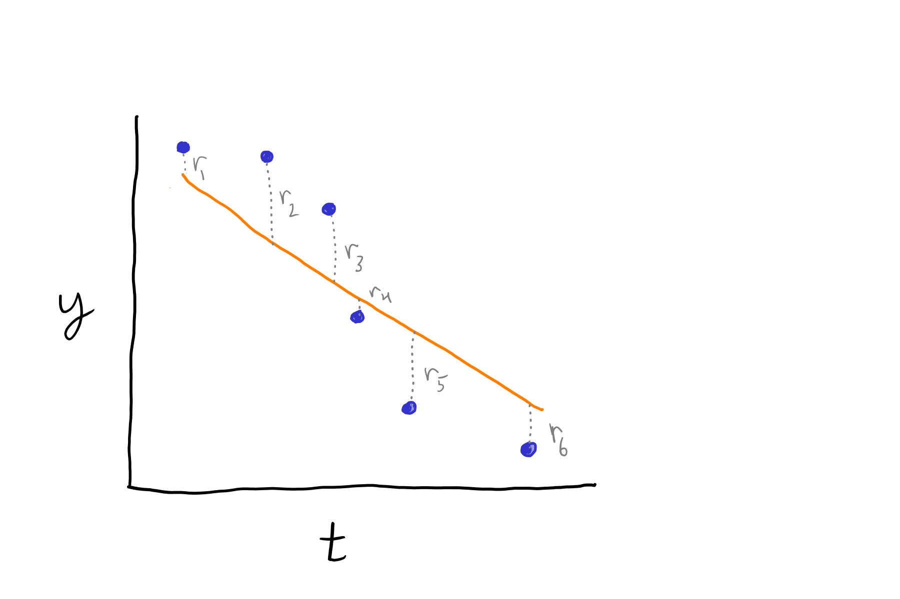
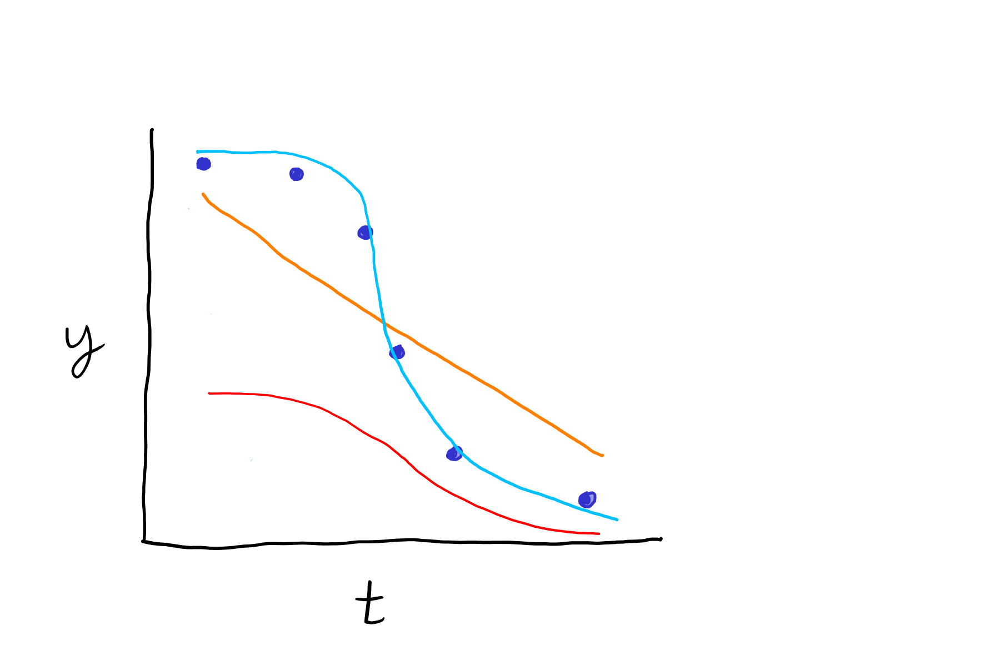
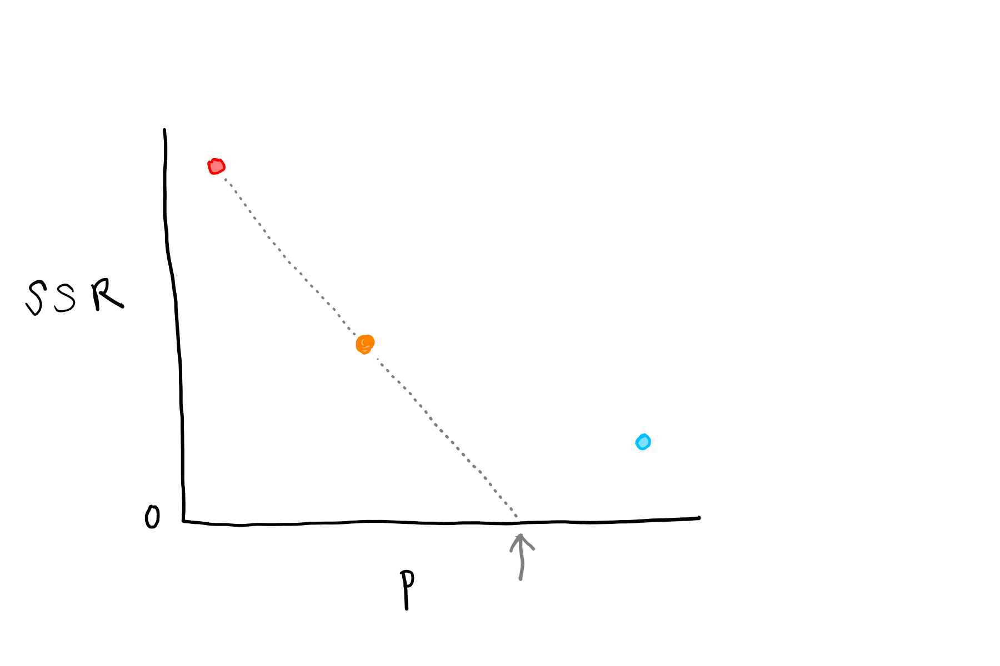
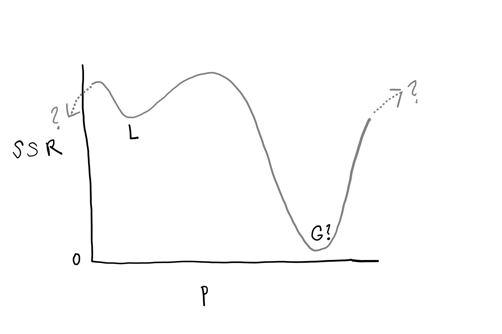

# Parameter estimation {#sec-param-est}

Parameter estimation is about determining (estimating) the "best" (ideally, the most accurate) parameter values for a model based on comparing model output and measurements.
It is related to model validation.
Parameter estimation requires a model with some adjustable parameter(s) and some measurement data.
The flexible approach that we will use has three steps: 

1. run the model with a specific numeric parameter value to get output,
2. quantify fit by comparing model output to measurement data, and see if the fit is good enough, and finally,
3. if needed, come up with a new parameter value and return to step 1.

Note that parameter estimation is yet another area where terminology is not consistently used!
What we call "measurements" or "measurement data" here are called "observations" or just "data" in other cases, but both are ambiguous.
What we call "model output" here might be called "predictions" or "theoretical values" in other cases.

## Underlying algorithm

Parameter estimation is an application of *optimization*, which works by repeated evaluation of an *objective function*, and updating the parameter guess each time based on how the values change.
For some hypothetical model, we might get the output shown as the orange line in @fig-par-est1.

{#fig-par-est1 fig-alt="Model residuals or error"}

To quantify model fit, the residuals, shown as dotted gray lines, are used.
These are the same residuals used in MAE, MBE, RMSE, and NSME.
To summarize the fit in a single numeric value, it is typically the sum of squared residuals that is used:

$$
SSR =  \sum_{i=1}^{N} r_i^2 = \sum_{i=1}^{N} (y_{p,i} - y_{m,i})^2.
$${#eq-ssr}

@eq-ssr is then the *objective function*, which is the function we want to optimize in an optimization problem.
In this case, we want to minimize it, so we could call it a *cost function*.
Note that the numeric value itself is not so important.
It is typically not seen or thought about during parameter estimation.
It is not normalized by the number of observations or total variability because it does not need to be.

Let's say we make two more guesses for the single model parameter we are estimating in this problem and they provide the output shown in @fig-par-est2.

{#fig-par-est2 fig-alt="Parameter estimation"}

These plots are shown in $t, y$ space, but our optimization algorithm uses $p, SSR$ space, where $p$ is the parameter we want to estimate.
In fact the $t$ (for time) dimension in the @fig-par-est1 and @fig-par-est2 does not enter the parameter optimization problem at all; it just helps us visualize the fit.
Instead, the view of an optimization algorithm for those data shown in @fig-par-est2 is more like @fig-par-est3.

{#fig-par-est3 fig-alt="SSR vs. parameter value"}

And it is the change in $SSR$ between guesses that is used to come up with the next guess.
A simple way of doing this is shown by the dotted gray line in @fig-par-est3, where the next estimate would that $p$ value shown by the arrow.
This is the Newton-Raphson method.
The methods we'll use are more sophisticated, but the principle is similar.

## Local and global minima

To get the best parameter value, typically defined as that value that gives the lowest value for $SSR$, we would need to know the shape of the $SSR$ vs. $p$ curve for all possible values of $p$.
But there is some cost to generating each value of $SSR$--it requires running a model.
Without that complete curve, it is possible that our parameter estimation algorithm returns a value at the *local* minimum $SSR$, while in fact we would like the *global* minium.
The difference is demonstrated in @fig-par-est4.

{#fig-par-est4 fig-alt="Local vs. global min."}

How is this problem avoided? 
By starting with a good guess for the initial parameter estimate, and trying different values.
If you get a different and better estimate by switching to a new initial guess, the earlier attempts did not provide the best parameter estimate!

## Loss function

The simplest way to use the residuals in a parameter estimation problem is to sum them, as in @eq-ssr, giving SSR.
Other approaches can be used though.
As with the model fit statistics $RMSE$ and $MAE$, squaring the residuals increases the relative effect of measurements far from the model output.
In the optimization function we will use, `scipy.optimize.least_squares()`, there is a `loss` parameter that transforms residuals before calculation of the sum.
The explicit purpose is to reduce the effect of outliers.

## Melting ice model example

Let's load the model.

```{python}

# Python packages
import numpy as np
import matplotlib.pyplot as plt
from importlib import reload
import pandas as pd

import sys

sys.path.append('modules')

# Our module
import ice_mods as im
```

Let's get some real measurements.
These are actually real--made on a dining table a year or two ago.
Mass is in g.
These were initially small ice cubes.

```{python}
meas = pd.read_csv("data/ice/ice_mass.csv")
meas

# Get time into the same units as the model
meas["time"] = meas["time_min"] * 60.

# And ice ice in kg
meas["ice_1"] = meas["ice_g_1"] / 1000.
meas["ice_2"] = meas["ice_g_2"] / 1000.
```

We need to have measurements and predictions at the same times in order to quantify model fit.
The best approach to have a model function that returns specified times.

We'll change the original one.
In this version, there is a single `times` argument.

```{python}

def melt2(mass_0,
          temp_air,
          h, 
          times, 
          dens = 920,
          temp_freeze = 0,
          Hf = 333000
    ):  

    """ 
    Dynamic model for heat transfer to a melting block of ice, with 
    disappearance of the ice over time. This version accepts a single
    times input, unlike the original above.

    Parameters
    ----------
    mass_0 : float
        Initial mass of ice (kg) 
    temp_air : float
        Air temperature (deg. C)
    h : float
        Convection heat transfer coefficient (W/m2-K)
    times : list or tuple or array
        time in output (s) 
    dens : float
        Ice density (kg/m3)
    temp_freeze : float
        Freezing point (deg. C)
    Hf : float
        Heat of fusion (J/kg)

    Returns
    -------
    dictionary
        With elements 't' for time (s) and 'm' for ice mass remaining (kg)
 
    """
     
    # Define rates function
    def rates(t, mass_t):

        # Skip when there is very little ice remaining (avoid power caculation error)
        if mass_t > 1e-10:
            # Get current exposed upper area, assuming hemisphere
            area = 2 * np.pi * (3 * mass_t / (2 * np.pi * dens))**(2/3)

            # Heat flow (W)
            Q = area * h * (temp_air - temp_freeze)

            # Melting rate (kg/s)
            dmdt = - Q / Hf

            return dmdt
        else:
            return 0.

    res = solve_ivp(
        rates, 
        t_span = [min(times), max(times)], 
        y0 = [mass_0], 
        t_eval = times
    )

    # Return user-friendly results object (dictionary here)
    out = {
        "t": res.t, 
        "m": res.y[0, :]
    }

    return out

```

So that is the software model we will work with.
When calling it, we can extract the times from the measurement data frame `meas` and pass them right to the model function.
Here is a demo with a reasonable value for the heat transfer coefficient $h$ for free convection.

```{python}
reload(im)

pred01 = im.melt2(
    mass_0 = 0.027, 
    temp_air = 24, 
    h = 50, 
    times =  meas.time
)

pred01
```

Let's plot measurements and model output together for simple validation.

```{python}
plt.plot(meas.time / 3600, 1000 * meas.ice_1, "k.")
plt.plot(pred01["t"] / 3600, 1000 * pred01["m"])
plt.xlabel("Time (h)")
plt.ylabel("Ice mass (g)")
```

It looks like the model overestimates the melting rate, i.e., the model predicts faster melting than the measurement data show, with that value for $h$.
For a lower rate we need a lower value of $h$.
To automate parameter estimation and for reproducible and defensible estimates, we need to quantify model fit. 

Get sum of squared residuals

```{python}
sum((meas.ice_g_1 - 1000 * pred01["m"])**2)
```
We need to create a function that will return residuals, which will be used by `least_squares()` to calculate the value of the cost function.
The simplest approach is to use only a single function parameter (the model parameter we want to estimate) and pass others through the global namespace--we will do that here but use a better approach in following scripts.

```{python}
def res_func(x):

    """
    Function for calculating residuals for ice melting model for 
    parameter estimation. This version uses objects in the global 
    namespace.

    Parameters
    ----------
    x : float
        Guess for values for the h parameter (convection heat transfer 
        coefficient) in the melt2() model.

    Returns
    -------
    np.ndarray
        Residuals
    """

    # Model call
    pred = im.melt2(
        mass_0=mass_0_meas, 
        temp_air=temp_air_meas, 
        h=x,                      # The parameter guess x!
        times=time_meas
    )

    # Calculate residuals 
    res = pred["m"] - ice_mass_meas

    # Return residuals
    return res
```

Let's test it.
We need to create some objects so they are in our global namespace.
These are needed to call the model function:

```{python}
mass_0_meas = 0.027
temp_air_meas = 24
time_meas = meas.time
```

These are the measurements compared to model output:

```{python}
ice_mass_meas = meas["ice_1"]
```

```{python}
res_func(50)
```

Does that match the plot?
It might help to use g.

```{python}
1000 * res_func(50)
```

Now we can put it together.
To use `least_squares()` we just need the name of the residuals function and an initial parameter guess.
The `least_squares()` function will call `res_func()` with different values for `x` (our model `h` parameter) until it settles on the best value.

```{python}
# We need to get least_squares() from the scipy.optimize module
# Normal approach is to get only that function when we just need one 
from scipy.optimize import least_squares

lspar = least_squares(res_func, x0 = 50)
lspar
lspar.x
lspar["x"]
lspar.x[0]
```

So our best-fit estimate is 21.6 $\WpmspK$.

We should, in the very least, do some graphical validation with this value.

```{python}
predval = im.melt2(
    mass_0 = mass_0_meas, 
    temp_air = temp_air_meas, 
    h = lspar.x[0], 
    times =  time_meas
)

plt.plot(meas.time / 3600, 1000 * meas.ice_1, "k.")
plt.plot(predval["t"] / 3600, 1000 * predval["m"])
plt.xlabel("Time (h)")
plt.ylabel("Ice mass (g)")
```

Do you think there is a trend in the residuals over time?
What might that mean?

# Passing additional parameters and more

# Value of measurements

Not all measurements are useful for 

Just having measurements does not necessarily mean that 

<!-- Basic approach.
     Implementation with least_squares().
     Equifinality.
     Understanding whether measurements provide information about specific parameters.
     Include example. -->

## Problems {.unnumbered}

This exercise is based on the model from the second mini-project.
You can load the model function from the `O2dc_mods` module included in this directory.
The model function is `O2dc()` and you can find a demo in the [class 19 solution directory](https://github.com/AU-BCE-EE/course-modelling-2025/blob/main/classes/19_04_nov_mini_project2/solution/demo.py).
Work through the demo if needed to understand inputs and outputs.

The 1D model was developed for diffusion-controlled oxygen and organic matter (OM) transport in a wastewater polishing lagoon.
However, it may be reasonable to apply to model to cases where transport is enhanced by mixing, as long as most of the resistance to transport remains in the water column (not the air)and the mass transfer parameter `D` is not too large.

Measurements are available from a 1 m deep lagoon and will be used for parameter estimation. 
The wastewater initially had a degradable organic matter (OM) concentration of 10 mg/L, initial oxygen 8 mg/L, and the system is run in batch mode. 
The file `meas_O2.csv` has measurements of dissolved oxygen concentration at the bottom of the lagoon at a daily frequency.
The concentration of OM in a sample from around 50 cm deep is in the file `meas_OM.csv` at a roughly 1 week frequency.
These measurements are made up, but could reflect the ease of making electrode-based measurements of dissolved oxygen and a more complicated analysis for OM (e.g., biochemical oxygen demand (BOD) incubation).

1. Assuming a reaction rate around 1E-4 m3/kg-s and that mass transfer is completely diffusion-controlled (see `parameter_values.md` if you need help coming up with a value), carry out a graphical validation of the model for both oxygen and OM.
Come up with a hypothsis for any differences you observe between measurements and model output.

2. Use `least_squares()` to estimate values for the (apparent) diffusivity and reaction rate (two parameters) based on the oxygen measurements.
It might be a good idea to change the model function so it accepts arbitrary times instead of `tmax` and `nt`.

3. Repeat the process, but this time use the OM concentrations.
Compare to the previous estimates.

4. Optional: Use both sets of measurements simultaneously for parameter estimation and compare the estimated values to what you got above. 
Use weights to ensure that each of the observed variables contributes equally to the parameter estimates, considering the lower sampling frequency of the OM measurements.
Check out the `loss` parameter for the `least_squares()` function and try a setting that minimized the influence of outliers (extreme values).
Do the parameter estimates change much?

5. Optional: What values would you ultimately recommend for these parameters based on the available measurements?
Are these results consistent with your hypothesis from 1?

### Some tips {.unnumbered}
* Remember to try different starting values.
* Do you need different values for `D` for the two solutes?
* Use `print()` calls in your residuals function to see what the values of the parameter guesses (or residuals) are if you encounter problems.
* If you ever see (or suspect) the completely implausible or impossible parameter guesses are causing problems, check out the `bounds` parameter (argument) in the `least_squares()` help file.
