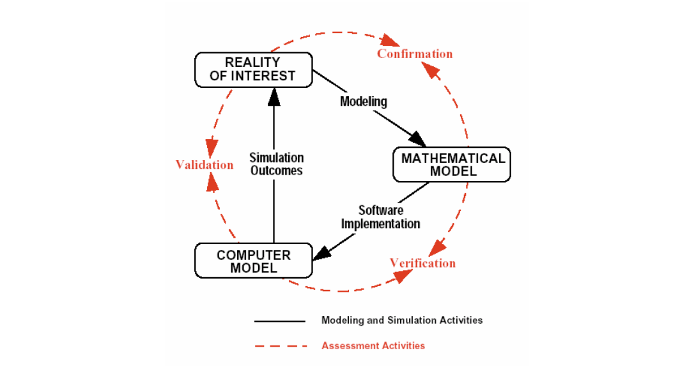

# Verification and Validation {#sec-vv}

There is a famous quote from George Box, a statistician or something. . .
It is often paraphrased as *all models are wrong, but some are useful*.
Indeed, both parts are true.
Although model error, cannot be eliminated, it can and should be evaluated and controlled.
Verification and validation address the problem of model error, and are essential steps in the "modelling process" and should be carried out before any confidence is placed in model predictions.

Verification is essentially ensuring that the mathematical model--developed through a model formulation process (@sec-formulation}--has been programmed or implemented correctly.
For us, that means checking that our Python code is correct.
That alone does not ensure the model produces accurate predictions; of course any mathematical model of a real process or system has error too.
It is common to find implementation errors through model verification.
Finding these errors after a model has been applied, and after its predictions have affected policy is quite uncomfortable!
They should be found and corrected before.
A clear and explicit model formulation and careful programming can reduce implementation errors, but verification is always needed.

In contrast, validation is done by comparing model output to measurements from the system under study.
Because validation is done after verification, code errors should already be eliminated, so any error seen in in validation can be interepreted as (most likely) coming from either model structure or parameter values.

The model developer needs to determine whether changes are needed and then which of these two is likely to improve the model.

@fig-vv1 shows where verification and validation fit in the model development process.
The connections between the software model (your Python code) and, first, the mathematical model (what you developed through model formulation), and some measurement data, called the "reality of interest" in the figure.

{#fig-vv1 fig-alt="V&V concept."}

One important point that model developers and users should both understand is that successful V&V does not prove that a model is correct. 
In fact, only model failure shows anything with any certainty: that a model is wrong.
But V&V can provide evidence that the model is accurate enough for application.
Both verification and validation are described in more detail in the sections below.

## Verification

Verification is about making sure your model has been implemented correctly.
So how exactly do you do that?
You should carefully check model code for:

* accurate constitutive equations, 
* accurate linking equations, and
* accurate mass or energy conservation, and
* consistent units.

When checking code, you should look for equations completeness and correctness by comparison to your model equations, written with pencil and paper or typed out somewhere.
Of course, this presumes that the original model formulation and description are accurate.
Unit consistency can be checked by entering units above terms in equations right in the model code, like this, where line 2 has the original model code and 1 a comment with units:

```{python}
#| eval: false
#                  m^2 *  W/m^2 -> W
        Q_solar = a_top * q_sol             # Solar energy (W)
```

Additionally, careful model calls themselves can be used for verification.
Check ultimate or limiting cases, where you have a clear expectation of what the model should show.
If a simpler analytical model is available, its predictions can be compared to those from the more complex model under appropriate conditions.
With this approach you can find problems without information on the causes.
Then experience, model call "experiments", and a check of the code can help identify the causes.
Some will require digging into the model code itself from the start, stepping through the code as it is evaluated using `breakpoint()`, or exporting intermediate results for checking. 

Model verification requires a good understanding of the underlying conceptual and mathematical models! 
Otherwise, how would you know what to expect?

Conservation can be checked by tracking cumulative transport.
Cumulative transport can be added as a state variable by simply integrating the ODE for mass or energy flow at the domain boundaries
The integrated cumulative totals can be compared it to the change in total energy or mass in the model domain for a conservation check.

## Pool model code verification

Let's use the swimming pool model as a demo for verification.
First, the model code from the `pool_mods` module:

```{python}
#| eval: false

"""
File name: pool_mods.py
Author: Sasha D. Hafner and Frederik Dalby
Course: Modelling 2026

Description:
    This module defines functions for modeling heat loss from a 
    swimming pool. BEWARE: This version includes deliberate **errors**
    because it is meant to be used for a verification demo.

Usage:
    See the file predictions.qmd for examples.
"""

# Load packages 
import numpy as np
from scipy.integrate import solve_ivp

# Define model function
def dynmod(a_top,    
           a_wall,       
           depth,
           q_sol,
           u_top,
           u_wall,
           temp_air,
           temp_sub,
           flow_renew,
           temp_renew,
           temp_init,
           times, 
           cp = 4180,
           dens = 1000
):  

    """ 
    Dynamic model for heat loss from an outdoor swimming pool. 

    Parameters
    ----------
    a_top : float
       Area of pool water surface at the top (m2) 
    a_wall : float
        Wall and floor area in contact with soil or substrate (m2)
    depth : float
        Pool depth (m)
    q_sol : float
        Global solar radiation flux (W/m2)
    u_top : float
        Overall heat transfer coefficient from the upper water surface (W/m2-K)
    u_wall : float
        Overall heat transfer coefficient for the walls and floor from water to substrate (W/m2-K)
    temp_air : float
        Constant air temperature (degree C)
    temp_sub : float
        Constant substrate temperature (degree C)
    flow_renew : float
        Flow rate of water cycling through pool (m3/s)
    temp_renew : float
        Temperature of heated water added to pool at rate of flow_renew (deg. C)
    temp_init : float
        Initial pool temperature (deg. C)
    times : tuple, list, or array
        Times for output (s)
    cp : float 
        Specific heat capacity of water (J/kg-K) 
    dens : float
        Density of water (kg/m3)
 
    """
     
    # Define rates function
    def rates(t, temp_pool):

        # Net energy, expressed as positive for increase 
        # One nice things about numerical solutions is you are not required to simplify the governing equation.
        # In fact it can be helpful to understand the different pathways to keep them separate

        # Calculate heat flow (W) through individual pathways
        # All are positive for heat flow in (this is arbitrary)
        Q_solar = a_top * q_sol                                     # Solar energy
        Q_top = a_top * u_top * (temp_air - temp_pool)              # Convection from top
        Q_sub = a_wall * u_wall * (temp_sub - temp_pool)            # Conduction to/from substrate (soil or whatever is there)
        Q_renew = cp * dens * flow_renew * (temp_pool - temp_renew) # Net energy coming in from renewal water
        
        # And sum them
        Q_net = Q_solar + Q_top + Q_renew

        # Express as temperature change
        dtemp_dt = Q_net / (cp * dens * vol)

        return dtemp_dt

    # Total water volume (m3)
    vol = a_top * depth

    # Now solve with solve_ivp()
    res = solve_ivp(rates, t_span = [min(times), max(times)], 
                    y0 = [temp_init], t_eval = times
    )

    # Create a dictionary to hold results
    out = {"t": res.t, "temp": res.y[0, :]}

    return(out)

```

And now some verification:
Let's start with a check of

1. conservation, and
2. constitutive equations.

During model formulation we came up with this energy conservation equation:

```{python}
#| eval: false
Rate of energy accumulation = solar + air/top + soil/substrate + renewal
```

All in W.

And the code has this:

```{python}
#| eval: false
        Q_net = Q_solar + Q_top + Q_renew
```

OK?
Nope!
We are missing energy transfer from soil/substrate.
Checking the module code above shows it is actually calculated, just not used.
So we can add it:

```{python}
#| eval: false
        Q_net = Q_solar + Q_top + Q_sub + Q_renew
```

Now for a check of the constitutive equations.

The code:
```{python}
#| eval: false
        # Calculate heat flow (W) through individual pathways
        # All are positive for heat flow in (this is arbitrary)
        Q_solar = a_top * q_sol                                     # Solar energy
        Q_top = a_top * u_top * (temp_air - temp_pool)              # Convection from top
        Q_sub = a_wall * u_wall * (temp_sub - temp_pool)            # Conduction to/from substrate (soil or whatever is there)
        Q_renew = cp * dens * flow_renew * (temp_pool - temp_renew) # Net energy coming in from renewal water
```

The check, where we have copied a single line a few times to think about it in some different ways
```{python}
#| eval: false
        #         Area  * flux -> OK
        Q_solar = a_top * q_sol                                     # Solar energy

	#       CHTS = combined heat transfer coefficient
        #        Area *  CHTC * delta T -> OK
        Q_top = a_top * u_top * (temp_air - temp_pool)              # Convection from top
        #       Area  * ------flux------------------- -> OK
        Q_top = a_top * u_top * (temp_air - temp_pool)              # Convection from top
        #                         High    -  low ->    postitive -> heat transfer into pool -> OK
        Q_top = a_top * u_top * (temp_air - temp_pool)              # Convection from top
```


Now some check of units.
During actual V&V, we would need to check *all* equations. 
But here let's focus on that same line of code from above as an example.


```{python}
#| eval: false

#        Overall heat transfer coefficient from the upper water surface (W/m2-K)
#               m^2   * W/m2-K  * ----------K---------- -> W OK 
        Q_top = a_top * u_top   * (temp_air - temp_pool)              # Convection from top
```

To be sure that even this single line of code is correct, we have to check that the inputs `a_top` etc. have the correct units. 
These should be defined in the docstring.
We see:

```{python}
#| eval: false

    a_top : float
       Area of pool water surface at the top (m2) 
    . . . 
    u_top : float
        Overall heat transfer coefficient from the upper water surface (W/m2-K)
    . . . 
    temp_air : float
        Constant air temperature (degree C)
```

Those three look fine, once we remember that a temperature difference is the same in $\degC$ and K.
Now, of course this doc string has no effect on the actual calculations carried out by the model, but it tells the user the units for the inputs.
And if everything is correct up/back to here, the rest is up to the user.

Now the linking equation, starting with a conceptual check.

```{python}
#| eval: false
  # temp change = energy in / (energy required for 1 K change in 1 kg * mass/vol * vol) -> seems OK
        dtemp_dt = Q_net / (cp * dens * vol)
```

And unit check.
```{python}
#| eval: false
        #          J/s   / J/K-kg * kg/m3 * m3 -> K/s OK
        dtemp_dt = Q_net / (cp    * dens * vol)
```

Compare to the information in the model function docstring:

```{python}
#| eval: false
    cp : float 
        Specific heat capacity of water (J/kg-K) 
    dens : float
        Density of water (kg/m3)
```

All OK?
Seems so, yes.

## Verification with model calls

Next, let's look at some model calls.

```{python}

# Packages
import numpy as np
import matplotlib.pyplot as plt
from importlib import reload

# Get out pool model functions (loading a module here)
# This will not load a new version!
import pool_mods as pm

# Use as needed (reload(pm) if module code is changed)
reload(pm)

# Set dimensions (all distances m, all areas m^2).
# Assume pool is 10 x 4 x 2 m.
length = 10
width = 4
depth = 2
a_top = length * width
a_wall = 2 * (length + width) * depth + a_top

# And a demo model call
pred01 = pm.dynmod(a_top = a_top,
                   a_wall = a_wall,
                   depth = depth,
                   q_sol = 0,
                   u_top = 100,
                   u_wall = 3,
                   temp_air = 10,
                   temp_sub = 10,
                   flow_renew = 0,
                   temp_renew = 0,
                   temp_init = 30,
                   times = np.arange(0, 12 * 3600 + 3600, 3600)
)

# Check results
pred01
pred01['temp']

# And 
plt.plot(pred01['t'] / 3600, pred01['temp'])
plt.xlabel('Time (h)')
plt.ylabel('Pool temperature (deg. C)')
plt.savefig('pred01.png')

# Conceptual and unit check (see md file)
# . . . .

# Now some model calls

# 1. Think about steady-state
# Should there be a steady state condition?
# Sure! 
# A. With the sun shining, the pool water will warm above ambient temperature 
# but eventually reach a steady-state where it . . .  

# Let's add 200 W/m2 of sun, keep environment at 10, and see
pred02 = pm.dynmod(a_top = a_top,
                   a_wall = a_wall,
                   depth = depth,
                   q_sol = 200,
                   u_top = 100,
                   u_wall = 3,
                   temp_air = 10,
                   temp_sub = 10,
                   flow_renew = 0,
                   temp_renew = 0,
                   temp_init = 10,
                   times = np.arange(0, 12 * 3600 + 3600, 3600)
)

pred02

# Run it for a long time
# Is this a realistic simulation, by the way?
pred03 = pm.dynmod(a_top = a_top,
                   a_wall = a_wall,
                   depth = depth,
                   q_sol = 200,
                   u_top = 100,
                   u_wall = 3,
                   temp_air = 10,
                   temp_sub = 10,
                   flow_renew = 0,
                   temp_renew = 0,
                   temp_init = 10,
                   times = np.arange(0, 30 * 86400 + 86400, 86400)
)

pred03['temp']

plt.close()
plt.plot(pred03['t'] / 86400, pred03['temp'])
plt.xlabel('Time (d)')
plt.ylabel('Pool temperature (deg. C)')
plt.savefig('pred03.png')

# As expected?
# Higher or lower than ambient?
# What about the oscillations?

# Does it match steady state model?
pm.ssmod(a_top = a_top,
         a_wall = a_wall,
         depth = depth,
         q_sol = 200,
         u_top = 100,
         u_wall = 3,
         temp_air = 10,
         temp_sub = 10,
         flow_renew = 0,
         temp_renew = 0
)

pred03['temp'][10:]

# Hmmm. . . does it?
# Is there an error in the model?

# Try renewal
# If we are interested in steady state, we might just return a few times
pm.dynmod(a_top = a_top,
          a_wall = a_wall,
          depth = depth,
          q_sol = 0,
          u_top = 100,
          u_wall = 3,
          temp_air = 10,
          temp_sub = 10,
          flow_renew = 0.1,
          temp_renew = 30,
          temp_init = 10,
          times = [0, 3600, 86400, 10*86400] 
)

# Big problem!
# We get massively negative temperature
# Let's dig into this, first with some more model calls
# Think about it . . . 
# Try smaller delta T and shorter time to slow down heat transfer and time, in a sense

pm.dynmod(a_top = a_top,
          a_wall = a_wall,
          depth = depth,
          q_sol = 0,
          u_top = 100,
          u_wall = 3,
          temp_air = 10,
          temp_sub = 10,
          flow_renew = 0.1,
          temp_renew = 10.1,
          temp_init = 10,
          times = np.arange(0, 101)
)

# Adjust the time a bit. . .
# What does that tell us?

# Try breakpoint() to see what is happening
# Edit module and . . .
reload(pm)

pm.dynmod(a_top = a_top,
          a_wall = a_wall,
          depth = depth,
          q_sol = 0,
          u_top = 100,
          u_wall = 3,
          temp_air = 10,
          temp_sub = 10,
          flow_renew = 0.1,
          temp_renew = 10.1,
          temp_init = 10,
          times = np.arange(0, 101)
)

# Check:
Q_renew
# Negative or positive?
temp_pool
temp_renew
# See it?

# See module code in rates()
# Q_renew = cp * dens * flow_renew * (temp_pool - temp_renew) # Net energy coming in from renewal water

# Possible checks
# * Correct steady-state predictions with solar radiation and other changes to inputs (possibly changed independently or stepwise)
# * Correct qualitative effects of changes to inputs (more or less radiation, higher or lower substrate temperature or resistance)

# We can check implementation of constitutive equation quantitatively with some careful calls and analysis of results
# breakpoint() can be used to check for object (variable) values during evlauation of rates() function

# For a quantitative check of energy balance, we can add cumulative heat transfer as state variables
# Let's try this new version

reload(pm)

pm.dynmod_pp(a_top = a_top,
             a_wall = a_wall,
             depth = depth,
             q_sol = 0,
             u_top = 100,
             u_wall = 3,
             temp_air = 10,
             temp_sub = 10,
             flow_renew = 0.1,
             temp_renew = 10.1,
             temp_init = 10,
             times = np.arange(0, 10)
)

# See huge negative h_renew (J).
# Wrong sign!
# And a flow of 0.1 m3/s (100 L/s) is probably high for a pool that is 10 x 4 x 2 = 80 m3

# Let's try to fix the error

# And do you see how these cumulative transport state variables can be useful and interesting?
# Should we plot some for different scenarios?


## Validation

## Problems

I. Verification

In this exercise you will work with a version of the ammonia volatilization model from the first mini-project.
This document provides some details, the `amm_concept_model.pdf` has more, and for even more, see the solutions to that mini-project.
Remember that you need to have a good understanding of the underlying conceptual and mathematical models in order to verify a computer model!
So make use of those documents.

You'll use the `dynmod()` function defined in the `amm_mods.py` file in the same subdirectory as this document.
The `amm_mods.py` file is a *module* that defines the model as a Python function called `dynmod()`.
The script `amm_demo.py` has a short demonstration.

The model simulates total ammonia nitrogen (TAN, the sum of free ammonia (NH3) and ammonium (NH4+)) in manure in a storage tank.
It includes continuous addition and removal of manure at a fixed rate, so the volume of manure in the tank does not change.
But TAN is lost through volatilization of ammonia from the surface.

Can you verify the model following the approach we went through in class? 
Save your work in a Python script and a text file, or really in any form that you think is appropriate.
If you prefer commenting in the module file `amm_mods.py` directly, that is fine.

If you struggle to work with the volume-normalized variables and expressions, you can use the second model function `ddynmod()`, named for *double* dynamic model because can also simulation tank volume dynamics.
It does not use volume-normalize values, because the volume is variable over time.
In that case you probably want to set the manure pumping rate (flow) in and out to the same value for simplicity.

For more details on the mass balance and constitutive equations, see `amm_concept_model.pdf`.

II. Validation


In this exercise you will work with a 1D diffusion model.
You will get some practice in verification of conservation with 1D models and try model validation.
There are also two optional questions on some different ways to implement and verify (program) 1D models.

The conceptual model is quite simple.
We have a column with some solute (NaCl for example, which is what was used in the measurements) diffusing from one end to the other through water.
We can represent the conceptual model it with text symbols:

```{python}
       --------------------------
       |                        |
 c_l   |                        | c_r
 bc[0] |                        | bc[0] 
       |                        |
       --------------------------
       x -->
```

Both boundaries, at the left and right, have fixed concentrations.
And there is only one phase--an aqueous phase that is somehow stagnant (or assumed to be)!
This same model could also be used for a semi-infinite plane.

The model is implemented in the function `diff1D()` which is defined in the `diff_mod.py` module. 
Check the docstring and, if needed, `rates()` to see exactly what `diff1D()` returns before starting.

1. Qualitatively describe what you expect this model predict, both after short and then long periods of time.

2. Given what you know about Fick's law of diffusion at steady-state in a plane wall, predict the steady-state flux of the solute without the model, and then compare your expected value to model predictions.

3. Can you use the output from the `diff1D()` to verify implementation of mass balance in the model?
Check the function docstring (look at the module file contents or run `help(diff1D)` in Python) to check function parameters and outputs.
This is meant to be a quick check, and not a detailed verification, but it is still good practice to keep a record of your function calls, output, and interpretation.
That could be done in many ways, including a Markdown document or `*.txt` file with code and output (manually pasted in), or an MS Word file, a Jupyter Notebook file, or a Quarto Markdown (`q.md`) file.

4. See the data file `col_salt.csv` for some (fabricated) measurements of the total salt (NaCl here) mass within a 0.1 m long column with a diameter of 0.02 m. 
Fixed salt concentrations at the boundaries were 36 kg/m3 at the left and zero at the right.
Use the measurements to validate the model graphically and with relevant model fit statistics.
The diffusivity of NaCl in water is known to be around 1.6E-9 m2/s.
What do you think about the accuracy of the model?
Hint: Be careful with units and variables. You have to convert model predictions to the variable that was measured.

Optional:
5. You may have noticed that the cumulative mass transfer at the left and right boundaries are both positive for flow to the right.
Create a new version of the `diff1D()` function and change this feature, so that both terms are positive for mass going into the column (model domain).
Make sure you give the new function a good name.
Save it in the same module as the original.
Now repeat your mass mass balance verification with this new function.

6. The code in the `rates()` function in `diff1D()` uses array indexing to efficiently calculate diffusion over spatial cells or layers.
Here is an example:
```{python}
        j = -D * (ca[1:] - ca[:-1]) / dxi
```
If we have say 5 cells or layers in the model, we could represent them like this:
```
   ca[0]    ca[1]     ca[2]     ca[3]     ca[4]  
```
And then this calculation
```{python}
ca[1:] - ca[:-1]
```
means this
```
   ca[1]    ca[2]     ca[3]     ca[4]  
 - ca[0]    ca[1]     ca[2]     ca[3]  
 -------------------------------------
```
and returns an array with those differences.
This is an efficient approach from a coding and evaluation (speed) perspective but it can be difficult to program or even understand!
Create a new (now third) version of the `diff1D()` function that replaces the clever indexing operations with `for` loops as in some of the 1D code you have seen before in this course.
Run it and show that it gives the same results as the original function.

