# Introduction to VS Code

This introduction was taken from the guide at <https://github.com/AU-BCE-EE/guidance-python-vs-code>, written by Sasha Hafner.

## Overview

This guide provides basic information on using Python in Visual Studio Code, a flexible and free integrated development environment (IDE).
It covers three main ways to use Python in VS Code: 

1. **Interactive** by typing directly into a Python interpreter
2. **Script mode** by calling Python and running script in shell non-interactively
3. **Interactive script development** by sending script code by line or section to the Python interpreter

These are not the only ways Python can be used in VS Code, but they are a good fit for the majority of our project and class needs.
There is also a notebook-style interface called the "Native REPL" that you might come across, and might actually prefer.
And VS Code has advanced debugging features that could be useful at some point, but can be overwhelming!
Neither are covered in this guide.
There is no good reason to try to learn about all the features VS Code offers from the start.
Utlimately most users probably use a small subset anyway.

Much of what is covered in this guide is specific to VS Code.
But all Python code and PowerShell commands can be applied outside of VS Code.

The rest of this guide includes:

* installing software,
* introduction to PowerShell
* running Python in PowerShell--script and interactive mode (section 4),
* opening a terminal pane and running Python in VS Code (section 5),
* **VS Code projects**,
* **Working with scripts in VS Code**,
* **Script mode Python usage in VS Code**,
* **Interactive script development and running**,
* troubleshooting, and
* a summary

Those section names shown in **bold** are key sections.

## Installing software
### VS Code
Visual Studio Code, VS Code, or, as we'll call it, VS Code, is a free "integrated development environment" (IDE) produced by Microsoft.
It is a simpler version of Visual Studio with fewer features.
If you don't already have it, you can download it from here: <https://code.visualstudio.com/download>

### Python
Python (3) should be installed from here: <https://www.python.org/downloads/>.
Select the stand-alone installer.
In the first step after running the installer, be sure you select the option to add the exe path to the `PATH` variable.

### VS Code Python extension
Lastly, you will need a Python extension.
1. Open up VS Code and click the Extensions icon (near top left, looks like four squares) or use `Ctrl + Shift + x`.
2. Search for `Python`.
3. Carefully find the one published by Microsoft that has a description similar to this: "Python language support with extension access points for IntelliSense (Pylance), Debugging (Python Debugger), linting, formatting, refactoring, unit tests, and more."
4. Install it.

Your VS Code program may not give you access to all the features you need by default, including extensions, depending on which folder it is running in.
If you see this warning at the top, you must "trust" the folder.

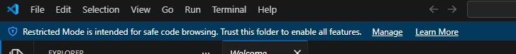{width="727px"}

Click on "Manage" and then "Trust" to do that.

### Python libraries
In this course you will need a few external Python libraries (collections of modules, which provide the functions that we will need).
You can install them all by opening up a new terminal window (PowerShell), either with "Terminal" -> "New Terminal" or the keyboard shortcut (`Ctrl + Shift + æ` for me) and running the following command:

```{python}
#| eval: false
python -m pip install numpy scipy matplotlib pandas
```

## PowerShell
A *shell* is a text-based program that reads commands and does things. 
Most of the readers of this guide are probably using Windows, and for that operating system, the modern shell that you should use is called *PowerShell*. 
In your Python work you may mostly interact with PowerShell through VS Code.
But here we'll start by running PowerShell outside of VS Code in the Windows terminal program (the window that runs shells), partially for understanding.

Open up PowerShell (e.g., hit the Windows or super key ⊞ and type PowerShell), and you should see something like this:

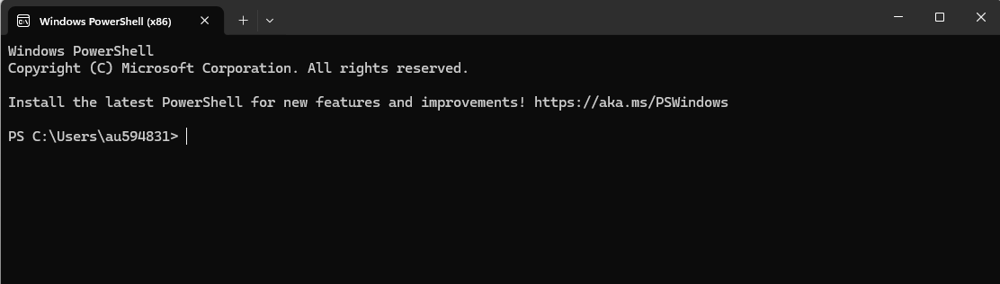{width="1112px"}

The bit at the left, `PS C:\Users\au594831>` is called the "prompt".
The single `>` is one way to tell you are working in PowerShell.
It will look the same when you open it up in VS Code.
And while you can do a lot in VS Code by clicking buttons, you still need to be aware of what is running in the terminal pane below.

(If you are working with Mac OS, the shell is just called *Terminal*, and on Linux it could be *Bash* or another shell program.
The few commands we will cover here are identical in all three, so you can use the appropriate program but replace PowerShell with e.g., Terminal or Bash and follow the instructions.)

There are many commands that PowerShell understands.
You can probably work with PowerShell in VS Code without knowing any PowerShell commands, but anyone working on Windows should really know some, and these are some useful ones:

* `cd folder_x`: *change directory* or move to the specified directory (folder), here called `folder_x` within the current directory
* `cd ..`: use the `..` syntax to *go up one level*
* `ls`: *list* all files and directories within the current directory
* `cp file1.py file2.py` *copy* a file
* `mv file1.py file2.py` *move* a file
* `rm file1.py` *remove* (delete!) a file

## Using Python in a shell
Python scripts can be run directly in PowerShell with the `python` command. 
This is the *script mode* listed at the top of this document.
The command is `python script_name.py`.
Of course, this requires that `script_name.py` is in the current directory in PowerShell. 

A shell can also run Python interactively.
To start an interactive session with Python, just type `python` at the prompt, like this:

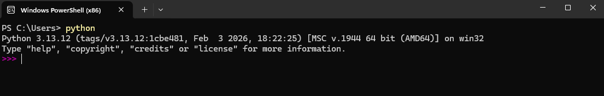{width="1105px"}

Notice how the prompt now looks different?
Like this: `>>>`, and also fuchsia in color.
That is a hint to show that you are now in a Python *interpreter*, the program that will read any commands you enter and evaluate them.
This mode is called a *REPL*, from "read-evaluate-print loop".
And the term REPL is often used to refer to an interactive interpreter session.

This window will now act like any interactive Python session, for example,

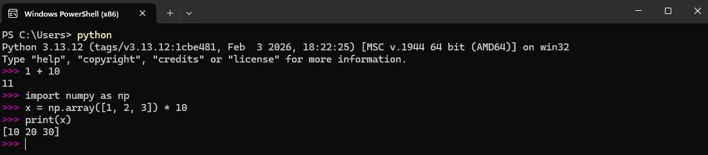{width="1101px"}

## Terminal window and PowerShell in VS Code
Open up VS Code and open a terminal pane at the bottom through the `Terminal` menu by clicking on `New terminal`.
Now you will see PowerShell running in the terminal pane at the bottom of VS Code, like this:

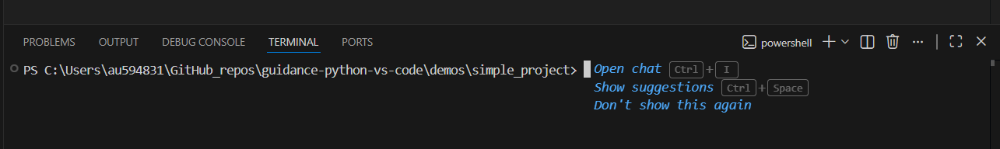{width="1285px"}

How can you tell this is a PowerShell terminal?
You should be able to tell because the prompt starts with `PS` and ends with `>`.
Also, can you see the `powershell` label toward the upper right?

Click in that pane and type `python`, followed by hitting `Enter`.


Now you are in an interactive Python session.
Do you see that the prompt changed?
This may be a quick way to check some ideas in Python, but for a couple reasons is not the best way to use Python in VS Code.
See the next sections for better options.

## VS Code workspace
VS Code uses something called *workspaces* to keep track of all the files involved in a project or assignment.
Generally each set of homework exercises or mini-project should be in a separate subdirectory on your computer and should be handled as a distinct workspace in VS Code.
Fortunately it is easy to sort this out--just set the project location before working.

Let's open up VS Code and start and new project.
First, make sure you have a directory or folder for your project.
To follow along with this guide, you can create a folder called `simple_project` in any appropriate location on your local computer.
(Or, you can clone this repo and use the `demos/simple_project` folder that is included.)
Then, in VS Code, under the `File` menu, click `Open folder` (or hit `Ctrl + k` followed by `Ctrl + o`), 

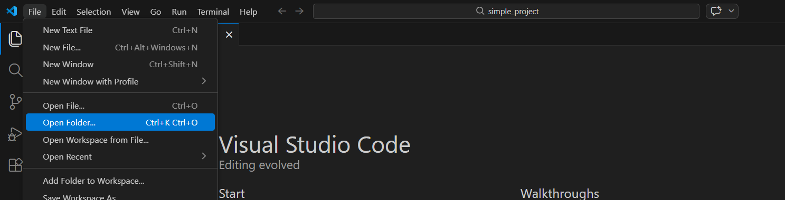{width="1487px"}

and browse to your folder,

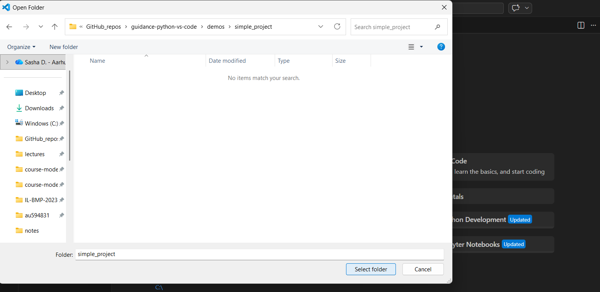{width="1564px"}

and click "Open".

What does this do?
It ensures that when Python is run it will have this folder as the *working directory*, i.e., the location where the Python interpreter looks for files and saves output.
It also "pins" settings for this particular project, e.g., pane layout or Python interpreter.
Generally you won't have to think about that though.
*Making sure that you start with this `open folder` step avoids a whole lot of problems related to file paths!*

## Create and edit a script in VS Code
A *script* is just a text file with commands in Python or some other computer language.
Python scripts are typically named with the `.py` extension, e.g., `simple1.py`. 

In VS Code you can create a new script with the `File` menu by selecting `New File` or `New Text File` (or using the keyboard shortcuts that are shown in the menu, e.g., `Ctrl + n`).
You can now edit the file using the feature-rich script editor.
Open a new file and add some content, e.g.,

```{python}
#| eval: false
"""
file: simple1.py
author: Your Name

description:
    A simple Python script
"""

print("If this message is printed, you ran this script!")

x = 10 + 2

print('Here is a sum:', x)
```

Then save the file with `Ctrl + s` or `Save` under the `File` menu.
You should see that the default location is your project folder--perfect!

Alternatively, you can open the `simple1.py` script that is included in this repo.
But remember the `Open folder` step from above!

VS Code has several features that are meant to make script editing easier. 
Syntax highlighting is obvious here:

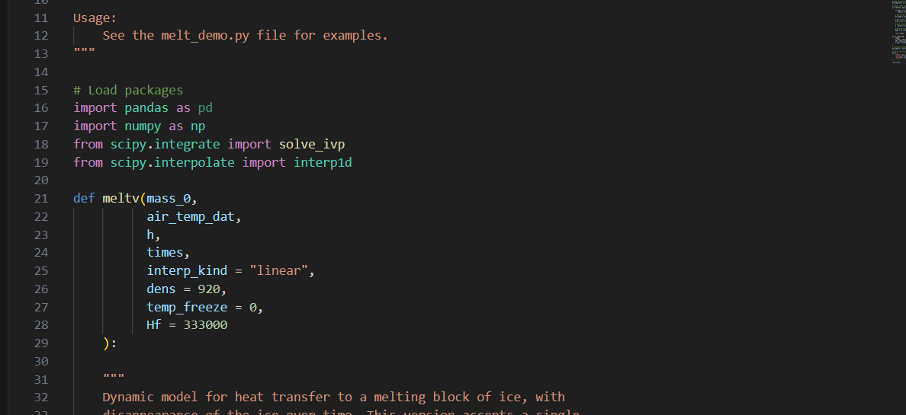{width="1188px"}

Be sure to save your script occasionally when editing it, and before you try to run it in script mode (next section).

## Run a script in Python in "script mode"
Under the `Terminal` menu select `New terminal`.
You should then see something like this at the bottom of your VS Code window:

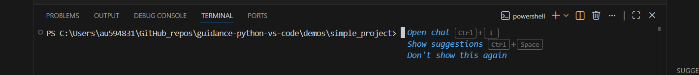{width="1420px"}

Now you can tell that this terminal pane is running PowerShell (right?).
And that is exactly what we need to run the `simple1.py` script in Python in *script mode*.
To do that, click in the terminal pane and enter this command:

```{python}
#| eval: false
python simple1.py
```

You should see this:

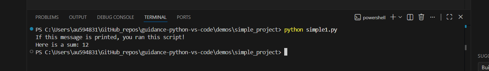{width="1416px"}

If you get an error like the one below, check the script name spelling.

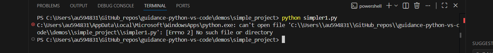{width="1450px"}

Or, did you forget to open the correct folder?
Remember that this window is a PowerShell terminal, so you have access to commands that can help, like `ls`.

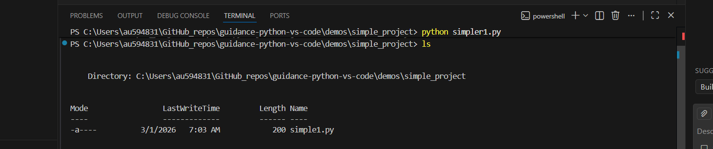{width="1461px"}

If you saw an error message about `python` not being recognized, check that you have actually installed Python.

How is this any different from part 5 above?
The key difference is that here we did the `open folder` step first, so we know that PowerShell is in the right directory, so Python will run in the right directory, and will be able to find our script.

If you prefer clicking buttons, you can click this "Run in Python" button at the top right of VS Code:

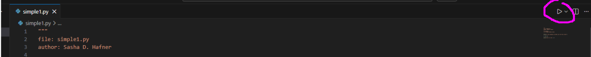{width="1385px"}

What does that do?
The button sends a command to a terminal pane.
The overall effect is the same as explicitly opening a terminal and typing `python simple1.py`, but there are some differences.
Here is what you should see below:

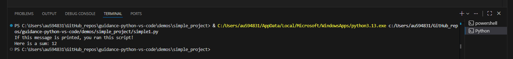{width="1450px"}

First, note that the actual command is different from what you manually typed.
This "Run" button generates a very explicit command, with the complete path to both the python executable and your script included.
This is a bit safer, in that it is less susceptible to details about how you installed Python.

Second, did you notice that this command was sent to a new terminal pane, running a different instance of PowerShell?
Unless you already closed it, the one that was opened from the `Terminal` menu is still open, but hidden.
Click here to go back to it:

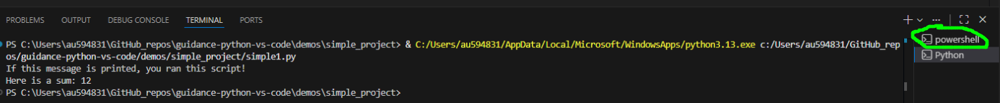{width="1386px"}

The "Run" button will never use it though--it will use a designated terminal pane that it opens if needed.
So if we click that button again, the newer instance is used.
If you prefer the button and the VS Code-spawned terminal pane, you can close the original one (or any others) with this "trash/kill" button:

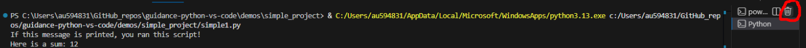{width="1387px"}

There is a keyboard shortcut for the `Run in Python` button: `Ctrl + F5`.
(The first time you use it you will have to select a "debugger", and the recommendation is fine. It won't actually be used unless you just hit `F5` without the `Ctrl` key.)

What if you wrote another script with only this line:

```{python}
#| eval: false
print(x)
```

Would it in fact print the value of `x`, calculated in the `simple1.py` script, if you ran first `script1.py` and then `script2.py` in script mode?
We can try to prove a point!

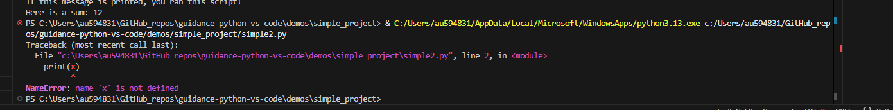{width="1391px"}

Nope!
Why not?
Because that is the behavior of an *interactive Python session* but we are running Python in *script mode*.
When we call `python simple1.py`, the Python interpreter is started, it runs the code in the `simple1.py` script **and then closes**, and the *state* of the interpreter is discarded.
Whatever variables were created by code in the script are lost.
For a different approach, see the next section.

## Interactive script development
In many cases, especially when learning something new about Python, or developing a script with multiple steps, it is helpful to be able to send only a single line or piece from a script.
This lets you check code as you write it, and you can be sure exactly which lines cause errors.
And because the same instance of the Python interpreter stays open, the *state* of the interpreter, or everything that the interpreter is holding in memory, which for us mainly means any variables that were created and any modules that were imported, *persists* until you close the Python interpreter.
You could get by by always running scripts in script mode, and checking any error messages if there are problems, perhaps using `breakpoint()` once in a while to go through code line-by-line.
But the interactive script development approach described here is probably easier and quicker.

Let's keep working with the simple1.py script. 
The simplest way to send a line of code is the `Shift + Enter` keyboard shortcut. 
Here is what you should see if you try that:

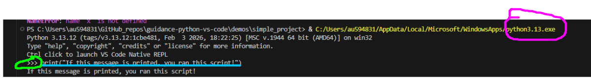{width="1199px"}

It did the job by opening an interactive Python session, and then sending the single line of code.
You can see the command for starting Python at the top.
The telltale Python prompt is circled in bright green.
And the line of code submitted to the interpreter is underlined in light blue.

If you prefer using a menu option (I am not sure why anyone would), you can find it by right-clicking on the line or selection, then scrolling way down to `Run Python`, and under that, `Run Selection/Line...` here:

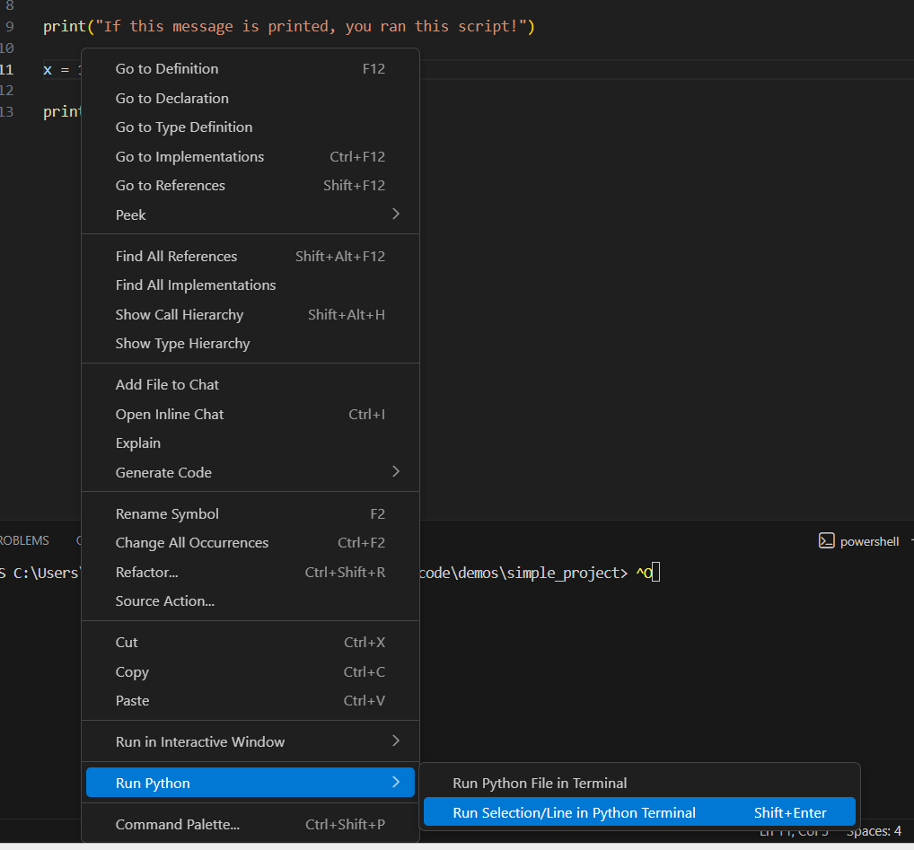{width="1018px"}

If you try the `Shift + Enter` shortcut again, VS Code recognizes that there is already a Python interpreter running, so it just sends the code. 
And if you send the following lines, Python works as expected, "remembering" the value of `x`, because all this code is run in the same instance of Python.

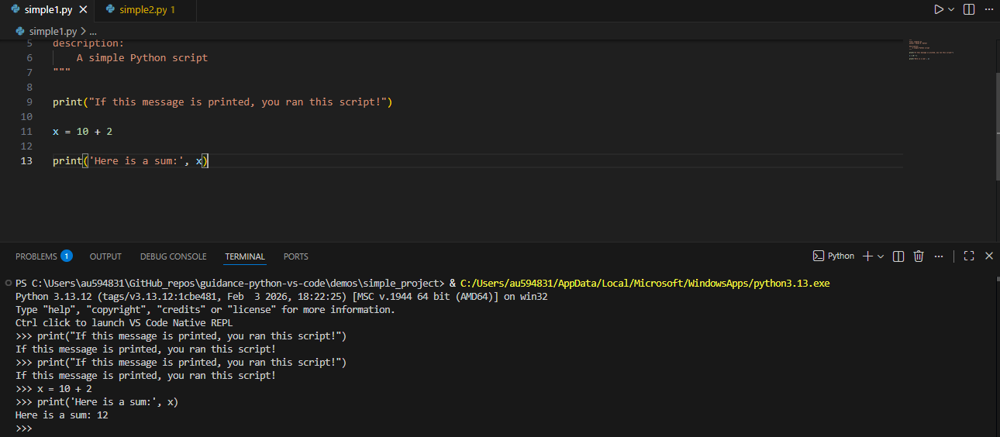{width="1290px"}

The cursor in the script editor automatically advances to the next line of Python code when you use `Shift + Enter`.
So it is easy to run a few lines sequentially without moving your fingers from the `Shift` and `Enter` keys.
But if you want to run several lines, you can highlight (select) them with the trackpad/mouse or keyboard (`Shift` and arrow keys) and hit `Shift + Enter` again.
Simple!

## Troubleshooting

Some problems can be solved by being aware of what is running in the terminal pane and making sure that the commands used (or automatically sent by clicking buttons) are appropriate.
For example, if you use the `Shift + Enter` shortcut to run lines from a script, and then decide to run the entire script in Python in script mode, VS Code may send the *PowerShell* command to that terminal pane running the Python interpreter.
That does not work!
Remember that you can see what is running by checking the prompts.
How do you solve this problem?
By closing ("killing") the pane running Python interactively and trying again.
Now you should get PowerShell.

The wrong working directory is another common cause of problems.
Whenever you open a script, get used to setting the working directory to the location of that script with "File" -> "Open Folder" or `Ctrl + k` immediately followed by `Ctrl + o`.

And the last common cause of problems is that VS Code is using the wrong version of Python.
Hit `Ctrl + Shift + p` and then "Python Select Interpretor", and select the correct exe file.
Which one? 
The latest one that you installed that is (should be?) in `AppData\Local\Program\Python`.

## Summary
1. To work with Python in VS Code, always start by opening the project folder: Under the `File` menu, click `Open folder` or use the keyboard shortcut listed there. 
2. To run the code in a Python script (in that project folder from step 1) in "script mode" you can either of these:
    A. Open a terminal pane by selecting `New terminal` under the `Terminal` menu and type the normal script mode command `python script_name.py`
    B. Click the `Run` button
3. Use the `Shift + Enter` shortcut to run individual lines or selected blocks of code from a script
4. Python can always be run interactively in a terminal pane after opening it by running `python`, but the other two options usually make more sense except for quickly checking some throwaway code
5. In case of problems with VS Code buttons or shortcuts sending code or commands to the wrong (or just inappropriate) panes, close the offending panes and try again

## Other resources
* <https://realpython.com/interacting-with-python/>
* <https://www.geeksforgeeks.org/computer-science-fundamentals/what-is-the-difference-between-interactive-and-script-mode-in-python-programming/>
* <https://code.visualstudio.com/docs/python/run>
* <https://code.visualstudio.com/docs/editing/workspaces/workspaces>


